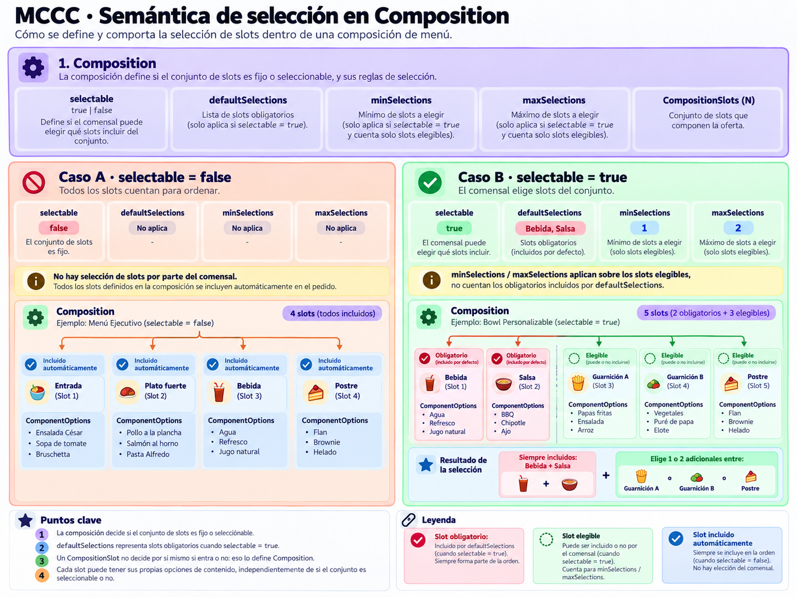
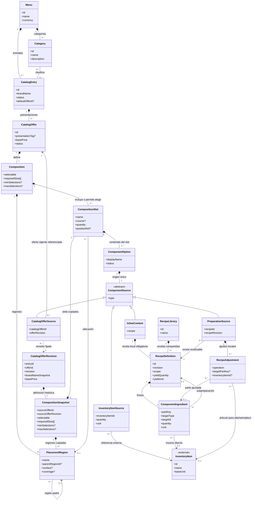
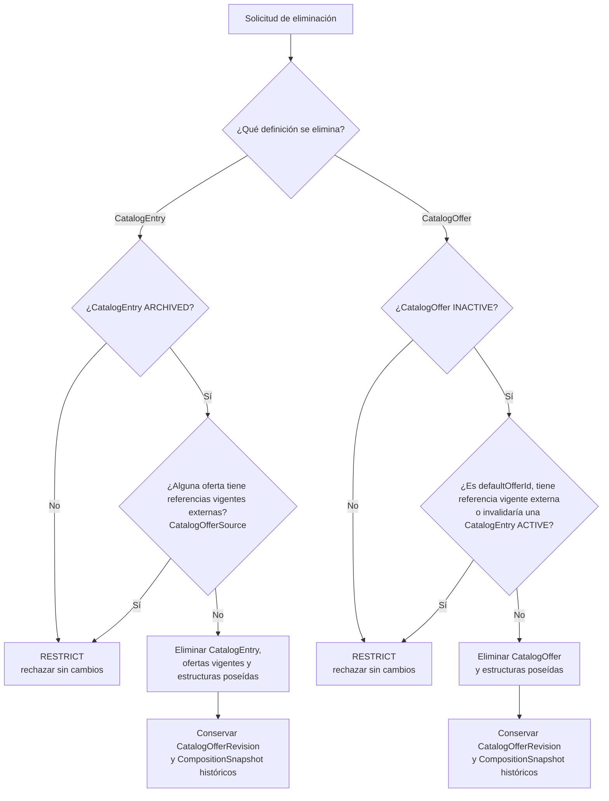
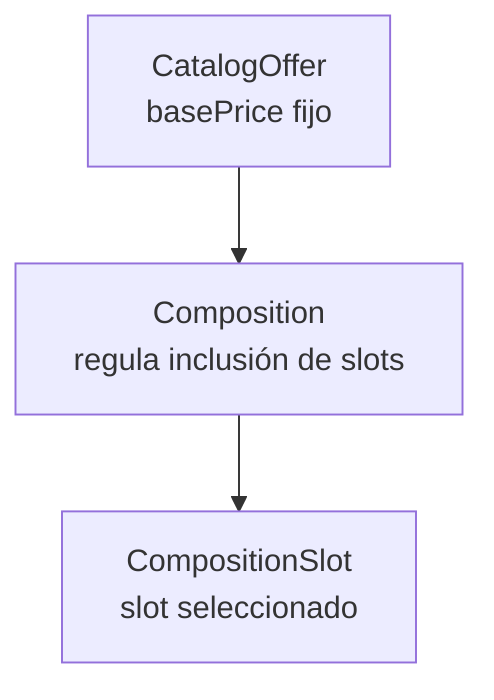
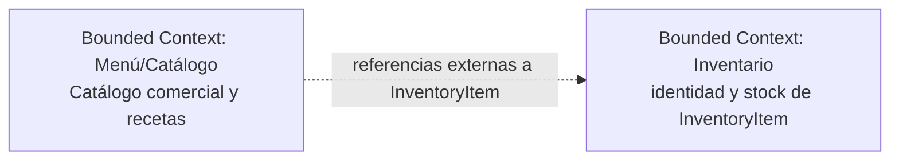

# Arquitectura de Dominio del Servicio Menu

## Modelo de Dominio

El modelo de Menú/Catálogo describe categorías, entradas comerciales, ofertas, composiciones, contenidos posibles y recetas. Menu contiene categorías y entradas; Category clasifica CatalogEntry; y CatalogEntry administra el nombre comercial, sus categorías y ofertas. Una CatalogEntry ACTIVE y publicable mantiene al menos una CatalogOffer ACTIVE y válida. Los estados de entrada y ofertas son independientes y no cambian automáticamente entre sí. Toda oferta vendible tiene una Composition de uno o más CompositionSlot, incluso cuando representa un producto individual.

CatalogOffer declara un precio base fijo y una presentación opcional; Composition define la inclusión de slots, y cada ComponentOption determina el contenido admitido para una aparición concreta. Catálogo administra las definiciones y cantidades de receta. Inventario conserva la identidad y el stock de InventoryItem, al que Catálogo referencia externamente.

## Agregados y Límites de Consistencia

Las relaciones siguientes expresan propiedad y composición conceptual del modelo. No prescriben agregados transaccionales, persistencia ni claves físicas.

### Menú y catálogo comercial

Menu contiene categorías y entradas comerciales. Category clasifica cero o más CatalogEntry y una entrada puede clasificarse en varias categorías del mismo menú. CatalogEntry es la identidad comercial con nombre autoritativo, descripción, estado, imagen y ofertas vendibles. Una entrada puede administrarse incompleta o inactiva, pero para permanecer ACTIVE y publicable debe disponer de al menos una CatalogOffer ACTIVE y válida. Archivar una entrada puede hacerse desde ACTIVE o INACTIVE; desarchivarla siempre la deja INACTIVE. El estado de la entrada no modifica automáticamente el de sus ofertas.

### Oferta y composición

CatalogEntry puede tener CatalogOffer; una CatalogEntry ACTIVE requiere al menos una CatalogOffer ACTIVE y válida. Una oferta solo puede publicarse mientras su entrada esté ACTIVE y su Composition sea válida. CatalogOffer posee exactamente una Composition y su basePrice describe el precio fijo de esa oferta. Su nombre visible combina el nombre comercial de la entrada con la presentación opcional; presentationTag es descriptiva y no determina cantidades físicas. Composition contiene uno o más CompositionSlot y puede declarar PlacementRegion. Cada slot posee una o más ComponentOption, cada una como aparición contextual de un contenido. La opción referencia exactamente un origen.

RecipeLibrary reúne recetas reutilizables. InlineContent contiene exactamente una RecipeDefinition local; PreparationSource referencia una receta publicada y sus ajustes locales; CatalogOfferSource referencia otra oferta vendible y su revisión publicada concreta. CompositionSnapshot pertenece exclusivamente a CatalogOfferRevision y conserva una definición histórica. InventoryItem y su stock siguen bajo Inventario.

Una CatalogEntry solo puede eliminarse desde ARCHIVED y si ninguna de sus ofertas mantiene referencias vigentes externas. Una CatalogOffer solo puede eliminarse individualmente desde INACTIVE, si no es el defaultOfferId de su entrada, no tiene referencias vigentes externas y su eliminación no deja una CatalogEntry ACTIVE sin una oferta ACTIVE y válida. CatalogOfferSource es una referencia externa que impone RESTRICT. Si una condición no se cumple, se rechaza la eliminación íntegra sin transformar referencias ni crear revisiones de las definiciones dependientes. Al eliminar una entrada sin referencias externas, su defaultOfferId y las ofertas y estructuras vigentes poseídas se retiran con ella. En ambas rutas, las revisiones históricas publicadas permanecen inmutables y consultables mediante offerId y revision.

## Entidades y Atributos Principales

La siguiente tabla resume los 20 conceptos del modelo, sus responsabilidades, atributos y relaciones. CatalogEntry declara ACTIVE, INACTIVE o ARCHIVED; CatalogOffer, ComponentOption y RecipeDefinition declaran ACTIVE o INACTIVE. Los identificadores son conceptuales: no prescriben claves de base de datos ni un esquema de almacenamiento.

| Entidad o concepto | Responsabilidad | Atributos y relaciones principales |
| :--- | :--- | :--- |
| Menu | Propietario del conjunto de categorías y entradas comerciales. | id, name, currency; contiene Category y CatalogEntry. |
| Category | Categoría reutilizable que clasifica entradas. | id, menuId, name, description; pertenece a Menu y clasifica cero o más CatalogEntry. |
| CatalogEntry | Identidad comercial y administración de un producto de la carta. | id, menuId, brandName, description, imageRef, status, categoryIds[], defaultOfferId?; pertenece a Menu, tiene ofertas y usa categorías del mismo menú. Una entrada ACTIVE y publicable requiere al menos una oferta ACTIVE y válida; el estado no se propaga a sus ofertas. |
| CatalogOffer | Presentación vendible con precio base y composición propia. | id, entryId, presentationTag?, basePrice, status (ACTIVE/INACTIVE), offerImageRef; pertenece a CatalogEntry, contiene exactamente una Composition y puede ser referenciada por CatalogOfferSource. La eliminación individual requiere INACTIVE, ausencia de referencias vigentes externas, no ser defaultOfferId y no invalidar una entrada ACTIVE; las revisiones publicadas se conservan como historia consultable. |
| CatalogOfferRevision | Instantánea inmutable de una revisión publicada de oferta. | entryId, offerId, revision, brandNameSnapshot, basePrice, offerImageRef, compositionSnapshot; conserva la composición histórica consultable aunque se elimine la oferta vigente. |
| Composition | Define slots y reglas para incluirlos en una oferta. | id, offerId, selectable, requiredSlots[], minSelections?, maxSelections?, slots[], placementRegions[]?; pertenece a CatalogOffer. |
| CompositionSnapshot | Copia histórica completa de la composición de una revisión publicada. | sourceOfferId, sourceOfferRevision, selectable, requiredSlots[], minSelections?, maxSelections?, slots[], placementRegions[]?; pertenece exclusivamente a CatalogOfferRevision y conserva slots y opciones de esa revisión sin mantener una referencia vigente a CatalogOffer. |
| CompositionSlot | Posición funcional o espacial que aporta contenido. | id, compositionId, name, course?, quantity, positionRef?, options[]; pertenece a Composition y contiene una o más ComponentOption. |
| PlacementRegion | Región o ubicación semántica descriptiva de una composición. | id, compositionId, name, parentRegionId?, surface?, coverage?; puede tener región padre y ser referida por CompositionSlot. |
| ComponentOption | Aparición contextual de contenido admitida en un slot. | id, slotId, displayName, status, source; pertenece a CompositionSlot y posee un ComponentSource. |
| ComponentSource | Tipo conceptual del origen único de una opción. | type: INLINE, INVENTORY_ITEM, PREPARATION o CATALOG_OFFER; especialización exclusiva en InlineContent, InventoryItemSource, PreparationSource o CatalogOfferSource. |
| InlineContent | Contenido definido localmente como receta en una opción. | id, name?, recipe, description?; pertenece a una ComponentOption y contiene exactamente una RecipeDefinition local. |
| InventoryItemSource | Referencia directa a un artículo externo de Inventario. | inventoryItemId, quantity, unit, displayNameSnapshot?; referencia exactamente un InventoryItem. |
| PreparationSource | Uso de una receta reutilizable, con ajustes locales opcionales. | recipeId, recipeRevision, name?, adjustments[]; referencia RecipeDefinition publicada de RecipeLibrary y posee RecipeAdjustment. |
| CatalogOfferSource | Referencia vigente a otra oferta vendible y a su revisión publicada concreta. | catalogOfferId, offerRevision, displayNameSnapshot?; referencia CatalogOffer y su CatalogOfferRevision. La referencia vigente externa impide eliminar la oferta referenciada o su entrada; las revisiones históricas permanecen consultables tras retirar la definición vigente. |
| InventoryItem | Artículo o ingrediente cuya identidad y stock son de Inventario. | id, name, baseUnit; concepto externo referenciado por InventoryItemSource y ComponentIngredient. |
| RecipeLibrary | Colección de recetas reutilizables administradas por Catálogo. | id, name, recipes[]; contiene RecipeDefinition de alcance LIBRARY. |
| RecipeDefinition | Definición física base de una preparación con rendimiento y líneas. | id, name, description?, revision, scope, yieldQuantity, yieldUnit, ingredients[], status; pertenece a InlineContent o RecipeLibrary. |
| ComponentIngredient | Aparición identificable de un ingrediente o preparación en una receta. | id, recipeId, partKey, displayName?, targetType, targetId, targetRevision?, quantity, unit; apunta a InventoryItem o a una RecipeDefinition reutilizable. |
| RecipeAdjustment | Diferencia administrativa local sobre una receta reutilizada. | id, preparationSourceId, operation, targetPartKey?, inventoryItemId?, quantity?, unit?; pertenece a PreparationSource y apunta a la parte de origen cuando la operación lo requiere. |

### Selección de composición y contenido

La decisión de incluir un slot y la decisión de qué contenido ocupa ese slot son distintas:

- Con selectable = false se incluyen todos los slots; requiredSlots queda vacío y minSelections/maxSelections no aplican.
- Con selectable = true, requiredSlots identifica slots propios, distintos e inamovibles. Los demás slots son elegibles; minSelections y maxSelections limitan solo cuántos de ellos se incluyen. Los obligatorios no consumen ese cupo.
- Debe cumplirse 0 ≤ minSelections ≤ maxSelections ≤ cantidad de slots elegibles. Si la composición exige elegir alguno, minSelections ≥ 1; una composición seleccionable necesita slots elegibles.
- Todo slot incluido se concreta con una de sus ComponentOption. Una opción única determina su contenido; varias opciones permiten elegir el contenido dentro de ese slot, incluso si el slot es obligatorio.
- quantity expresa unidades incluidas en la posición. Si dos unidades representan posiciones distintas, se modelan como slots distintos.
- course sugiere un tiempo de servicio. positionRef señala ubicación espacial y no determina obligatoriedad.
- PlacementRegion.name es una etiqueta descriptiva; surface y coverage son opcionales y quedan reservados para futuras implementaciones, sin comportamiento de cobertura en este modelo.
- Una ComponentOption INACTIVE no se ofrece como nueva alternativa.

*Figura 1. Selección conceptual de slots y ComponentOption según la composición.*

### Recetas y precios

Inventory posee la identidad de InventoryItem y el stock. Catálogo administra RecipeDefinition y las cantidades de sus ComponentIngredient. ComponentIngredient apunta a InventoryItem o, para una preparación reutilizable anidada, a una receta de RecipeLibrary. Las recetas publicadas se identifican por revisión; no se alteran retroactivamente. Los ciclos entre recetas se impiden.

INLINE contiene exactamente una receta local; PREPARATION reutiliza una RecipeDefinition de RecipeLibrary, tal cual o con RecipeAdjustment local; INVENTORY_ITEM referencia un artículo externo; CATALOG_OFFER referencia una oferta vendible y su revisión publicada concreta. CompositionSnapshot pertenece solo a CatalogOfferRevision y conserva su composición publicada histórica. Las opciones de receta requieren una receta efectiva en su propio ámbito.

InventoryItemSource declara cantidad positiva y unidad compatible con el artículo; su displayNameSnapshot es descriptivo y no crea identidad de Inventario. RecipeAdjustment usa ADD, REMOVE, OVERRIDE_QUANTITY o REPLACE_INVENTORY_ITEM: ADD requiere ingrediente y cantidad, y las demás operaciones sobre una parte requieren una línea de origen compatible. Los ajustes son locales a PreparationSource y no cambian la receta compartida.

CatalogOffer.basePrice es fijo para la oferta, independientemente de los slots y contenidos elegidos. Ni CompositionSlot, ComponentOption ni una oferta hija aportan cargos automáticos a ese precio. El modelo no calcula el precio final de una orden.

### Diagramas Estructurales y de Comportamiento

#### Diagrama de Clases del Dominio Comercial

La vista siguiente resume el modelo. La composición representa pertenencia conceptual; las asociaciones y dependencias representan referencias y no prescriben claves foráneas.

InlineContent contiene únicamente una receta local. CompositionSnapshot pertenece únicamente a CatalogOfferRevision y conserva inmutable la composición publicada de esa revisión. CatalogOfferSource, cuando forma parte de una definición vigente, requiere la oferta vigente y su revisión fijada; esa referencia externa impide eliminar la oferta o su CatalogEntry sin modificar el dependiente. Las revisiones históricas siguen consultables por offerId y revision aunque se retire la definición vigente. RecipeDefinition pertenece a InlineContent o a RecipeLibrary según scope. ComponentIngredient apunta a InventoryItem o a una receta reutilizable, nunca a ambos a la vez. RecipeAdjustment apunta a una parte de origen cuando operation lo requiere; ADD y REPLACE_INVENTORY_ITEM usan InventoryItem.

#### Estados comerciales

CatalogEntry declara status ACTIVE, INACTIVE o ARCHIVED. El archivado es reversible: una entrada puede archivarse desde ACTIVE o INACTIVE y al desarchivarse queda INACTIVE. CatalogOffer declara solo ACTIVE o INACTIVE; ComponentOption y RecipeDefinition también declaran ACTIVE o INACTIVE. Para permanecer ACTIVE y publicable, una entrada necesita al menos una oferta ACTIVE y válida; una oferta solo se publica bajo una entrada ACTIVE y con composición válida. Los estados de la entrada y de sus ofertas son independientes y ninguna transición administrativa cambia automáticamente el estado de otra entidad. course no es un estado de marcha.

La eliminación tiene dos rutas y aplica RESTRICT a referencias vigentes externas. Una CatalogEntry solo puede eliminarse desde ARCHIVED y cuando ninguna de sus ofertas tenga referencias vigentes desde CatalogOfferSource. Una CatalogOffer solo puede eliminarse individualmente desde INACTIVE, sin esas referencias, sin ser el defaultOfferId de su entrada y sin dejar una CatalogEntry ACTIVE sin una oferta ACTIVE y válida. Si cualquier condición falla, la operación se rechaza íntegramente: no transforma referencias ni crea revisiones de recursos dependientes. Cuando procede, se retiran la definición vigente y sus estructuras poseídas; eliminar una entrada también retira su defaultOfferId junto con ella. CatalogOfferRevision y su CompositionSnapshot permanecen inmutables y consultables por offerId y revision.

#### Selección de una oferta

La vista expresa definiciones del catálogo; no representa la selección de una orden concreta.

## Arquitectura y Límites del Sistema

### Diagrama de Contexto de Bounded Contexts

El límite de Menú/Catálogo contiene las definiciones comerciales y culinarias descritas aquí. Inventario mantiene la identidad de sus artículos y el stock; el catálogo conserva referencias externas a InventoryItem.

La relación expresa que Catálogo referencia identidades cuyo origen y stock pertenecen a Inventario.

### Patrones de Interacción y Comunicación

El modelo establece datos de catálogo y reglas para describir ofertas, composición y recetas. La cantidad pedida, las elecciones concretas de una orden, asientos, tiempos operacionales de marcha, disponibilidad en tiempo real, facturación y cálculo del precio final pertenecen a otros modelos. El documento no selecciona patrones de lectura/escritura, mecanismos de comunicación, APIs, eventos ni tecnologías de transporte.

### Aislamiento Lógico y Reglas de Integración

1. Menu es propietario de sus Category y CatalogEntry. CatalogEntry posee CatalogOffer; CatalogOffer posee Composition; las composiciones contienen slots y apariciones de contenido.
2. Catálogo define las recetas y las cantidades de sus ComponentIngredient, así como los ajustes administrativos locales de PreparationSource.
3. Inventario posee la identidad de InventoryItem y su stock. Catálogo referencia InventoryItem mediante identidades explícitas; igualdad numérica entre identificadores de contextos diferentes no establece identidad compartida.
4. La validez estructural de una receta no depende de existencias de Inventario. Catálogo no administra el stock externo.
5. CatalogOffer.basePrice es un dato declarado por el catálogo. El dominio no calcula precios finales de pedidos ni suma precios base de slots, opciones u ofertas hijas.
6. Las referencias recursivas entre ofertas y recetas no pueden formar ciclos. Las versiones publicadas de ofertas y recetas referenciadas se identifican sin alterar retroactivamente composiciones ya publicadas.
7. La eliminación de una CatalogEntry archivada requiere que ninguna de sus ofertas tenga referencias vigentes externas; la eliminación individual de una CatalogOffer inactiva requiere que no tenga referencias vigentes externas, que no sea defaultOfferId y que no deje una CatalogEntry ACTIVE sin oferta ACTIVE y válida. Las referencias externas de CatalogOfferSource aplican RESTRICT: ante una restricción, se rechaza la operación íntegra sin transformar referencias ni crear revisiones de dependientes. Las estructuras poseídas pueden eliminarse con su propietario; CatalogOfferRevision y CompositionSnapshot históricos permanecen inmutables y consultables.
8. Las relaciones descritas son conceptuales. No prescriben tablas, claves foráneas, APIs, eventos, motor de resolución ni arquitectura de persistencia.
