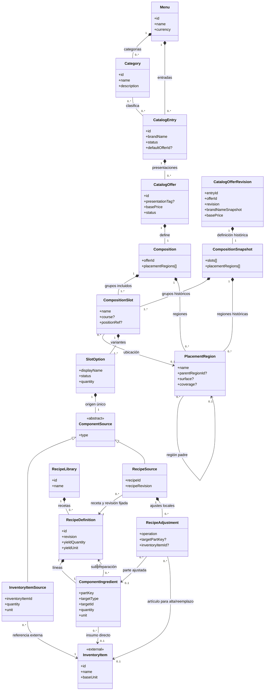
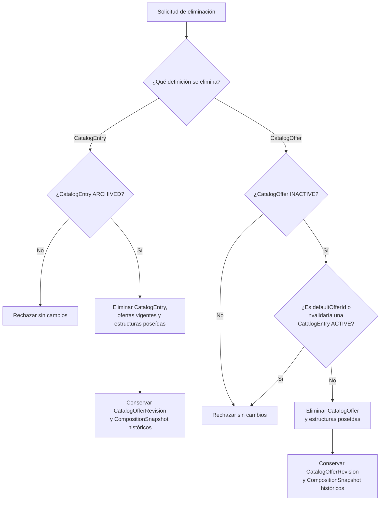
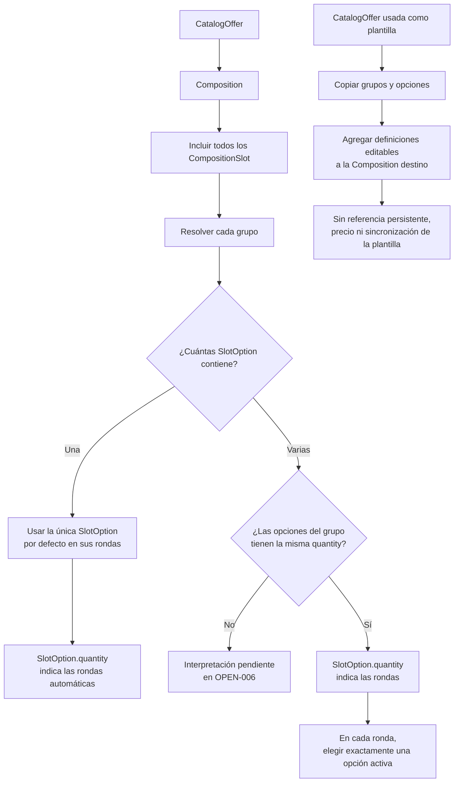
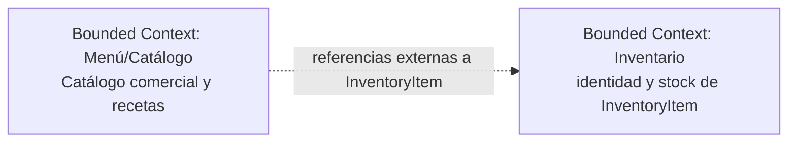

# Arquitectura de Dominio del Servicio Menu

## Modelo de Dominio

El modelo de Menú/Catálogo describe categorías, entradas comerciales, ofertas, composiciones, grupos de opciones de contenido y recetas. Menu contiene categorías y entradas; Category clasifica CatalogEntry; y CatalogEntry administra el nombre comercial, sus categorías y ofertas. Una CatalogEntry ACTIVE y publicable mantiene al menos una CatalogOffer ACTIVE y válida. Los estados de entrada y ofertas son independientes y no cambian automáticamente entre sí.

Toda oferta vendible posee una Composition con uno o más CompositionSlot y todos sus grupos se incluyen en la oferta. Cada CompositionSlot agrupa una o más SlotOption. Cuando contiene una sola opción, esta es la predeterminada; cuando contiene varias, el catálogo no declara una predeterminada y en cada ronda se elige exactamente una opción. SlotOption.quantity expresa las rondas asociadas a la opción; cuando las opciones de un mismo grupo tienen cantidades distintas, su interpretación conjunta queda pendiente en OPEN-006.

Una oferta del catálogo puede usarse como plantilla durante la configuración de otra oferta. Sus grupos y opciones se copian a la composición destino como definiciones locales editables. La copia conserva los orígenes de Inventario y las referencias a recetas y sus revisiones, pero no conserva la identidad, el precio ni una referencia persistente a la oferta plantilla; los cambios posteriores no se sincronizan.

RecipeLibrary reúne todas las RecipeDefinition del catálogo. RecipeSource referencia una receta por ID y revisión y mantiene ajustes locales para esa aparición. Inventario conserva la identidad y el stock de InventoryItem, al que Catálogo referencia externamente.

## Agregados y Límites de Consistencia

Las relaciones siguientes expresan propiedad y composición conceptual del modelo. No prescriben agregados transaccionales, persistencia ni claves físicas.

### Menú y catálogo comercial

Menu contiene categorías y entradas comerciales. Category clasifica cero o más CatalogEntry y una entrada puede clasificarse en varias categorías del mismo menú. CatalogEntry es la identidad comercial con nombre autoritativo, descripción, estado, imagen y ofertas vendibles. Una entrada puede administrarse incompleta o inactiva, pero para permanecer ACTIVE y publicable debe disponer de al menos una CatalogOffer ACTIVE y válida. Archivar una entrada puede hacerse desde ACTIVE o INACTIVE; desarchivarla siempre la deja INACTIVE. El estado de la entrada no modifica automáticamente el de sus ofertas.

### Oferta y composición

CatalogEntry puede tener CatalogOffer; una CatalogEntry ACTIVE requiere al menos una CatalogOffer ACTIVE y válida. Una oferta solo puede publicarse mientras su entrada esté ACTIVE y su Composition sea válida. CatalogOffer posee exactamente una Composition y su basePrice describe el precio fijo de esa oferta. Su nombre visible combina el nombre comercial de la entrada con la presentación opcional; presentationTag es descriptiva y no determina cantidades físicas.

Composition contiene uno o más CompositionSlot; todos se incluyen en la oferta. Cada grupo contiene una o más SlotOption, variantes de contenido que poseen un origen único. Los grupos y sus opciones son definiciones pertenecientes a la composición, no referencias a otras ofertas. Usar una oferta como plantilla copia esas definiciones a otra composición sin conservar relación con la oferta de origen.

RecipeLibrary contiene todas las RecipeDefinition. RecipeSource referencia una receta publicada por ID y revisión, y puede mantener ajustes locales para esa aparición. CompositionSnapshot pertenece exclusivamente a CatalogOfferRevision y conserva una definición histórica. InventoryItem y su stock siguen bajo Inventario.

Una CatalogEntry solo puede eliminarse desde ARCHIVED. Una CatalogOffer solo puede eliminarse individualmente desde INACTIVE, si no es el defaultOfferId de su entrada y su eliminación no deja una CatalogEntry ACTIVE sin una oferta ACTIVE y válida. No hay referencias vigentes de una oferta a otra que restrinjan estas eliminaciones. Al eliminar una entrada, su defaultOfferId y las ofertas y estructuras vigentes poseídas se retiran con ella. En ambas rutas, las revisiones históricas publicadas permanecen inmutables y consultables mediante offerId y revision.

## Entidades y Atributos Principales

La siguiente tabla resume los 18 conceptos del modelo, sus responsabilidades, atributos y relaciones. CatalogEntry declara ACTIVE, INACTIVE o ARCHIVED; CatalogOffer, SlotOption y RecipeDefinition declaran ACTIVE o INACTIVE. Los identificadores son conceptuales: no prescriben claves de base de datos ni un esquema de almacenamiento.

| Entidad o concepto | Responsabilidad | Atributos y relaciones principales |
| :--- | :--- | :--- |
| Menu | Propietario del conjunto de categorías y entradas comerciales. | id, name, currency; contiene Category y CatalogEntry. |
| Category | Categoría reutilizable que clasifica entradas. | id, menuId, name, description; pertenece a Menu y clasifica cero o más CatalogEntry. |
| CatalogEntry | Identidad comercial y administración de un producto de la carta. | id, menuId, brandName, description, imageRef, status, categoryIds[], defaultOfferId?; pertenece a Menu, tiene ofertas y usa categorías del mismo menú. Una entrada ACTIVE y publicable requiere al menos una oferta ACTIVE y válida; el estado no se propaga a sus ofertas. |
| CatalogOffer | Presentación vendible con precio base y composición propia. | id, entryId, presentationTag?, basePrice, status (ACTIVE/INACTIVE), offerImageRef; pertenece a CatalogEntry y contiene exactamente una Composition. La eliminación individual requiere INACTIVE, no ser defaultOfferId y no invalidar una entrada ACTIVE; las revisiones publicadas se conservan como historia consultable. |
| CatalogOfferRevision | Instantánea inmutable de una revisión publicada de oferta. | entryId, offerId, revision, brandNameSnapshot, basePrice, offerImageRef, compositionSnapshot; conserva la composición histórica consultable aunque se elimine la oferta vigente. |
| Composition | Define los grupos de opciones incluidos en una oferta. | id, offerId, slots[], placementRegions[]?; pertenece a CatalogOffer y contiene uno o más CompositionSlot. |
| CompositionSnapshot | Copia histórica completa de la composición de una revisión publicada. | slots[], placementRegions[]?; pertenece exclusivamente a CatalogOfferRevision y conserva los grupos y opciones de esa revisión. |
| CompositionSlot | Grupo funcional o espacial incluido en una composición. | id, compositionId, name, course?, positionRef?, options[]; pertenece a Composition y contiene una o más SlotOption. |
| PlacementRegion | Región o ubicación semántica descriptiva de una composición. | id, compositionId, name, parentRegionId?, surface?, coverage?; puede tener región padre y ser referida por CompositionSlot. |
| SlotOption | Variante de contenido dentro de un grupo. | id, slotId, displayName, status, quantity, source; pertenece a CompositionSlot y posee un ComponentSource. |
| ComponentSource | Tipo conceptual del origen único de una opción. | type: INVENTORY_ITEM o RECIPE; especialización exclusiva en InventoryItemSource o RecipeSource. |
| InventoryItemSource | Referencia directa a un artículo externo de Inventario. | inventoryItemId, quantity, unit, displayNameSnapshot?; referencia exactamente un InventoryItem. |
| RecipeSource | Uso de una receta de RecipeLibrary, con ajustes locales opcionales. | recipeId, recipeRevision, name?, adjustments[]; referencia por ID y revisión una RecipeDefinition publicada de RecipeLibrary y posee RecipeAdjustment para esa aparición. |
| InventoryItem | Artículo o ingrediente cuya identidad y stock son de Inventario. | id, name, baseUnit; concepto externo referenciado por InventoryItemSource y ComponentIngredient. |
| RecipeLibrary | Colección de recetas administradas por Catálogo. | id, name, recipes[]; contiene todas las RecipeDefinition del catálogo. |
| RecipeDefinition | Definición de receta con rendimiento y líneas. | id, name, description?, revision, yieldQuantity, yieldUnit, ingredients[], status; pertenece a RecipeLibrary. |
| ComponentIngredient | Aparición identificable de un ingrediente o receta en una receta. | id, recipeId, partKey, displayName?, targetType, targetId, targetRevision?, quantity, unit; apunta a InventoryItem o a una RecipeDefinition de RecipeLibrary. |
| RecipeAdjustment | Diferencia administrativa local sobre una receta usada en una aparición. | id, recipeSourceId, operation, targetPartKey?, inventoryItemId?, quantity?, unit?; pertenece a RecipeSource y apunta a la parte de origen cuando la operación lo requiere. |

### Selección de composición y contenido

La composición incluye todos sus grupos; la elección de contenido ocurre dentro de cada grupo:

- Una Composition tiene uno o más CompositionSlot y todos forman parte de la oferta.
- Cada CompositionSlot contiene una o más SlotOption.
- Si un grupo tiene una sola opción, se toma como predeterminada. Si tiene varias, no se configura una opción predeterminada en el catálogo y en cada ronda se elige exactamente una.
- SlotOption.quantity indica cuántas rondas representa esa opción. Por ejemplo, cuatro opciones con cantidad 2 presentan dos rondas independientes, cada una con una elección entre las opciones del grupo.
- Si las opciones de un mismo grupo declaran cantidades distintas, cómo se determina el número de rondas queda pendiente en OPEN-006.
- La cantidad de InventoryItemSource expresa cantidad y unidad del artículo; no sustituye las rondas de SlotOption.quantity.
- course sugiere un tiempo de servicio. positionRef señala ubicación espacial y no determina inclusión.
- PlacementRegion.name es una etiqueta descriptiva; surface y coverage son opcionales y quedan reservados para futuras implementaciones, sin comportamiento de cobertura en este modelo.
- Una SlotOption INACTIVE no se presenta como opción para una nueva selección.

### Recetas y precios

Inventory posee la identidad de InventoryItem y el stock. Catálogo administra RecipeLibrary, todas sus RecipeDefinition y las cantidades de sus ComponentIngredient. ComponentIngredient apunta a InventoryItem o a una RecipeDefinition de RecipeLibrary. Las recetas publicadas se identifican por revisión; no se alteran retroactivamente. Los ciclos entre recetas se impiden.

Una SlotOption de tipo RECIPE se configura seleccionando el ID de una RecipeDefinition existente en RecipeLibrary o definiendo una receta desde el flujo de configuración de esa opción. Al guardar la nueva definición, esta se almacena en RecipeLibrary; en ambos caminos, RecipeSource queda enlazado por recipeId y recipeRevision. RecipeAdjustment conserva cualquier diferencia administrativa para esa aparición y no cambia la receta compartida. INVENTORY_ITEM referencia un artículo externo.

InventoryItemSource declara cantidad positiva y unidad compatible con el artículo; su displayNameSnapshot es descriptivo y no crea identidad de Inventario. RecipeAdjustment usa ADD, REMOVE, OVERRIDE_QUANTITY o REPLACE_INVENTORY_ITEM: ADD requiere ingrediente y cantidad, y las demás operaciones sobre una parte requieren una línea de origen compatible. Los ajustes son locales a RecipeSource y no cambian la receta compartida.

CatalogOffer.basePrice es fijo para la oferta, independientemente de los grupos y contenidos elegidos. Ni CompositionSlot, SlotOption ni las definiciones copiadas de otra oferta aportan cargos automáticos a ese precio. El modelo no calcula el precio final de una orden.

### Diagramas Estructurales y de Comportamiento

#### Diagrama de Clases del Dominio Comercial

La vista siguiente resume el modelo. La composición representa pertenencia conceptual; las asociaciones y dependencias representan referencias y no prescriben claves foráneas.

Todas las RecipeDefinition pertenecen a RecipeLibrary. CompositionSnapshot pertenece únicamente a CatalogOfferRevision y conserva inmutable los grupos y opciones de la composición publicada. ComponentIngredient apunta a InventoryItem o a una RecipeDefinition de RecipeLibrary, nunca a ambos a la vez. RecipeAdjustment apunta a una parte de origen cuando operation lo requiere; ADD y REPLACE_INVENTORY_ITEM usan InventoryItem.

#### Estados comerciales

CatalogEntry declara status ACTIVE, INACTIVE o ARCHIVED. El archivado es reversible: una entrada puede archivarse desde ACTIVE o INACTIVE y al desarchivarse queda INACTIVE. CatalogOffer declara solo ACTIVE o INACTIVE; SlotOption y RecipeDefinition también declaran ACTIVE o INACTIVE. Para permanecer ACTIVE y publicable, una entrada necesita al menos una oferta ACTIVE y válida; una oferta solo se publica bajo una entrada ACTIVE y con composición válida. Los estados de la entrada y de sus ofertas son independientes y ninguna transición administrativa cambia automáticamente el estado de otra entidad. course no es un estado de marcha.

Una CatalogEntry solo puede eliminarse desde ARCHIVED. Una CatalogOffer solo puede eliminarse individualmente desde INACTIVE, si no es el defaultOfferId de su entrada y su eliminación no deja una CatalogEntry ACTIVE sin una oferta ACTIVE y válida. Las ofertas no mantienen referencias vigentes entre sí. Si una condición falla, la operación se rechaza íntegramente. Cuando procede, se retiran la definición vigente y sus estructuras poseídas; eliminar una entrada también retira su defaultOfferId junto con ella. CatalogOfferRevision y su CompositionSnapshot permanecen inmutables y consultables por offerId y revision.

#### Selección de una oferta y copia de una composición

El diagrama expresa la inclusión de grupos y la selección conceptual de opciones. No define una interfaz ni el contrato de una orden.

La configuración de una oferta concluye al definir su Composition, sus grupos y las opciones de contenido. La cantidad pedida y la resolución concreta de elecciones corresponden al modelo de una orden.

## Arquitectura y Límites del Sistema

### Diagrama de Contexto de Bounded Contexts

El límite de Menú/Catálogo contiene las definiciones comerciales y culinarias descritas aquí. Inventario mantiene la identidad de sus artículos y el stock; el catálogo conserva referencias externas a InventoryItem.

La relación expresa que Catálogo referencia identidades cuyo origen y stock pertenecen a Inventario.

### Patrones de Interacción y Comunicación

El modelo establece datos de catálogo y reglas para describir ofertas, composición y recetas. La cantidad pedida, las elecciones concretas de una orden, asientos, tiempos operacionales de marcha, disponibilidad en tiempo real, facturación y cálculo del precio final pertenecen a otros modelos. El documento no selecciona patrones de lectura/escritura, mecanismos de comunicación, APIs, eventos ni tecnologías de transporte.

### Aislamiento Lógico y Reglas de Integración

1. Menu es propietario de sus Category y CatalogEntry. CatalogEntry posee CatalogOffer; CatalogOffer posee Composition; las composiciones contienen grupos CompositionSlot y sus opciones SlotOption.
2. Catálogo administra RecipeLibrary, define sus recetas y las cantidades de sus ComponentIngredient, así como los ajustes administrativos locales de RecipeSource.
3. Inventario posee la identidad de InventoryItem y su stock. Catálogo referencia InventoryItem mediante identidades explícitas; igualdad numérica entre identificadores de contextos diferentes no establece identidad compartida.
4. La validez estructural de una receta no depende de existencias de Inventario. Catálogo no administra el stock externo.
5. CatalogOffer.basePrice es un dato declarado por el catálogo. El dominio no calcula precios finales de pedidos ni suma cargos por grupos, opciones o definiciones copiadas.
6. Las referencias recursivas entre recetas no pueden formar ciclos. Las recetas publicadas se identifican por revisión sin alterar retroactivamente composiciones ya publicadas.
7. La eliminación de una CatalogEntry archivada y la eliminación individual de una CatalogOffer inactiva siguen las condiciones de estado, defaultOfferId y validez de la entrada descritas arriba. Las ofertas no se referencian entre sí; CatalogOfferRevision y CompositionSnapshot históricos permanecen inmutables y consultables.
8. Las relaciones descritas son conceptuales. No prescriben tablas, claves foráneas, APIs, eventos, motor de resolución ni arquitectura de persistencia.
