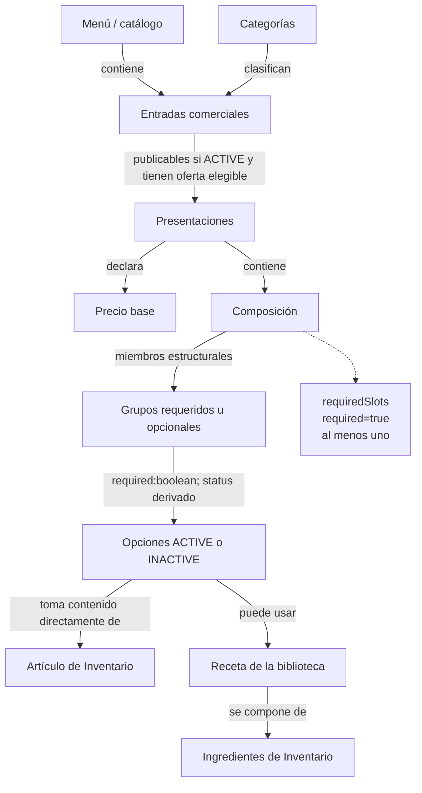
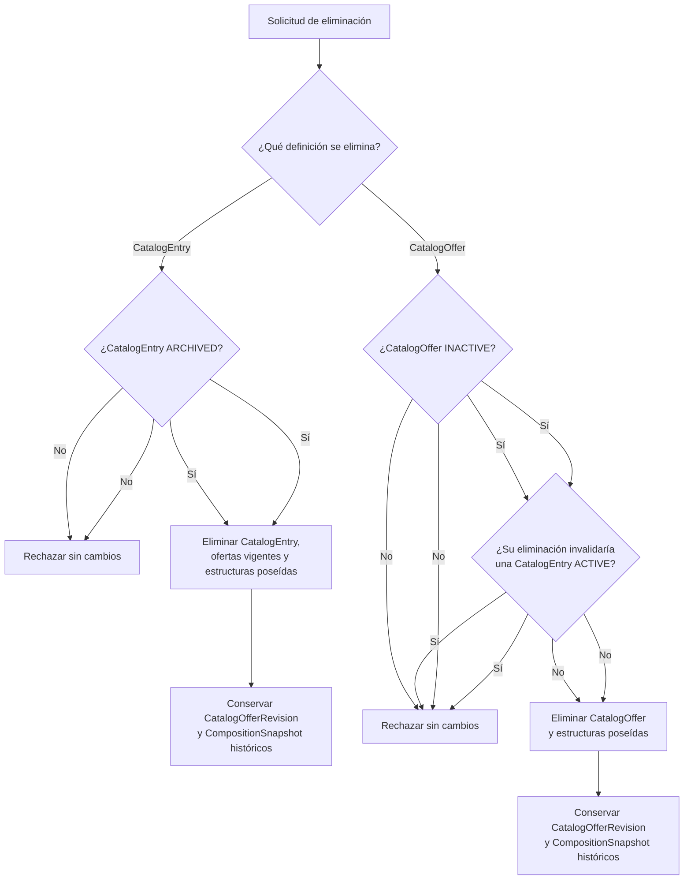
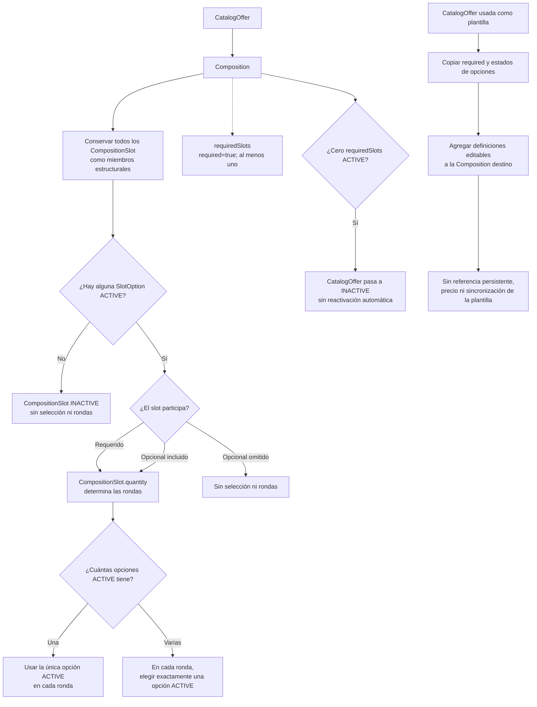
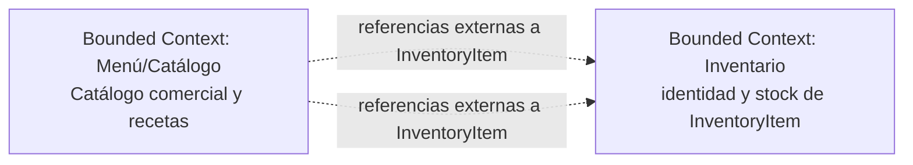

# Arquitectura de Dominio del Servicio Menu

## Modelo de Dominio

El modelo de Menú/Catálogo describe categorías, entradas comerciales, ofertas, composiciones, grupos de opciones de contenido y recetas. Menu contiene categorías y entradas; Category clasifica CatalogEntry; y CatalogEntry administra el nombre comercial y sus categorías, y agrupa sus CatalogOffer. Cada CatalogOffer concreta es seleccionable y vendible de forma individual. Una entrada se publica solo mientras está administrativamente ACTIVE y tiene al menos una oferta ACTIVE válida; si no tiene una, conserva su estado ACTIVE pero queda oculta. La inactivación automática de una oferta no cambia el estado administrativo de su entrada.
El modelo de Menú/Catálogo describe categorías, entradas comerciales, ofertas, composiciones, grupos de opciones de contenido y recetas. Menu contiene categorías y entradas; Category clasifica CatalogEntry; y CatalogEntry administra el nombre comercial y sus categorías, y agrupa sus CatalogOffer. Cada CatalogOffer concreta es seleccionable y vendible de forma individual. Una entrada se publica solo mientras está administrativamente ACTIVE y tiene al menos una oferta ACTIVE válida; si no tiene una, conserva su estado ACTIVE pero queda oculta. La inactivación automática de una oferta no cambia el estado administrativo de su entrada.

Toda oferta vendible posee una Composition con uno o más CompositionSlot; todos los grupos son miembros estructurales de la composición. Cada slot tiene `required: boolean`, y `requiredSlots` es el subconjunto de slots requeridos; la composición válida contiene al menos uno. El estado del slot se deriva de sus opciones: es ACTIVE si al menos una SlotOption está ACTIVE e INACTIVE si ninguna lo está. Un slot requerido ACTIVE participa; uno opcional ACTIVE puede omitirse; un slot INACTIVE no se selecciona ni genera rondas. `CompositionSlot.quantity` determina las rondas del grupo solo cuando participa. Si no queda ningún `requiredSlot` ACTIVE, CatalogOffer pasa automáticamente a INACTIVE y no se reactiva automáticamente al restaurar opciones; requiere activación administrativa. En cada ronda se elige exactamente una opción ACTIVE; cuando hay una sola opción ACTIVE, se selecciona automáticamente.
Toda oferta vendible posee una Composition con uno o más CompositionSlot; todos los grupos son miembros estructurales de la composición. Cada slot tiene `required: boolean`, y `requiredSlots` es el subconjunto de slots requeridos; la composición válida contiene al menos uno. El estado del slot se deriva de sus opciones: es ACTIVE si al menos una SlotOption está ACTIVE e INACTIVE si ninguna lo está. Un slot requerido ACTIVE participa; uno opcional ACTIVE puede omitirse; un slot INACTIVE no se selecciona ni genera rondas. `CompositionSlot.quantity` determina las rondas del grupo solo cuando participa. Si no queda ningún `requiredSlot` ACTIVE, CatalogOffer pasa automáticamente a INACTIVE y no se reactiva automáticamente al restaurar opciones; requiere activación administrativa. En cada ronda se elige exactamente una opción ACTIVE; cuando hay una sola opción ACTIVE, se selecciona automáticamente.

Una oferta del catálogo puede usarse como plantilla durante la configuración de otra oferta. Sus grupos y opciones se copian a la composición destino como definiciones locales editables, conservando para cada grupo `required` y los estados de sus opciones; el estado del grupo se deriva de las opciones copiadas. La copia conserva los orígenes de Inventario y las referencias a recetas y sus revisiones, pero no conserva la identidad, el precio ni una referencia persistente a la oferta plantilla; los cambios posteriores no se sincronizan.
Una oferta del catálogo puede usarse como plantilla durante la configuración de otra oferta. Sus grupos y opciones se copian a la composición destino como definiciones locales editables, conservando para cada grupo `required` y los estados de sus opciones; el estado del grupo se deriva de las opciones copiadas. La copia conserva los orígenes de Inventario y las referencias a recetas y sus revisiones, pero no conserva la identidad, el precio ni una referencia persistente a la oferta plantilla; los cambios posteriores no se sincronizan.

RecipeLibrary reúne las RecipeDefinition vigentes y sus revisiones históricas publicadas. Cada receta contiene instrucciones textuales y líneas ComponentIngredient que refieren a InventoryItem; Inventario conserva la identidad, la unidad de medida y el stock de esos artículos. RecipeSource fija el ID y la revisión de la receta asignada a una SlotOption.
RecipeLibrary reúne las RecipeDefinition vigentes y sus revisiones históricas publicadas. Cada receta contiene instrucciones textuales y líneas ComponentIngredient que refieren a InventoryItem; Inventario conserva la identidad, la unidad de medida y el stock de esos artículos. RecipeSource fija el ID y la revisión de la receta asignada a una SlotOption.

## Agregados y Límites de Consistencia

Las relaciones siguientes expresan propiedad y composición conceptual del modelo. No prescriben agregados transaccionales, persistencia ni claves físicas.

### Menú y catálogo comercial

Menu contiene categorías y entradas comerciales. Category clasifica cero o más CatalogEntry y una entrada puede clasificarse en varias categorías del mismo menú. CatalogEntry es la identidad comercial con nombre autoritativo, descripción, estado, imagen y un grupo de CatalogOffer, cada una vendible y seleccionable individualmente. Una entrada puede administrarse incompleta o inactiva; si está ACTIVE sin una CatalogOffer ACTIVE y válida permanece ACTIVE pero no se publica. Archivar una entrada puede hacerse desde ACTIVE o INACTIVE; desarchivarla siempre la deja INACTIVE. La inactivación de una oferta no modifica el estado administrativo de la entrada.
Menu contiene categorías y entradas comerciales. Category clasifica cero o más CatalogEntry y una entrada puede clasificarse en varias categorías del mismo menú. CatalogEntry es la identidad comercial con nombre autoritativo, descripción, estado, imagen y un grupo de CatalogOffer, cada una vendible y seleccionable individualmente. Una entrada puede administrarse incompleta o inactiva; si está ACTIVE sin una CatalogOffer ACTIVE y válida permanece ACTIVE pero no se publica. Archivar una entrada puede hacerse desde ACTIVE o INACTIVE; desarchivarla siempre la deja INACTIVE. La inactivación de una oferta no modifica el estado administrativo de la entrada.

### Oferta y composición

CatalogEntry agrupa CatalogOffer; cada oferta concreta puede seleccionarse individualmente. Una CatalogEntry solo se publica mientras está ACTIVE y tiene al menos una CatalogOffer ACTIVE y válida, pero su estado administrativo no depende de sus ofertas. Una oferta solo puede publicarse mientras su entrada esté ACTIVE y su Composition sea válida. CatalogOffer posee exactamente una Composition y su basePrice describe el precio fijo de esa oferta. Su nombre visible combina el nombre comercial de la entrada con la presentación opcional; presentationTag es descriptiva y no determina cantidades físicas.

Composition contiene uno o más CompositionSlot; todos permanecen como miembros estructurales de la oferta. Cada slot indica con `required: boolean` si es requerido u opcional; `requiredSlots` es el subconjunto con `required=true`, y la composición tiene al menos uno. Cada grupo contiene una o más SlotOption, variantes de contenido que poseen un origen único. Los grupos requeridos ACTIVE participan; los opcionales ACTIVE pueden omitirse; los INACTIVE no se seleccionan ni generan rondas. Si ningún `requiredSlot` queda ACTIVE, CatalogOffer pasa automáticamente a INACTIVE y no se reactiva automáticamente. Usar una oferta como plantilla copia los grupos, su atributo `required` y estados de opciones a otra composición sin conservar relación con la oferta de origen.

RecipeLibrary contiene las definiciones vigentes y revisiones históricas de receta. Cada RecipeSource referencia una receta publicada por ID y revisión. CompositionSnapshot pertenece exclusivamente a CatalogOfferRevision y conserva una definición histórica. InventoryItem, su unidad de medida y su stock siguen bajo Inventario.
CatalogEntry agrupa CatalogOffer; cada oferta concreta puede seleccionarse individualmente. Una CatalogEntry solo se publica mientras está ACTIVE y tiene al menos una CatalogOffer ACTIVE y válida, pero su estado administrativo no depende de sus ofertas. Una oferta solo puede publicarse mientras su entrada esté ACTIVE y su Composition sea válida. CatalogOffer posee exactamente una Composition y su basePrice describe el precio fijo de esa oferta. Su nombre visible combina el nombre comercial de la entrada con la presentación opcional; presentationTag es descriptiva y no determina cantidades físicas.

Composition contiene uno o más CompositionSlot; todos permanecen como miembros estructurales de la oferta. Cada slot indica con `required: boolean` si es requerido u opcional; `requiredSlots` es el subconjunto con `required=true`, y la composición tiene al menos uno. Cada grupo contiene una o más SlotOption, variantes de contenido que poseen un origen único. Los grupos requeridos ACTIVE participan; los opcionales ACTIVE pueden omitirse; los INACTIVE no se seleccionan ni generan rondas. Si ningún `requiredSlot` queda ACTIVE, CatalogOffer pasa automáticamente a INACTIVE y no se reactiva automáticamente. Usar una oferta como plantilla copia los grupos, su atributo `required` y estados de opciones a otra composición sin conservar relación con la oferta de origen.

RecipeLibrary contiene las definiciones vigentes y revisiones históricas de receta. Cada RecipeSource referencia una receta publicada por ID y revisión. CompositionSnapshot pertenece exclusivamente a CatalogOfferRevision y conserva una definición histórica. InventoryItem, su unidad de medida y su stock siguen bajo Inventario.

Una receta vigente solo puede eliminarse cuando ninguna SlotOption de ninguna oferta vigente la referencia, incluso si la oferta o la opción está inactiva. Si existe una referencia, se rechaza la eliminación sin cambios; las revisiones históricas publicadas permanecen consultables.

Una CatalogEntry solo puede eliminarse desde ARCHIVED. Una CatalogOffer solo puede eliminarse individualmente desde INACTIVE si su eliminación no deja una CatalogEntry ACTIVE sin una oferta ACTIVE y válida. No hay referencias vigentes de una oferta a otra que restrinjan estas eliminaciones. Al eliminar una entrada, las ofertas y estructuras vigentes poseídas se retiran con ella. En ambas rutas, las revisiones históricas publicadas permanecen inmutables y consultables mediante offerId y revision.
Una receta vigente solo puede eliminarse cuando ninguna SlotOption de ninguna oferta vigente la referencia, incluso si la oferta o la opción está inactiva. Si existe una referencia, se rechaza la eliminación sin cambios; las revisiones históricas publicadas permanecen consultables.

Una CatalogEntry solo puede eliminarse desde ARCHIVED. Una CatalogOffer solo puede eliminarse individualmente desde INACTIVE si su eliminación no deja una CatalogEntry ACTIVE sin una oferta ACTIVE y válida. No hay referencias vigentes de una oferta a otra que restrinjan estas eliminaciones. Al eliminar una entrada, las ofertas y estructuras vigentes poseídas se retiran con ella. En ambas rutas, las revisiones históricas publicadas permanecen inmutables y consultables mediante offerId y revision.

## Entidades y Atributos Principales

La siguiente tabla resume los 16 conceptos del modelo, sus responsabilidades, atributos y relaciones. CatalogEntry declara ACTIVE, INACTIVE o ARCHIVED; CatalogOffer, CompositionSlot, SlotOption y RecipeDefinition declaran ACTIVE o INACTIVE. El estado de CompositionSlot es derivado de las opciones. Los identificadores son conceptuales: no prescriben claves de base de datos ni un esquema de almacenamiento.

| Entidad o concepto | Responsabilidad | Atributos y relaciones principales |
| :--- | :--- | :--- |
| Menu | Propietario del conjunto de categorías y entradas comerciales. | id, name, currency; contiene Category y CatalogEntry. |
| Category | Categoría reutilizable que clasifica entradas. | id, menuId, name, description; pertenece a Menu y clasifica cero o más CatalogEntry. |
| CatalogEntry | Identidad comercial que agrupa las ofertas de un producto de la carta. | id, menuId, brandName, description, imageRef, status, categoryIds[]; pertenece a Menu, agrupa CatalogOffer y usa categorías del mismo menú. Se publica solo si está ACTIVE y tiene al menos una oferta ACTIVE válida; si no, permanece ACTIVE pero oculta. La oferta no cambia el estado administrativo de la entrada. |
| CatalogOffer | Oferta concreta, individualmente vendible y seleccionable, con precio base y composición propia. | id, entryId, presentationTag?, basePrice, status (ACTIVE/INACTIVE), offerImageRef; pertenece a CatalogEntry y contiene exactamente una Composition. Pasa a INACTIVE si ningún requiredSlot está ACTIVE y no se reactiva automáticamente. La eliminación individual requiere INACTIVE y no invalidar una entrada ACTIVE; las revisiones publicadas se conservan como historia consultable. |
| CatalogEntry | Identidad comercial que agrupa las ofertas de un producto de la carta. | id, menuId, brandName, description, imageRef, status, categoryIds[]; pertenece a Menu, agrupa CatalogOffer y usa categorías del mismo menú. Se publica solo si está ACTIVE y tiene al menos una oferta ACTIVE válida; si no, permanece ACTIVE pero oculta. La oferta no cambia el estado administrativo de la entrada. |
| CatalogOffer | Oferta concreta, individualmente vendible y seleccionable, con precio base y composición propia. | id, entryId, presentationTag?, basePrice, status (ACTIVE/INACTIVE), offerImageRef; pertenece a CatalogEntry y contiene exactamente una Composition. Pasa a INACTIVE si ningún requiredSlot está ACTIVE y no se reactiva automáticamente. La eliminación individual requiere INACTIVE y no invalidar una entrada ACTIVE; las revisiones publicadas se conservan como historia consultable. |
| CatalogOfferRevision | Instantánea inmutable de una revisión publicada de oferta. | entryId, offerId, revision, brandNameSnapshot, basePrice, offerImageRef, compositionSnapshot; conserva la composición histórica consultable aunque se elimine la oferta vigente. |
| Composition | Define los grupos de opciones de una oferta. | id, offerId, slots[], requiredSlots[] (subconjunto derivado); pertenece a CatalogOffer, conserva todos sus slots como miembros estructurales y requiere al menos un slot requerido. |
| CompositionSnapshot | Copia histórica completa de la composición de una revisión publicada. | slots[], requiredSlots[] (derivado); pertenece exclusivamente a CatalogOfferRevision y conserva slots, atributos required y estados de opciones de esa revisión. |
| CompositionSlot | Grupo requerido u opcional de una composición, propietario de sus rondas cuando participa. | id, compositionId, name, required:boolean, status (ACTIVE/INACTIVE, derivado), quantity, course? (entrada, plato fuerte, postre o bebida), options[]; el curso es una sugerencia de tiempo de servicio; pertenece a Composition y contiene una o más SlotOption. Solo required ACTIVE participa; optional ACTIVE puede omitirse; INACTIVE no genera rondas. |
| SlotOption | Variante de contenido dentro de un grupo. | id, slotId, displayName, status, source; pertenece a CompositionSlot y posee un ComponentSource. Un slot es ACTIVE si al menos una opción está ACTIVE. |
| ComponentSource | Tipo conceptual del origen único de una opción. | type: INVENTORY_ITEM o RECIPE; especialización exclusiva en InventoryItemSource o RecipeSource. |
| InventoryItemSource | Referencia directa a un artículo externo de Inventario. | inventoryItemId, quantity, unit, displayNameSnapshot?; referencia exactamente un InventoryItem. |
| RecipeSource | Referencia a una receta de RecipeLibrary desde una SlotOption. | recipeId, recipeRevision; fija una RecipeDefinition publicada. |
| InventoryItem | Artículo o ingrediente cuya identidad, unidad de medida y stock son de Inventario. | id, name, baseUnit; concepto externo referenciado por InventoryItemSource y ComponentIngredient. |
| RecipeLibrary | Colección de recetas administradas por Catálogo. | id, name, recipes[]; contiene definiciones vigentes e historial de revisiones publicadas. |
| RecipeDefinition | Receta versionada con datos textuales, rendimiento y líneas de ingredientes. | id, name, description, instructions (texto), revision, yieldQuantity, yieldUnit, ingredients[], status; pertenece a RecipeLibrary. |
| ComponentIngredient | Ingrediente de Inventario incluido en una receta. | id, recipeId, inventoryItemId, quantity, unit; referencia exactamente un InventoryItem. La unidad de Inventario se muestra al seleccionar, consultar o editar. |
| RecipeSource | Referencia a una receta de RecipeLibrary desde una SlotOption. | recipeId, recipeRevision; fija una RecipeDefinition publicada. |
| InventoryItem | Artículo o ingrediente cuya identidad, unidad de medida y stock son de Inventario. | id, name, baseUnit; concepto externo referenciado por InventoryItemSource y ComponentIngredient. |
| RecipeLibrary | Colección de recetas administradas por Catálogo. | id, name, recipes[]; contiene definiciones vigentes e historial de revisiones publicadas. |
| RecipeDefinition | Receta versionada con datos textuales, rendimiento y líneas de ingredientes. | id, name, description, instructions (texto), revision, yieldQuantity, yieldUnit, ingredients[], status; pertenece a RecipeLibrary. |
| ComponentIngredient | Ingrediente de Inventario incluido en una receta. | id, recipeId, inventoryItemId, quantity, unit; referencia exactamente un InventoryItem. La unidad de Inventario se muestra al seleccionar, consultar o editar. |

### Selección de composición y contenido

Todos los grupos pertenecen estructuralmente a la composición, pero solo los participantes generan selección:

- Una Composition tiene uno o más CompositionSlot; cada uno tiene `required: boolean`. `requiredSlots` es el subconjunto derivado de los slots con `required=true`, y toda composición tiene al menos un requerido.
- Cada CompositionSlot contiene una o más SlotOption. Su estado derivado es ACTIVE si al menos una opción está ACTIVE, e INACTIVE si ninguna lo está.
- Un slot requerido ACTIVE participa. Un slot opcional ACTIVE puede incluirse u omitirse. Un slot INACTIVE no puede seleccionarse ni genera rondas.
- CompositionSlot.quantity determina cuántas rondas tiene el grupo cuando participa; la cantidad es del grupo, no de cada opción. En cada ronda se elige exactamente una de sus opciones ACTIVE. Por ejemplo, un grupo de acompañamientos con quantity 3 tiene tres rondas cuando participa, eligiendo en cada una entre papas, aros de cebolla o nuggets ACTIVE.
- Si un grupo participante tiene una sola opción ACTIVE, se selecciona automáticamente en cada ronda. Si tiene varias opciones ACTIVE, no se configura una opción predeterminada en el catálogo.
- Si ningún elemento de requiredSlots está ACTIVE, CatalogOffer pasa automáticamente a INACTIVE. Si posteriormente vuelve a haber un requiredSlot ACTIVE, la oferta no se reactiva sin una activación administrativa.
- La cantidad de InventoryItemSource expresa la cantidad y unidad física del artículo; no sustituye las rondas definidas por CompositionSlot.quantity.
- course es opcional; cuando se informa, acepta exactamente entrada, plato fuerte, postre o bebida y sugiere un tiempo de servicio.
- Una SlotOption INACTIVE no se presenta como opción para una nueva selección.

### Recetas y precios

Inventory posee la identidad, unidad de medida y stock de InventoryItem. Catálogo administra RecipeLibrary, las definiciones de receta y las cantidades de sus ComponentIngredient. Cada receta se crea con nombre, descripción, instrucciones en texto y una o más líneas de ingredientes seleccionados de Inventario. Cada línea contiene una referencia a InventoryItem y una cantidad; la unidad administrada por Inventario se muestra al seleccionar, consultar o editar el ingrediente. Su precisión, rangos y conversiones se remiten a OPEN-006.

Una SlotOption de tipo RECIPE se configura seleccionando una receta existente de RecipeLibrary por ID y revisión o definiendo una nueva desde el flujo de configuración. La nueva definición se guarda en RecipeLibrary y RecipeSource conserva su ID y revisión. La opción no modifica la receta asignada. Editar una receta publicada crea una revisión nueva; sus referencias previas permanecen fijadas a la revisión anterior.

La definición vigente de una receta solo puede eliminarse cuando ninguna SlotOption de ninguna oferta vigente la referencia, aunque la oferta o la opción esté inactiva. Si hay una referencia, se rechaza la operación sin cambios; se conservan las revisiones históricas publicadas. INVENTORY_ITEM referencia directamente un artículo externo.

CatalogOffer.basePrice es fijo para la oferta, independientemente de los grupos y contenidos elegidos. Ni CompositionSlot, SlotOption ni las definiciones copiadas de otra oferta aportan cargos automáticos a ese precio. El modelo no calcula el precio final de una orden.
CatalogOffer.basePrice es fijo para la oferta, independientemente de los grupos y contenidos elegidos. Ni CompositionSlot, SlotOption ni las definiciones copiadas de otra oferta aportan cargos automáticos a ese precio. El modelo no calcula el precio final de una orden.

### Diagramas Estructurales y de Comportamiento

#### Vista conceptual del catálogo (para Front)

Cada opción tiene un único origen de contenido: un artículo de Inventario o una receta de la biblioteca. La vista conceptual resume cómo se organiza el catálogo:



Inventario conserva la identidad de los artículos, sus unidades y existencias. Menú/Catálogo administra las ofertas comerciales y la biblioteca de recetas; cada opción de tipo RECIPE referencia la receta seleccionada por ID y revisión. Solo los grupos requeridos ACTIVE y los opcionales ACTIVE elegidos participan en la selección; los INACTIVE no generan rondas. Menú declara el precio base de cada presentación; no calcula el precio final de la orden.

#### Vista técnica: diagrama de clases del dominio comercial (para Back)

La vista técnica detalla el mismo modelo comercial representado en la vista conceptual. La composición representa pertenencia conceptual; las asociaciones y dependencias representan referencias y no prescriben claves foráneas.
#### Vista conceptual del catálogo (para Front)

Cada opción tiene un único origen de contenido: un artículo de Inventario o una receta de la biblioteca. La vista conceptual resume cómo se organiza el catálogo:


Inventario conserva la identidad de los artículos, sus unidades y existencias. Menú/Catálogo administra las ofertas comerciales y la biblioteca de recetas; cada opción de tipo RECIPE referencia la receta seleccionada por ID y revisión. Solo los grupos requeridos ACTIVE y los opcionales ACTIVE elegidos participan en la selección; los INACTIVE no generan rondas. Menú declara el precio base de cada presentación; no calcula el precio final de la orden.

#### Vista técnica: diagrama de clases del dominio comercial (para Back)

La vista técnica detalla el mismo modelo comercial representado en la vista conceptual. La composición representa pertenencia conceptual; las asociaciones y dependencias representan referencias y no prescriben claves foráneas.

```mermaid
classDiagram
    direction TB
    class Menu {
        +id
        +name
        +currency
    }
    class Category {
        +id
        +name
        +description
    }
    class CatalogEntry {
        +id
        +brandName
        +status
    }
    class CatalogOffer {
        +id
        +presentationTag?
        +basePrice
        +status
    }
    class CatalogOfferRevision {
        +entryId
        +offerId
        +revision
        +brandNameSnapshot
        +basePrice
    }
    class Composition {
        +offerId
        +slots[]
        +requiredSlots[] (derived)
    }
    class CompositionSnapshot {
        +slots[]
        +requiredSlots[] (derived)
    }
    class CompositionSlot {
        +required: boolean
        +status (derived)
        +required: boolean
        +status (derived)
        +name
        +quantity
        +course?
    }
    class SlotOption {
    class SlotOption {
        +displayName
        +status
    }
    class ComponentSource {
        <<abstract>>
        +type
    }
    class InventoryItemSource {
        +inventoryItemId
        +quantity
        +unit
    }
    class RecipeSource {
    class RecipeSource {
        +recipeId
        +recipeRevision
    }
    class InventoryItem {
        <<external>>
        +id
        +name
        +baseUnit
    }
    class RecipeLibrary {
        +id
        +name
    }
    class RecipeDefinition {
        +id
        +name
        +description
        +instructions
        +name
        +description
        +instructions
        +revision
        +yieldQuantity
        +yieldUnit
    }
    class ComponentIngredient {
        +inventoryItemId
        +inventoryItemId
        +quantity
        +unit
    }
    Menu "1" *-- "0..*" Category : categorías
    Menu "1" *-- "0..*" CatalogEntry : entradas
    Category "0..*" -- "0..*" CatalogEntry : clasifica
    CatalogEntry "1" *-- "0..*" CatalogOffer : ofertas
    CatalogEntry "1" *-- "0..*" CatalogOffer : ofertas
    CatalogOffer "1" *-- "1" Composition : define
    CatalogOfferRevision "1" *-- "1" CompositionSnapshot : definición histórica
    Composition "1" *-- "1..*" CompositionSlot : miembros estructurales
    CompositionSnapshot "1" *-- "1..*" CompositionSlot : grupos históricos
    CompositionSlot "1" *-- "1..*" SlotOption : variantes
    SlotOption "1" *-- "1" ComponentSource : origen único
    ComponentSource <|-- InventoryItemSource
    ComponentSource <|-- RecipeSource
    ComponentSource <|-- RecipeSource
    InventoryItemSource "0..*" --> "1" InventoryItem : referencia externa
    RecipeLibrary "1" *-- "0..*" RecipeDefinition : definiciones e historial
    RecipeSource "0..*" --> "1" RecipeDefinition : receta y revisión fijada
    RecipeLibrary "1" *-- "0..*" RecipeDefinition : definiciones e historial
    RecipeSource "0..*" --> "1" RecipeDefinition : receta y revisión fijada
    RecipeDefinition "1" *-- "1..*" ComponentIngredient : líneas
    ComponentIngredient "0..*" --> "1" InventoryItem : ingrediente
```

Todas las RecipeDefinition vigentes pertenecen a RecipeLibrary y sus revisiones publicadas conservan su historial. CompositionSnapshot pertenece únicamente a CatalogOfferRevision y conserva inmutables los grupos con su atributo required y el estado de sus opciones; el estado de cada grupo se deriva de ellas. Cada ComponentIngredient referencia exactamente un InventoryItem, conserva su cantidad y muestra la unidad que administra Inventario. RecipeSource fija ID y revisión.
    ComponentIngredient "0..*" --> "1" InventoryItem : ingrediente
```

Todas las RecipeDefinition vigentes pertenecen a RecipeLibrary y sus revisiones publicadas conservan su historial. CompositionSnapshot pertenece únicamente a CatalogOfferRevision y conserva inmutables los grupos con su atributo required y el estado de sus opciones; el estado de cada grupo se deriva de ellas. Cada ComponentIngredient referencia exactamente un InventoryItem, conserva su cantidad y muestra la unidad que administra Inventario. RecipeSource fija ID y revisión.

#### Estados comerciales

CatalogEntry declara status ACTIVE, INACTIVE o ARCHIVED. El archivado es reversible: una entrada puede archivarse desde ACTIVE o INACTIVE y al desarchivarse queda INACTIVE. Su estado administrativo es independiente: permanece ACTIVE aunque quede sin ofertas elegibles, pero no se publica hasta tener una oferta ACTIVE válida. CatalogOffer declara ACTIVE o INACTIVE; SlotOption también declara esos estados, mientras que el estado de CompositionSlot se deriva: ACTIVE si al menos una SlotOption está ACTIVE e INACTIVE si ninguna lo está. CatalogOffer pasa automáticamente a INACTIVE cuando cero elementos de requiredSlots están ACTIVE; recuperar luego uno o más slots no reactiva automáticamente la oferta. Una oferta solo se publica bajo una entrada ACTIVE y con composición válida. course es opcional y, cuando se informa, acepta exactamente entrada, plato fuerte, postre o bebida como sugerencia de tiempo de servicio; no es un estado de marcha.
CatalogEntry declara status ACTIVE, INACTIVE o ARCHIVED. El archivado es reversible: una entrada puede archivarse desde ACTIVE o INACTIVE y al desarchivarse queda INACTIVE. Su estado administrativo es independiente: permanece ACTIVE aunque quede sin ofertas elegibles, pero no se publica hasta tener una oferta ACTIVE válida. CatalogOffer declara ACTIVE o INACTIVE; SlotOption también declara esos estados, mientras que el estado de CompositionSlot se deriva: ACTIVE si al menos una SlotOption está ACTIVE e INACTIVE si ninguna lo está. CatalogOffer pasa automáticamente a INACTIVE cuando cero elementos de requiredSlots están ACTIVE; recuperar luego uno o más slots no reactiva automáticamente la oferta. Una oferta solo se publica bajo una entrada ACTIVE y con composición válida. course es opcional y, cuando se informa, acepta exactamente entrada, plato fuerte, postre o bebida como sugerencia de tiempo de servicio; no es un estado de marcha.

Una CatalogEntry solo puede eliminarse desde ARCHIVED. Una CatalogOffer solo puede eliminarse individualmente desde INACTIVE si su eliminación no deja una CatalogEntry ACTIVE sin una oferta ACTIVE y válida. Las ofertas no mantienen referencias vigentes entre sí. Si una condición falla, la operación se rechaza íntegramente. Cuando procede, se retiran la definición vigente y sus estructuras poseídas. CatalogOfferRevision y su CompositionSnapshot permanecen inmutables y consultables por offerId y revision.
Una CatalogEntry solo puede eliminarse desde ARCHIVED. Una CatalogOffer solo puede eliminarse individualmente desde INACTIVE si su eliminación no deja una CatalogEntry ACTIVE sin una oferta ACTIVE y válida. Las ofertas no mantienen referencias vigentes entre sí. Si una condición falla, la operación se rechaza íntegramente. Cuando procede, se retiran la definición vigente y sus estructuras poseídas. CatalogOfferRevision y su CompositionSnapshot permanecen inmutables y consultables por offerId y revision.



#### Selección de una oferta y copia de una composición

El diagrama separa la pertenencia estructural de la participación en la selección. No define una interfaz ni el contrato de una orden.
#### Selección de una oferta y copia de una composición

El diagrama separa la pertenencia estructural de la participación en la selección. No define una interfaz ni el contrato de una orden.



La configuración de una oferta concluye al definir su Composition, los atributos requeridos u opcionales de sus grupos y las opciones de contenido. La cantidad pedida y la resolución concreta de elecciones corresponden al modelo de una orden.
    Offer["CatalogOffer"] --> Composition["Composition"]
    Composition --> AllSlots["Conservar todos los CompositionSlot<br/>como miembros estructurales"]
    Composition -.-> RequiredSlots["requiredSlots<br/>required=true; al menos uno"]
    AllSlots --> GroupStatus{"¿Hay alguna SlotOption ACTIVE?"}
    GroupStatus -->|No| InactiveSlot["CompositionSlot INACTIVE<br/>sin selección ni rondas"]
    GroupStatus -->|Sí| Participation{"¿El slot participa?"}
    Participation -->|Requerido| Rounds["CompositionSlot.quantity<br/>determina las rondas"]
    Participation -->|Opcional incluido| Rounds
    Participation -->|Opcional omitido| Omitted["Sin selección ni rondas"]
    Rounds --> Count{"¿Cuántas opciones ACTIVE tiene?"}
    Count -->|Una| Default["Usar la única opción ACTIVE<br/>en cada ronda"]
    Count -->|Varias| Choice["En cada ronda,<br/>elegir exactamente una opción ACTIVE"]
    Composition --> ActiveRequired{"¿Cero requiredSlots ACTIVE?"}
    ActiveRequired -->|Sí| DeactivateOffer["CatalogOffer pasa a INACTIVE<br/>sin reactivación automática"]

    Template["CatalogOffer usada como plantilla"] --> Copy["Copiar required y estados de opciones"]
    Copy --> Destination["Agregar definiciones editables<br/>a la Composition destino"]
    Destination --> Independent["Sin referencia persistente,<br/>precio ni sincronización de la plantilla"]
```

La configuración de una oferta concluye al definir su Composition, los atributos requeridos u opcionales de sus grupos y las opciones de contenido. La cantidad pedida y la resolución concreta de elecciones corresponden al modelo de una orden.

## Arquitectura y Límites del Sistema

### Diagrama de Contexto de Bounded Contexts

El límite de Menú/Catálogo contiene las definiciones comerciales y culinarias descritas aquí. Inventario mantiene la identidad de sus artículos y el stock; el catálogo conserva referencias externas a InventoryItem.



La relación expresa que Catálogo referencia identidades cuyo origen y stock pertenecen a Inventario.

### Patrones de Interacción y Comunicación

El modelo establece datos de catálogo y reglas para describir ofertas, composición y recetas. La cantidad pedida, las elecciones concretas de una orden, asientos, tiempos operacionales de marcha, disponibilidad en tiempo real, facturación y cálculo del precio final pertenecen a otros modelos. El documento no selecciona patrones de lectura/escritura, mecanismos de comunicación, APIs, eventos ni tecnologías de transporte.
El modelo establece datos de catálogo y reglas para describir ofertas, composición y recetas. La cantidad pedida, las elecciones concretas de una orden, asientos, tiempos operacionales de marcha, disponibilidad en tiempo real, facturación y cálculo del precio final pertenecen a otros modelos. El documento no selecciona patrones de lectura/escritura, mecanismos de comunicación, APIs, eventos ni tecnologías de transporte.

### Aislamiento Lógico y Reglas de Integración

1. Menu es propietario de sus Category y CatalogEntry. CatalogEntry posee CatalogOffer; CatalogOffer posee Composition; las composiciones contienen grupos CompositionSlot y sus opciones SlotOption.
2. Catálogo administra RecipeLibrary, define sus recetas con datos textuales y cantidades de ingredientes, y asigna una receta a SlotOption mediante ID y revisión.
3. Inventario posee la identidad, unidad de medida y stock de InventoryItem. Catálogo referencia InventoryItem mediante identidades explícitas; igualdad numérica entre identificadores de contextos diferentes no establece identidad compartida.
1. Menu es propietario de sus Category y CatalogEntry. CatalogEntry posee CatalogOffer; CatalogOffer posee Composition; las composiciones contienen grupos CompositionSlot y sus opciones SlotOption.
2. Catálogo administra RecipeLibrary, define sus recetas con datos textuales y cantidades de ingredientes, y asigna una receta a SlotOption mediante ID y revisión.
3. Inventario posee la identidad, unidad de medida y stock de InventoryItem. Catálogo referencia InventoryItem mediante identidades explícitas; igualdad numérica entre identificadores de contextos diferentes no establece identidad compartida.
4. La validez estructural de una receta no depende de existencias de Inventario. Catálogo no administra el stock externo.
5. CatalogOffer.basePrice es un dato declarado por el catálogo. El dominio no calcula precios finales de pedidos ni suma cargos por grupos, opciones o definiciones copiadas.
6. Las recetas publicadas se identifican por revisión; editarlas no cambia referencias existentes. La definición vigente solo se elimina si ninguna SlotOption de una oferta vigente la referencia, y las revisiones históricas permanecen inmutables y consultables.
7. La eliminación de una CatalogEntry archivada y la eliminación individual de una CatalogOffer inactiva siguen las condiciones de estado y validez de la entrada descritas arriba. Las ofertas no se referencian entre sí; CatalogOfferRevision y CompositionSnapshot históricos permanecen inmutables y consultables.
5. CatalogOffer.basePrice es un dato declarado por el catálogo. El dominio no calcula precios finales de pedidos ni suma cargos por grupos, opciones o definiciones copiadas.
6. Las recetas publicadas se identifican por revisión; editarlas no cambia referencias existentes. La definición vigente solo se elimina si ninguna SlotOption de una oferta vigente la referencia, y las revisiones históricas permanecen inmutables y consultables.
7. La eliminación de una CatalogEntry archivada y la eliminación individual de una CatalogOffer inactiva siguen las condiciones de estado y validez de la entrada descritas arriba. Las ofertas no se referencian entre sí; CatalogOfferRevision y CompositionSnapshot históricos permanecen inmutables y consultables.
8. Las relaciones descritas son conceptuales. No prescriben tablas, claves foráneas, APIs, eventos, motor de resolución ni arquitectura de persistencia.
