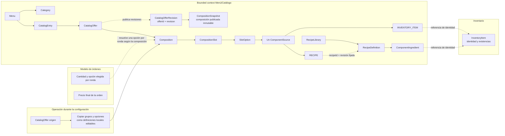
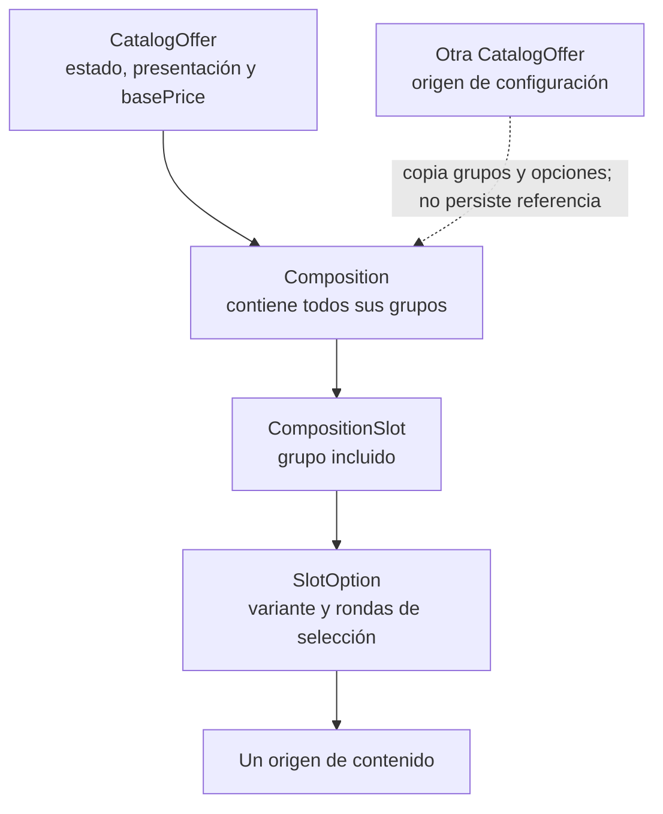

# Contexto, alcance y lenguaje del dominio

## Responsabilidad del bounded context Menú/Catálogo

El bounded context Menú/Catálogo define la identidad comercial de las entradas de la carta, sus presentaciones vendibles y la composición de cada presentación. También administra las categorías del menú y las recetas que el catálogo utiliza para describir elaboraciones.

El modelo organiza esta responsabilidad en tres niveles:

1. **Identidad comercial:** `Menu` agrupa categorías y entradas. `CatalogEntry` conserva la identidad de un producto de la carta y sus categorías.
2. **Presentación vendible:** cada `CatalogEntry` puede ofrecer una o más `CatalogOffer`. Cada oferta define su precio base y una `Composition`.
3. **Composición y contenido:** una composición contiene todos sus grupos (`CompositionSlot`). Cada grupo reúne una o más variantes (`SlotOption`) que describen el contenido posible en ese grupo.

El nombre visible combina el `brandName` de `CatalogEntry` con el `presentationTag` opcional de `CatalogOffer`. La presentación describe la oferta. Una entrada `ACTIVE` requiere al menos una `CatalogOffer` `ACTIVE` y válida; una oferta solo se publica bajo una entrada `ACTIVE`. `CatalogEntry` tiene los estados `ACTIVE`, `INACTIVE` y `ARCHIVED`; `CatalogOffer`, `SlotOption` y `RecipeDefinition` tienen `ACTIVE` e `INACTIVE`. Los estados de la entrada y de sus ofertas son independientes: cambiar uno no modifica automáticamente el otro.

### Composición y selección

- Cada oferta contiene exactamente una composición, con uno o más `CompositionSlot`; todos los grupos de la composición se incluyen en la oferta. No se configura la inclusión opcional de grupos ni límites mínimos o máximos de selección de grupos.
- Cada `CompositionSlot` representa un grupo por su función o posición y contiene una o más `SlotOption`. Cada opción es una variante de contenido dentro del mismo grupo.
- Si un grupo tiene una sola opción, esa opción se toma como predeterminada. Si tiene varias, el cliente elige exactamente una opción en cada ronda de selección.
- `SlotOption.quantity` indica cuántas rondas de selección se resuelven para el grupo. Por ejemplo, si las cuatro opciones de un grupo tienen cantidad 2, se realizan dos elecciones independientes entre esas cuatro opciones. La interpretación conjunta de opciones del mismo grupo con cantidades distintas permanece pendiente en OPEN-006.
- `course` sugiere un tiempo de servicio. `positionRef` señala una ubicación y no determina qué opción se elige. `PlacementRegion.name` es descriptivo; `surface` y `coverage` son atributos opcionales reservados para el futuro.
- Durante la configuración, se puede elegir otra `CatalogOffer` como origen para copiar sus grupos y opciones a la composición destino. La copia queda como definiciones locales, independientes y editables. La oferta destino no conserva el ID ni una referencia a la oferta origen, no sincroniza cambios con ella y no copia su precio.

### Contenido y recetas

Cada `SlotOption` es una aparición contextual con exactamente un `ComponentSource`: `INVENTORY_ITEM` o `RECIPE`. Varias opciones pueden referir el mismo artículo o la misma definición de receta en apariciones distintas.

Catálogo administra las `RecipeDefinition` en `RecipeLibrary` y sus líneas `ComponentIngredient`. Todas las recetas se almacenan en la biblioteca; si esta se comparte entre varios menús o tiene alcance de un solo menú permanece pendiente en OPEN-003. Al configurar una `SlotOption` de tipo `RECIPE`, se puede seleccionar una receta existente por ID o definir una receta desde ese flujo. Una receta nueva se guarda en `RecipeLibrary`; la opción referencia su ID y la revisión fijada. `RecipeSource` identifica esa aparición mediante `recipeSourceId`, referencia la `RecipeDefinition` mediante `recipeId` y su revisión fijada, y puede declarar ajustes administrativos locales mediante `RecipeAdjustment`. Los ajustes describen diferencias para esa aparición y conservan la definición de biblioteca como fuente común.

Una línea `ComponentIngredient` identifica una aparición de un `InventoryItem` o de una receta de `RecipeLibrary` y expresa su cantidad y unidad. Una receta requiere una cantidad de rendimiento y una unidad; sus revisiones identifican la definición utilizada. Las referencias recursivas entre recetas se mantienen sin ciclos. La cantidad y unidad de un contenido directo de Inventario son distintas de `SlotOption.quantity`, que expresa rondas de selección.

`CompositionSnapshot` conserva la composición publicada de una revisión de la propia `CatalogOffer` y pertenece únicamente a `CatalogOfferRevision`. No representa una referencia a la oferta que pudo servir como origen durante la configuración.

Una oferta `INACTIVE` no se presenta como alternativa vigente. Archivar una entrada desde `ACTIVE` o `INACTIVE` la retira del flujo normal sin modificar los estados de sus ofertas; desarchivarla la deja en `INACTIVE`.

Una `CatalogEntry` solo puede eliminarse cuando está `ARCHIVED`. Una `CatalogOffer` solo puede eliminarse individualmente cuando está `INACTIVE`, no es el `defaultOfferId` de su entrada y su eliminación no deja una entrada `ACTIVE` sin una oferta `ACTIVE` y válida. `defaultOfferId` pertenece a la entrada e impide eliminar individualmente la oferta indicada; el vínculo se retira con ella al eliminar la entrada completa. Usar otra oferta como origen de configuración no crea una referencia vigente entre ofertas ni añade una condición de eliminación. La operación se rechaza íntegramente cuando no se cumplen sus condiciones, sin modificar recursos dependientes ni crear revisiones. Las composiciones, grupos y opciones poseídos exclusivamente pueden eliminarse junto con su propietario. Las revisiones históricas publicadas y sus `CompositionSnapshot` permanecen inmutables y consultables por `offerId` y `revision` aunque se elimine la definición vigente.

### Precio declarado por Catálogo

`CatalogOffer.basePrice` es fijo para la oferta, independientemente de los grupos y opciones de su composición. Los grupos, sus opciones y la oferta seleccionada como origen de una copia no aportan cargos automáticos ni trasladan precios al precio base.

El catálogo declara `basePrice`. La cantidad pedida, las elecciones concretas de opciones en cada ronda y el cálculo del precio final pertenecen al modelo de órdenes.

## Ownership y límites de contexto

| Ámbito | Responsabilidad del dominio |
| :--- | :--- |
| Menú/Catálogo | Es propietario de `Menu`, `Category`, `CatalogEntry`, `CatalogOffer`, sus composiciones, grupos, opciones y recetas; declara los precios base. |
| Inventario | Es propietario de la identidad de `InventoryItem` y de sus existencias. Catálogo lo referencia como concepto externo en opciones y recetas. |
| Órdenes | Registra la cantidad pedida y la opción concreta elegida en cada ronda de los grupos; determina el precio final de la orden según el modelo transaccional. |

La validez estructural de una composición o receta corresponde a sus definiciones de catálogo. El stock de los artículos referenciados pertenece a Inventario y es independiente de esa validez.

La conexión desde `CatalogOffer origen` representa una operación de configuración: al concluir la copia, la composición destino no mantiene una relación con esa oferta. Las revisiones históricas y snapshots describen la oferta destino publicada, de forma independiente.

## Lenguaje para describir una oferta

Una oferta se describe desde la identidad de la carta hasta las variantes que pueden ocupar cada grupo:

La composición define los grupos incluidos. Cada grupo ofrece sus variantes; una opción única se usa como predeterminada y, ante varias, se elige exactamente una por ronda. La vista describe definiciones de catálogo; las elecciones concretas se registran en el modelo de órdenes.

## Glosario del dominio

- **`Menu`:** ámbito propietario de las categorías y entradas comerciales.
- **`Category`:** clasificación reutilizable del menú que puede relacionarse con varias entradas.
- **`CatalogEntry`:** identidad comercial de un producto de la carta; conserva `brandName`, categorías, estado y ofertas. Una entrada `ACTIVE` requiere al menos una oferta `ACTIVE` y válida.
- **`CatalogOffer`:** presentación vendible de una entrada, con estado `ACTIVE` o `INACTIVE`, `presentationTag` opcional, `basePrice` y exactamente una composición; solo se publica bajo una entrada `ACTIVE`.
- **`CatalogOfferRevision`:** revisión publicada e inmutable de una oferta, consultable por `offerId` y `revision` aunque ya no exista la definición vigente.
- **`Composition`:** estructura de una oferta que contiene todos sus grupos y las variantes de cada grupo.
- **`CompositionSnapshot`:** composición publicada e inmutable que pertenece únicamente a una `CatalogOfferRevision` histórica de la oferta.
- **`CompositionSlot`:** grupo funcional o espacial de una composición. Todos los grupos se incluyen; cada uno contiene una o más opciones.
- **`PlacementRegion`:** región semántica descriptiva de una composición que puede ser referida por un grupo.
- **`SlotOption`:** aparición contextual que representa una variante dentro de un grupo, indica sus rondas con `quantity` y contiene un origen único. Si es la única opción del grupo, se toma como predeterminada; si hay varias, se elige exactamente una por ronda.
- **`ComponentSource`:** tipo conceptual que identifica el origen único de una opción: `INVENTORY_ITEM` o `RECIPE`.
- **`InventoryItemSource`:** contenido que referencia un artículo externo de Inventario con cantidad y unidad.
- **`RecipeSource`:** aparición de una receta de `RecipeLibrary`, identificada por `recipeSourceId`, que referencia `recipeId` y una revisión fijada, y puede tener ajustes administrativos locales. Al configurar una opción `RECIPE`, se puede elegir una receta de la biblioteca o definir una nueva, que se guarda en la biblioteca y queda referenciada por ID y revisión.
- **`InventoryItem`:** artículo cuya identidad y existencias pertenecen a Inventario.
- **`RecipeLibrary`:** biblioteca administrada por Catálogo que almacena las definiciones de receta; su alcance entre menús permanece pendiente en OPEN-003.
- **`RecipeDefinition`:** definición de una elaboración con revisión, rendimiento y líneas de ingredientes.
- **`ComponentIngredient`:** línea identificable de receta que referencia un artículo de Inventario o una receta de `RecipeLibrary`, con cantidad y unidad.
- **`RecipeAdjustment`:** diferencia administrativa local aplicada a una aparición de receta mediante `RecipeSource`.
