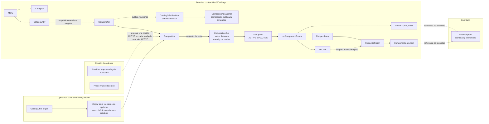
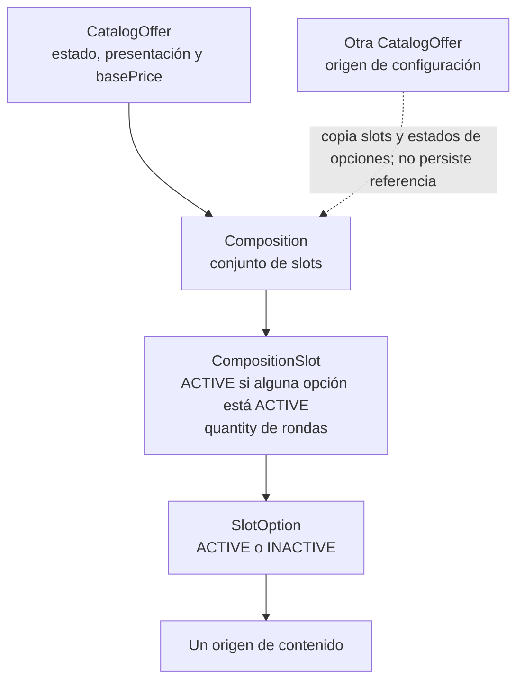

# Contexto, alcance y lenguaje del dominio

## Responsabilidad del bounded context Menú/Catálogo

El bounded context Menú/Catálogo define la identidad comercial de las entradas de la carta, las ofertas asociadas a cada entrada y la composición de cada oferta. También administra las categorías del menú y las recetas que el catálogo utiliza para describir elaboraciones.

El modelo organiza esta responsabilidad en tres niveles:

1. **Identidad comercial:** `Menu` contiene categorías y entradas. `CatalogEntry` conserva la identidad de un producto de la carta, sus categorías y sus ofertas.
2. **Oferta vendible:** cada `CatalogOffer` concreta pertenece a una `CatalogEntry` y se selecciona y vende individualmente. Cada oferta define su precio base y una `Composition`.
3. **Composición y contenido:** una composición es el conjunto que contiene uno o más slots (`CompositionSlot`). Cada slot contiene una o más opciones (`SlotOption`) que describen el contenido posible.

El nombre visible combina el `brandName` de `CatalogEntry` con el `presentationTag` opcional de `CatalogOffer`. La etiqueta describe la oferta concreta. Una entrada solo se publica mientras está administrativamente `ACTIVE` y cuenta con al menos una `CatalogOffer` `ACTIVE` y válida; si no tiene una, permanece `ACTIVE` pero no se muestra. La inactivación automática de una oferta no cambia el estado administrativo de la entrada. `CatalogEntry` tiene los estados `ACTIVE`, `INACTIVE` y `ARCHIVED`; `CatalogOffer`, `CompositionSlot` y `SlotOption` tienen `ACTIVE` e `INACTIVE`. El estado de `CompositionSlot` se deriva de sus opciones: es `ACTIVE` si al menos una está `ACTIVE`, y `INACTIVE` si ninguna lo está. Si todos los slots quedan `INACTIVE`, la oferta pasa automáticamente a `INACTIVE`. Si después vuelve a haber un slot `ACTIVE`, la oferta vuelve automáticamente a `ACTIVE` cuando su inactivación se debió a que no había slots activos y seguía habilitada administrativamente. Una inactivación administrativa explícita permanece hasta una nueva activación administrativa.

### Composición y selección

- Cada oferta contiene exactamente una composición, formada por uno o más slots (`CompositionSlot`). Una composición válida contiene al menos un slot.
- Cada `CompositionSlot` contiene una o más `SlotOption`. Todo slot `ACTIVE` participa en la selección y todo slot `INACTIVE` queda fuera de ella y no genera rondas.
- `CompositionSlot.quantity` indica cuántas rondas de selección tiene el slot. En cada ronda se resuelve exactamente una opción `ACTIVE` de ese slot; si solo tiene una opción `ACTIVE`, se resuelve directamente en cada ronda. Por ejemplo, un slot de acompañamientos con `quantity` 3 tiene tres rondas, y en cada una se elige una opción `ACTIVE` entre papas, aros de cebolla y nuggets. Si ninguna opción del slot está `ACTIVE`, el slot queda `INACTIVE`. Si todos los slots quedan `INACTIVE`, la oferta pasa a `INACTIVE`; al volver a haber un slot `ACTIVE`, la oferta se reactiva automáticamente si se había inactivado por esa causa y seguía habilitada administrativamente. La inactivación administrativa explícita requiere una nueva activación administrativa.
- `course` es opcional; cuando está presente, admite únicamente `entrada`, `plato fuerte`, `postre` o `bebida` y sugiere un tiempo de servicio.
- Durante la configuración, se puede elegir otra `CatalogOffer` como origen para copiar sus slots y opciones a la composición destino. La copia conserva el estado de las opciones; el estado de cada slot se deriva de las opciones copiadas. Las definiciones quedan locales, independientes y editables. La oferta destino no conserva el ID ni una referencia a la oferta origen, no sincroniza cambios con ella y no copia su precio.

### Contenido y recetas

Cada `SlotOption` es una aparición contextual con exactamente un `ComponentSource`: `INVENTORY_ITEM` o `RECIPE`. Varias opciones pueden referir el mismo artículo o la misma definición de receta en apariciones distintas.

Catálogo administra las `RecipeDefinition` en `RecipeLibrary` y sus líneas `ComponentIngredient`. Una receta define nombre, descripción, instrucciones en texto y uno o más ingredientes seleccionados de Inventario, cada uno con su cantidad. Todas las recetas se almacenan en la biblioteca; si esta se comparte entre varios menús o tiene alcance de un solo menú permanece pendiente en OPEN-003. Al configurar un `CompositionSlot`, se puede seleccionar una receta existente por ID y revisión o crear una receta desde ese flujo. Una receta nueva se guarda en `RecipeLibrary`; `RecipeSource` conserva el ID y la revisión de la definición asignada, que no se modifica desde la opción.

Cada línea `ComponentIngredient` referencia exactamente un `InventoryItem` e indica la cantidad física de ese ingrediente. Al seleccionar, consultar o editar la línea se muestra su unidad de medida autoritativa, suministrada por Inventario; la unidad de la cantidad debe ser compatible con la del artículo. Editar una receta publicada crea una nueva revisión sin cambiar las referencias existentes. Las cantidades físicas de artículos e ingredientes son distintas de `CompositionSlot.quantity`, que expresa rondas de selección del slot.

La definición vigente de una receta solo puede eliminarse cuando ninguna `SlotOption` de ninguna oferta vigente la referencia, incluso si la oferta o la opción está inactiva. Si existe una referencia, se rechaza la eliminación sin cambios. Las revisiones históricas publicadas se conservan y permanecen consultables.

`CompositionSnapshot` conserva de forma inmutable los slots publicados y los estados de sus opciones; el estado de cada slot se deriva de las opciones de esa revisión. Pertenece únicamente a `CatalogOfferRevision` y no representa una referencia a la oferta que pudo servir como origen durante la configuración.

Una oferta `INACTIVE` no se presenta como alternativa vigente. La entrada conserva su estado administrativo cuando cambia el estado de una oferta, aunque deje de publicarse al no tener una oferta `ACTIVE` válida. Archivar una entrada desde `ACTIVE` o `INACTIVE` la retira del flujo normal sin modificar los estados de sus ofertas; desarchivarla la deja en `INACTIVE`.

Una `CatalogEntry` solo puede eliminarse cuando está `ARCHIVED`. Una `CatalogOffer` solo puede eliminarse individualmente cuando está `INACTIVE` y su eliminación no deja una entrada `ACTIVE` sin una oferta `ACTIVE` y válida. Usar otra oferta como origen de configuración no crea una referencia vigente entre ofertas ni añade una condición de eliminación. La operación se rechaza íntegramente cuando no se cumplen sus condiciones, sin modificar recursos dependientes ni crear revisiones. Las composiciones, slots y opciones poseídos exclusivamente pueden eliminarse junto con su propietario. Las revisiones históricas publicadas y sus `CompositionSnapshot` permanecen inmutables y consultables por `offerId` y `revision` aunque se elimine la definición vigente.

### Precio declarado por Catálogo

`CatalogOffer.basePrice` es fijo para la oferta, independientemente de los slots y opciones de su composición. Los slots, sus opciones y la oferta seleccionada como origen de una copia no aportan cargos automáticos ni trasladan precios al precio base.

El catálogo declara `basePrice`. La cantidad pedida, las opciones concretas resueltas en cada ronda según la cantidad de cada slot y el cálculo del precio final pertenecen al modelo de órdenes.

## Ownership y límites de contexto

| Ámbito | Responsabilidad del dominio |
| :--- | :--- |
| Menú/Catálogo | Es propietario de `Menu`, `Category`, `CatalogEntry`, `CatalogOffer`, sus composiciones, slots, opciones y recetas; declara los precios base y publica solo entradas `ACTIVE` con alguna oferta `ACTIVE` válida. |
| Inventario | Es propietario de la identidad, unidad de medida y existencias de `InventoryItem`. Catálogo lo referencia como concepto externo en opciones y recetas. |
| Órdenes | Registra la cantidad pedida y la opción concreta elegida en cada ronda definida por la cantidad de cada slot; determina el precio final de la orden según el modelo transaccional. |

La validez estructural de una composición o receta corresponde a sus definiciones de catálogo. El stock de los artículos referenciados pertenece a Inventario y es independiente de esa validez.

La conexión desde `CatalogOffer origen` representa una operación de configuración: al concluir la copia, la composición destino no mantiene una relación con esa oferta. El slot está `ACTIVE` si al menos una opción está `ACTIVE`; todo slot `ACTIVE` genera sus rondas según `quantity` y los slots `INACTIVE` no generan rondas. Si todos los slots quedan `INACTIVE`, la oferta pasa automáticamente a `INACTIVE`; cuando vuelve a haber un slot `ACTIVE`, se reactiva automáticamente si su inactivación se debió a esa causa y seguía habilitada administrativamente. La inactivación administrativa explícita permanece hasta una nueva activación administrativa. La entrada conserva su estado administrativo y solo se publica si tiene una oferta `ACTIVE` válida. Las revisiones históricas y snapshots describen la oferta destino publicada, de forma independiente.

## Lenguaje para describir una oferta

Una oferta se describe desde la identidad de la carta hasta las opciones que pueden ocupar cada slot:

Todo slot `ACTIVE` participa en la selección y genera el número de rondas indicado por su `quantity`; los slots `INACTIVE` no generan rondas. En cada ronda se resuelve una opción `ACTIVE`, directamente cuando solo hay una o por elección cuando hay varias. Si todos los slots quedan `INACTIVE`, la oferta se inactiva y se reactiva automáticamente cuando vuelve a haber un slot `ACTIVE`, siempre que se hubiera inactivado por esa causa y siguiera habilitada administrativamente. Una inactivación administrativa explícita requiere una nueva activación administrativa. La vista describe definiciones de catálogo; las elecciones concretas se registran en el modelo de órdenes.

## Glosario del dominio

- **`Menu`:** ámbito propietario de las categorías y entradas comerciales.
- **`Category`:** clasificación reutilizable del menú que puede relacionarse con varias entradas.
- **`CatalogEntry`:** identidad comercial de un producto de la carta; conserva `brandName`, categorías, estado administrativo y sus ofertas. Se publica solo si está `ACTIVE` y tiene al menos una oferta `ACTIVE` válida; si no, permanece `ACTIVE` pero no se muestra.
- **`CatalogOffer`:** oferta concreta de una entrada, seleccionable y vendible individualmente; tiene estado `ACTIVE` o `INACTIVE`, `presentationTag` opcional, `basePrice` y exactamente una composición. Solo se publica bajo una entrada `ACTIVE`. Si todos sus slots quedan `INACTIVE`, la oferta se inactiva; vuelve automáticamente a `ACTIVE` al recuperar un slot `ACTIVE` cuando la inactivación se debió a esa causa y la oferta seguía habilitada administrativamente. Una inactivación administrativa explícita permanece hasta nueva activación administrativa.
- **`CatalogOfferRevision`:** revisión publicada e inmutable de una oferta, consultable por `offerId` y `revision` aunque ya no exista la definición vigente.
- **`Composition`:** conjunto de uno o más slots que define la composición de una oferta.
- **`CompositionSnapshot`:** composición publicada e inmutable que pertenece únicamente a una `CatalogOfferRevision` histórica de la oferta.
- **`CompositionSlot`:** slot de una composición, con una o más opciones y una `quantity` que indica su número de rondas. Está `ACTIVE` si tiene al menos una opción `ACTIVE`, e `INACTIVE` si no; todos los slots `ACTIVE` participan y los `INACTIVE` no generan rondas.
- **`SlotOption`:** aparición contextual que contiene un origen único. Las opciones `INACTIVE` no se ofrecen; el estado del slot depende de si tiene al menos una opción `ACTIVE`.
- **`ComponentSource`:** tipo conceptual que identifica el origen único de una opción: `INVENTORY_ITEM` o `RECIPE`.
- **`InventoryItemSource`:** contenido que referencia un artículo externo de Inventario con su cantidad física y unidad.
- **`RecipeSource`:** referencia desde una `SlotOption` a una receta de `RecipeLibrary` mediante `recipeId` y una revisión fijada. Al configurar una opción `RECIPE`, se puede elegir una receta de la biblioteca o definir una nueva, que se guarda en la biblioteca y queda referenciada por ID y revisión.
- **`InventoryItem`:** artículo cuya identidad, unidad de medida y existencias pertenecen a Inventario.
- **`RecipeLibrary`:** biblioteca administrada por Catálogo que almacena las definiciones de receta; su alcance entre menús permanece pendiente en OPEN-003.
- **`RecipeDefinition`:** receta con nombre, descripción, instrucciones en texto, revisión y una o más líneas de ingredientes de Inventario.
- **`ComponentIngredient`:** línea de receta que referencia un `InventoryItem`, conserva la cantidad indicada y muestra la unidad autoritativa de Inventario.
