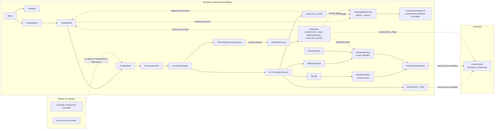
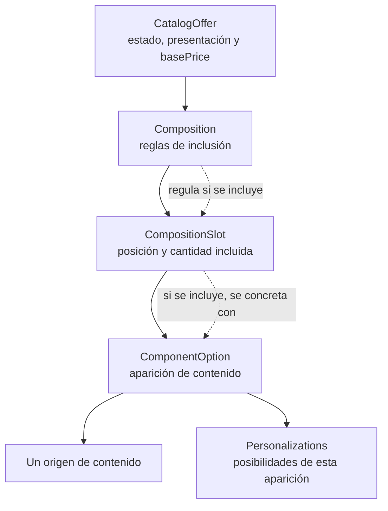

# Contexto, alcance y lenguaje del dominio

## Responsabilidad del bounded context Menú/Catálogo

El bounded context Menú/Catálogo define la identidad comercial de las entradas de la carta, sus presentaciones vendibles, la composición de cada presentación y las personalizaciones permitidas en cada aparición de contenido. También administra las categorías del menú y las recetas que el catálogo utiliza para describir elaboraciones.

El modelo organiza esta responsabilidad en tres niveles:

1. **Identidad comercial:** `Menu` agrupa categorías y entradas. `CatalogEntry` conserva la identidad de un producto de la carta y sus categorías.
2. **Presentación vendible:** cada `CatalogEntry` puede ofrecer una o más `CatalogOffer`. Cada oferta define su precio base y una `Composition`.
3. **Composición y contenido:** la composición define slots y reglas de inclusión. Cada slot contiene alternativas de contenido; cada alternativa identifica una aparición concreta y puede declarar personalizaciones propias.

El nombre visible combina el `brandName` de `CatalogEntry` con el `presentationTag` opcional de `CatalogOffer`. La presentación describe la oferta; las cantidades se expresan en los slots de su composición. Una entrada `ACTIVE` requiere al menos una `CatalogOffer` `ACTIVE` y válida; una oferta solo se publica bajo una entrada `ACTIVE`. `CatalogEntry` tiene los estados `ACTIVE`, `INACTIVE` y `ARCHIVED`; `CatalogOffer`, `ComponentOption` y `RecipeDefinition` tienen `ACTIVE` e `INACTIVE`. Los estados de la entrada y de sus ofertas son independientes: cambiar uno no modifica automáticamente el otro.

### Reglas de composición

La inclusión de slots y la elección de contenido son decisiones distintas:

- Si `selectable = false`, se incluyen todos los slots; `requiredSlots`, `minSelections` y `maxSelections` no aplican.
- Si `selectable = true`, `requiredSlots` identifica los slots propios, distintos y siempre incluidos. Los demás slots son elegibles y `minSelections` y `maxSelections` limitan cuántos de ellos se incluyen.
- Los límites cumplen `0 ≤ minSelections ≤ maxSelections ≤ cantidad de slots elegibles`. Si la composición requiere elegir alguno, `minSelections ≥ 1`; una composición seleccionable tiene al menos un slot elegible.
- Cada slot incluido se concreta con una `ComponentOption`. Si hay varias opciones, elegir su contenido es independiente de incluir el slot.
- `CompositionSlot.quantity` indica las unidades incorporadas al incluir esa posición. Cuando las unidades requieren personalización independiente, cada una se representa mediante su propio slot.
- `course` sugiere un tiempo de servicio. `positionRef` señala una ubicación; la obligatoriedad del slot se establece en `Composition`. `PlacementRegion.name` es descriptivo; `surface` y `coverage` son atributos opcionales reservados para el futuro.

### Contenido, recetas y personalizaciones

Cada `ComponentOption` es una aparición contextual con exactamente un `ComponentSource`. Las cuatro clases de contenido son `INLINE`, `INVENTORY_ITEM`, `PREPARATION` y `CATALOG_OFFER`. Varias apariciones pueden referir el mismo contenido y mantener personalizaciones distintas.

Catálogo administra `RecipeDefinition`, sus líneas `ComponentIngredient` y las posibilidades de personalización declaradas. `RecipeLibrary` agrupa recetas reutilizables; `InlineContent` contiene una receta local de alcance propio. `CompositionSnapshot` conserva la composición publicada de una revisión y pertenece únicamente a `CatalogOfferRevision`; no es contenido vigente de `InlineContent` ni de `AddOption`. `PreparationSource` referencia una receta de biblioteca y puede declarar ajustes locales. Esos ajustes describen diferencias para esa aparición y conservan la definición compartida como fuente común.

Una línea `ComponentIngredient` identifica una aparición de un `InventoryItem` o de una receta reutilizable y expresa su cantidad y unidad. Una receta requiere una cantidad de rendimiento y una unidad; sus revisiones identifican la definición utilizada. Las referencias recursivas entre recetas se mantienen sin ciclos.

`Personalizations` pertenece a una `ComponentOption` y puede agrupar cuatro familias:

- `RecipeModifierGroup`: cambios permitidos sobre líneas existentes de la receta efectiva.
- `AddOptionGroup`: alternativas para agregar contenido a una opción ya incorporada.
- `ReplaceOptionGroup`: alternativas para sustituir una línea directa de artículo de Inventario.
- `PreparationInstructionGroup`: instrucciones de elaboración o servicio que no cambian por sí mismas las cantidades físicas.

Las personalizaciones que requieren líneas de receta usan la receta efectiva de su propia opción. Cada grupo expresa sus propias alternativas y límites; las personalizaciones de apariciones distintas permanecen en sus respectivos contextos.

Una `AddOption` referencia exactamente uno de estos destinos: un `InventoryItem`, una `RecipeDefinition` reutilizable o una oferta del catálogo (`CATALOG_OFFER`).

Desactivar una oferta impide nuevos usos o su publicación sin eliminar las referencias existentes ni cambiar automáticamente otros recursos. Archivar una entrada desde `ACTIVE` o `INACTIVE` la retira del flujo normal sin modificar los estados de sus ofertas; desarchivarla la deja en `INACTIVE`.

Una `CatalogEntry` solo puede eliminarse cuando está `ARCHIVED` y ninguna de sus ofertas mantiene referencias vigentes externas. Una `CatalogOffer` solo puede eliminarse individualmente cuando está `INACTIVE`, no está referenciada por una definición vigente mediante `CatalogOfferSource` o `AddOption` de destino `CATALOG_OFFER`, no es el `defaultOfferId` de su entrada y su eliminación no deja una entrada `ACTIVE` sin una oferta `ACTIVE` y válida. Una referencia vigente bloquea también la eliminación de la entrada propietaria de la oferta afectada. `defaultOfferId` impide eliminar individualmente la oferta indicada, pero el vínculo, que pertenece a la entrada, se retira con ella al eliminar la entrada completa. La operación se rechaza sin modificar los recursos referenciantes o crear revisiones nuevas. Las relaciones y estructuras poseídas exclusivamente pueden eliminarse junto con su propietario cuando no hay referencias impeditivas. Las revisiones históricas publicadas, incluida su `CompositionSnapshot`, permanecen inmutables y consultables por `offerId` y `revision`; las referencias que solo permanecen en revisiones históricas no bloquean la eliminación de la definición vigente.

### Precio declarado por Catálogo

`CatalogOffer.basePrice` es fijo para la oferta, independientemente de los slots y contenidos elegidos. La composición, sus slots, sus opciones y las ofertas hijas referenciadas no aportan cargos automáticos al precio base. Las personalizaciones pueden declarar `priceDelta` conforme a las reglas de su tipo.

El catálogo declara `basePrice` y los ajustes de precio permitidos. La cantidad pedida, las elecciones concretas de una orden y el cálculo de su precio final pertenecen al modelo de órdenes.

## Ownership y límites de contexto

| Ámbito | Responsabilidad del dominio |
| :--- | :--- |
| Menú/Catálogo | Es propietario de `Menu`, `Category`, `CatalogEntry`, `CatalogOffer`, composición, opciones de contenido, recetas y personalizaciones; declara los precios base y los ajustes comerciales permitidos. |
| Inventario | Es propietario de la identidad de `InventoryItem` y de sus existencias. Catálogo lo referencia como concepto externo en opciones, recetas y personalizaciones. |
| Órdenes | Registra la cantidad pedida y las elecciones concretas de slots, contenido y personalizaciones; determina el precio final de la orden según el modelo transaccional. |

La validez estructural de una composición o receta corresponde a sus definiciones de catálogo. El stock de los artículos referenciados pertenece a Inventario y es independiente de esa validez.

Una referencia vigente desde `CatalogOfferSource` o una `AddOption` `CATALOG_OFFER` impide eliminar la oferta afectada o la entrada que la contiene. El rechazo no desactiva opciones, no modifica los recursos referenciantes y no crea revisiones; `CatalogOfferRevision` y su `CompositionSnapshot` histórica se conservan.

## Lenguaje para describir una oferta

Una oferta se describe desde la identidad de la carta hasta las alternativas que pueden ocupar cada posición:

La vista distingue la regla que incluye una posición del contenido que la ocupa. Describe definiciones de catálogo; las elecciones concretas se registran en el modelo de órdenes.

## Glosario del dominio

- **`Menu`:** ámbito propietario de las categorías y entradas comerciales.
- **`Category`:** clasificación reutilizable del menú que puede relacionarse con varias entradas.
- **`CatalogEntry`:** identidad comercial de un producto de la carta; conserva `brandName`, categorías, estado y ofertas. Una entrada `ACTIVE` requiere al menos una oferta `ACTIVE` y válida.
- **`CatalogOffer`:** presentación vendible de una entrada, con estado `ACTIVE` o `INACTIVE`, `presentationTag` opcional, `basePrice` y exactamente una composición; solo se publica bajo una entrada `ACTIVE`.
- **`CatalogOfferRevision`:** revisión publicada e inmutable de una oferta, consultable por `offerId` y `revision` aunque ya no exista la definición vigente.
- **`Composition`:** estructura de una oferta que define slots, slots obligatorios y límites para incluir slots elegibles.
- **`CompositionSnapshot`:** composición publicada e inmutable que pertenece únicamente a una `CatalogOfferRevision` histórica.
- **`CompositionSlot`:** posición funcional o espacial de una composición, con cantidad incluida y alternativas de contenido.
- **`PlacementRegion`:** región semántica descriptiva de una composición que puede ser referida por un slot.
- **`ComponentOption`:** aparición contextual de contenido admitida en un slot, con un origen y personalizaciones opcionales propias.
- **`ComponentSource`:** tipo conceptual que identifica el origen único de una opción: `INLINE`, `INVENTORY_ITEM`, `PREPARATION` o `CATALOG_OFFER`.
- **`InlineContent`:** contenido local de una opción que contiene una receta propia.
- **`InventoryItemSource`:** contenido que referencia un artículo externo de Inventario con cantidad y unidad.
- **`PreparationSource`:** contenido que referencia una receta reutilizable y puede tener ajustes locales.
- **`CatalogOfferSource`:** contenido que referencia otra oferta vendible y fija la revisión publicada utilizada; una referencia vigente bloquea la eliminación de la oferta o su entrada.
- **`InventoryItem`:** artículo cuya identidad y existencias pertenecen a Inventario.
- **`RecipeLibrary`:** colección de recetas reutilizables administrada por Catálogo.
- **`RecipeDefinition`:** definición de una elaboración con revisión, rendimiento y líneas de ingredientes.
- **`ComponentIngredient`:** línea identificable de receta que referencia un artículo de Inventario o una receta reutilizable, con cantidad y unidad.
- **`RecipeAdjustment`:** diferencia administrativa local aplicada a una `PreparationSource`.
- **`Personalizations`:** conjunto opcional de personalizaciones pertenecientes a una aparición concreta de `ComponentOption`.
- **`RecipeModifierGroup`:** grupo de cambios permitidos sobre ingredientes existentes en la receta efectiva.
- **`RecipeModifier`:** cambio declarado de cantidad o eliminación de una línea de receta existente, con su `priceDelta`.
- **`AddOptionGroup`:** grupo que limita las alternativas adicionales seleccionables para una opción incorporada.
- **`AddOption`:** contenido adicional que referencia exactamente un artículo de Inventario, una receta reutilizable o una oferta del catálogo (`CATALOG_OFFER`). Una referencia vigente bloquea la eliminación de la oferta o su entrada.
- **`ReplaceOptionGroup`:** grupo que identifica una línea directa de Inventario de la receta efectiva y sus sustituciones posibles.
- **`ReplaceOption`:** alternativa de sustitución que referencia un artículo de Inventario.
- **`PreparationInstructionGroup`:** grupo de instrucciones seleccionables para una preparación o servicio.
- **`PreparationInstruction`:** instrucción estructurada que puede referirse a una parte identificable de la preparación.
