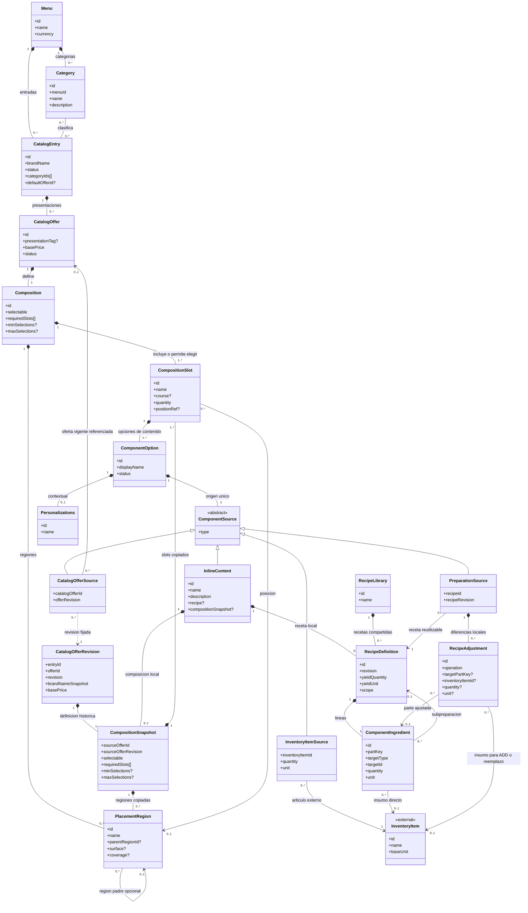
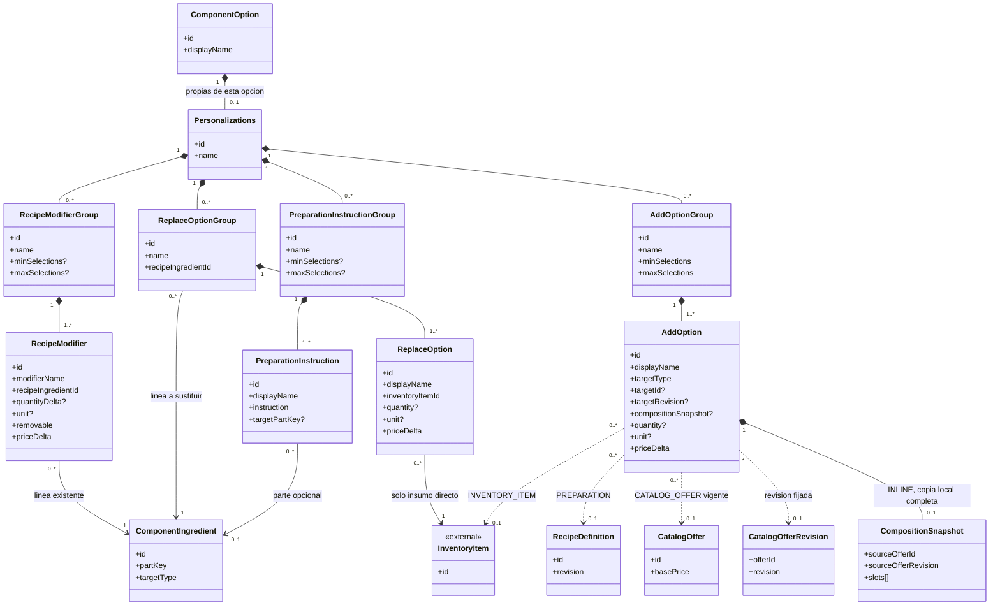

# Modelo de dominio del catálogo — MCCC

**Estado:** propuesta estructural consolidada.  
**Alcance:** Bounded Context de Menú/Catálogo.  
**Propósito:** describir qué ofrece el restaurante, cómo se compone cada oferta, qué decisiones están permitidas al ordenar y qué personalizaciones declara el catálogo. No define el procesamiento de una orden ni un motor de configuración.

## 1. Resumen del diseño

### 1.1. Estructura general

El menú contiene un catálogo común de categorías y entradas comerciales (`CatalogEntry`). Una entrada puede pertenecer a varias categorías y ofrece una o más presentaciones vendibles (`CatalogOffer`). La oferta no repite el nombre de su entrada: su etiqueta `presentationTag` es opcional y descriptiva. Por ejemplo, «Hamburguesa de la Casa · Grande» resulta de combinar el nombre comercial con la presentación.

**Toda `CatalogOffer` tiene una `Composition` de uno o más `CompositionSlot`.** Esta estructura representa tanto una bebida o un espagueti individual —un único slot— como un combo de varias pizzas. No existe una clasificación previa y excluyente de la oferta como «ingrediente», «preparación» o «combo»; la composición determina qué contiene.

Cada slot identifica una posición o función del producto («Primera pizza», «Bebida», «Plato principal»), su cantidad incluida, su tiempo de servicio sugerido, una ubicación espacial opcional y un conjunto de `ComponentOption`. Una opción es una **aparición definida en ese slot**, no la definición global del producto que referencia. Dos opciones pueden apuntar a la misma oferta y tener personalizaciones contextuales diferentes.

Una `ComponentOption` tiene exactamente un contenido polimórfico:

- **`INLINE`:** una receta definida directamente en la opción **o** una copia local completa de la composición de una oferta, con sus slots, opciones y personalizaciones.
- **`INVENTORY_ITEM`:** artículo o ingrediente del catálogo externo de Inventario.
- **`PREPARATION`:** receta de una biblioteca reutilizable de Catálogo, utilizada tal cual o adaptada mediante ajustes locales.
- **`CATALOG_OFFER`:** referencia a otra oferta vendible con su propia composición y posibilidades de personalización.

`Personalizations` pertenece a cada `ComponentOption`, no al slot completo ni obligatoriamente a la oferta raíz. Contiene cuatro familias: modificadores de receta, opciones a agregar, opciones a reemplazar e instrucciones de preparación. Cuando la opción reutiliza una oferta o una receta, las capacidades propias de esa referencia no se duplican en el catálogo padre; las personalizaciones locales describen lo permitido en **esa aparición** y deben ser compatibles con el contenido referenciado.

### 1.2. Dos niveles de selección, sin confundirlos

**Nivel 1 — inclusión de slots, definido por `Composition`:**

- `selectable = false`: **todos** los slots de la composición están incluidos. `requiredSlots`, `minSelections` y `maxSelections` no aplican.
- `selectable = true`: `requiredSlots` identifica **slots obligatorios e inamovibles**. El comensal elige además entre los restantes según `minSelections` y `maxSelections`.
- Los límites se aplican **solo a slots elegibles**, excluyendo los obligatorios incluidos en `requiredSlots`.

**Nivel 2 — contenido de cada slot incluido:** cada slot tiene una o más `ComponentOption`. Si contiene una única opción, su contenido está determinado; si ofrece varias alternativas, se elige la que ocupa ese slot. Incluso un slot obligatorio puede tener varias alternativas de contenido. Elegir incluir un slot y elegir su contenido son decisiones distintas.

**Ejemplo:** un combo con `selectable = false` tiene obligatoriamente «Pizza 1», «Pizza 2» y «Bebida»; dentro de «Pizza 1» todavía puede elegirse entre hawaiana o pepperoni. En otro menú, `selectable = true` puede fijar «Bebida» mediante `requiredSlots` y permitir elegir entre uno y dos slots adicionales de entrada, fuerte o postre.

### 1.3. Recetas y responsabilidades

Inventario **posee** la identidad de sus artículos/ingredientes y su stock. Catálogo los referencia mediante identificadores externos, y **posee** la definición de recetas, cantidades y posibilidades de personalización. No se introduce un servicio Kitchen ni una segunda entidad autoritativa de ingrediente dentro de Catálogo.

Una `RecipeDefinition` contiene líneas `ComponentIngredient` con cantidad y unidad. Cada línea apunta a un `InventoryItem` o, cuando una preparación reutilizable es parte de otra receta, a una `RecipeDefinition` de biblioteca. Una `PreparationSource` referencia una receta publicada y puede declarar `RecipeAdjustment` sobre partes concretas: mantiene la receta de biblioteca como fuente común y explicita sus diferencias sin editarla globalmente. Cuando `INLINE` representa una preparación, utiliza una receta propia de esa opción. Una receta de biblioteca puede utilizarse tal cual, sin ajustes.

`INLINE` también puede contener una `CompositionSnapshot`: una copia local de la composición completa de una revisión publicada de oferta. Conserva las reglas de selección, todos los slots, las alternativas de contenido y sus personalizaciones. Es distinta de una receta local: no reduce una oferta con varias posibilidades a una lista de ingredientes. Una `InlineContent` contiene exactamente una receta local **o** una `CompositionSnapshot`.

No se requieren tres recetas independientes para una hamburguesa chica, mediana y grande: las ofertas pueden reutilizar una receta y declarar cantidades o ajustes propios en sus opciones. Cada aparición tiene identidad contextual; no se alteran otras ofertas por una personalización local.

### 1.4. Regla comercial de precios

`CatalogOffer.basePrice` es el **precio base fijo de la oferta tal como se venda, independientemente de qué slots u opciones de su composición se seleccionen**. Una oferta con diferentes slots no suma automáticamente los precios base de otros slots. `CompositionSlot`, `ComponentOption` y la selección entre ellos **no aportan cargos a `basePrice`**.

Las personalizaciones pueden declarar `priceDelta` (`0` o positivo según la política comercial). El catálogo **solo declara** esos importes: no calcula el precio final, no evalúa cambios de una orden y no determina aquí el algoritmo de cobro. No se usa `extraPriceDelta` como nombre de una propiedad genérica: una sustitución puede costar cero.

### 1.5. Límites del modelo

Se definen identidades, referencias y estructuras necesarias para que el dominio sea inequívoco; **no** se prescriben tablas, claves foráneas, arquitectura de persistencia, API, eventos ni motor de resolución. La cantidad pedida, las elecciones concretas, los asientos, los tiempos de marcha, la disponibilidad en tiempo real, la facturación y el cálculo de precio de una orden pertenecen a otros modelos.

La eliminación definitiva de una entrada archivada conserva las revisiones publicadas como instantáneas históricas consultables. En las definiciones vigentes, cada `ComponentOption` que referencia cualquiera de sus ofertas —directamente mediante `CatalogOfferSource` o dentro de una `AddOption` con destino `CATALOG_OFFER`— se desactiva en un mismo lote y sustituye esa referencia por contenido `INLINE` local de la revisión fijada. La conversión se completa antes de borrar la entrada y sus ofertas vigentes; no desactiva automáticamente las ofertas que contienen esas opciones. Las revisiones históricas de otras ofertas permanecen inmutables, incluso cuando conservan una referencia histórica a una oferta eliminada.

---

## 2. Resumen de entidades

| Entidad | Descripción |
|---|---|
| `Menu` | Menú propietario del conjunto de categorías y entradas comerciales. |
| `Category` | Categoría reutilizable del menú que clasifica varias entradas. |
| `CatalogEntry` | Identidad comercial y administración de un producto de la carta. |
| `CatalogOffer` | Presentación vendible vigente con precio base y composición propia. |
| `CatalogOfferRevision` | Instantánea histórica e inmutable de una revisión publicada de oferta, consultable aunque se elimine su oferta vigente. |
| `Composition` | Define el conjunto de slots y las reglas para incluirlos en la oferta. |
| `CompositionSnapshot` | Copia local completa de la composición de una revisión de oferta, con slots, alternativas y personalizaciones. |
| `CompositionSlot` | Posición funcional o espacial que aporta contenido a la composición. |
| `PlacementRegion` | Región o ubicación semántica donde se aplica un slot. |
| `ComponentOption` | Alternativa de contenido admitida dentro de un slot, con personalización contextual propia. |
| `ComponentSource` | Tipo conceptual de contenido que identifica el origen único de una opción. |
| `InlineContent` | Contenido local que contiene exactamente una receta o una copia completa de composición. |
| `InventoryItemSource` | Referencia a un artículo o ingrediente cuyo catálogo pertenece a Inventario. |
| `PreparationSource` | Referencia a una receta reutilizable con ajustes locales opcionales. |
| `CatalogOfferSource` | Referencia a otra oferta comercial reutilizada como componente. |
| `InventoryItem` *(externa)* | Artículo o ingrediente autoritativo de Inventario al que Catálogo hace referencia. |
| `RecipeLibrary` | Colección de recetas compartidas administradas por Catálogo. |
| `RecipeDefinition` | Composición física base de una preparación, con rendimiento y líneas de receta. |
| `ComponentIngredient` | Aparición identificable de un ingrediente o preparación dentro de una receta. |
| `RecipeAdjustment` | Diferencia local respecto de una receta reutilizable, referida a una parte identificable. |
| `Personalizations` | Conjunto de personalizaciones disponibles para una opción concreta. |
| `RecipeModifierGroup` | Grupo de modificadores aplicados a ingredientes ya existentes en la receta. |
| `RecipeModifier` | Cambio permitido sobre una línea de receta, por cantidad o eliminación. |
| `AddOptionGroup` | Grupo de opciones para incorporar componentes adicionales. |
| `AddOption` | Componente adicional; con destino `INLINE` contiene directamente una copia local de la composición de una oferta. |
| `ReplaceOptionGroup` | Grupo de alternativas para reemplazar una línea directa de ingrediente de Inventario. |
| `ReplaceOption` | Artículo de Inventario que puede sustituir un ingrediente concreto de la receta. |
| `PreparationInstructionGroup` | Grupo de instrucciones de preparación o servicio permitidas. |
| `PreparationInstruction` | Instrucción estructurada y elegible de elaboración o presentación. |

---

## 3. Desglose de entidades

Las marcas **obligatorio**, **opcional** y **derivado** expresan necesidades de dominio. Los identificadores son conceptuales y no presuponen un tipo de clave de base de datos. Las listas vacías se permiten únicamente cuando las reglas de publicación de su entidad lo indican.

### 3.1. `Menu`

**Atributos:** `id`, `name`, `currency`, `categories[]`, `entries[]`.

**Relaciones:** contiene múltiples `Category` y `CatalogEntry`.

**Reglas e invariantes:** los identificadores de categorías y entradas son únicos en su ámbito; cada entrada se clasifica usando categorías del mismo menú. La categoría se administra una sola vez, no dentro de cada oferta.

### 3.2. `Category`

**Atributos:** `id`, `menuId`, `name`, `description`.

**Relaciones:** pertenece a un menú; clasifica cero o más entradas. Una entrada puede tener varias categorías (relación conceptual muchos a muchos).

**Reglas e invariantes:** no se duplica una entrada por asignarla a más de una categoría; la asignación puede almacenarse como `categoryIds[]` en el modelo de dominio sin convertir la tabla de unión futura en una entidad de negocio obligatoria.

### 3.3. `CatalogEntry`

**Atributos:** `id`, `menuId`, `brandName`, `description`, `imageRef`, `status: ACTIVE | INACTIVE | ARCHIVED`, `categoryIds[]`, `defaultOfferId?`, `offers[]`.

**Relaciones:** pertenece a `Menu`; tiene múltiples categorías y múltiples `CatalogOffer`.

**Reglas e invariantes:** `brandName` es el nombre comercial autoritativo. Puede guardarse una entrada incompleta, pero una entrada publicable debe tener al menos una oferta válida. Archivado reversible; desarchivar deja la entrada inactiva. Las categorías no alteran recetas ni composiciones. Solo una entrada `ARCHIVED` admite eliminación definitiva. Primero se localizan todas las referencias en definiciones vigentes a cualquiera de sus ofertas, incluidas las `AddOption` y las opciones ya inactivas; se desactivan en lote las `ComponentOption` que las contienen y se convierten esas referencias a copias `INLINE` de las revisiones fijadas. Solo después se eliminan la entrada y sus ofertas vigentes. El lote no desactiva automáticamente las ofertas que contienen esas opciones ni reescribe revisiones históricas.

### 3.4. `CatalogOffer`

**Atributos:** `id`, `entryId`, `presentationTag`, `basePrice`, `status: ACTIVE | INACTIVE`, `offerImageRef`, `composition`.

**Relaciones:** pertenece a una `CatalogEntry` y contiene exactamente una `Composition`. Puede ser referenciada por múltiples `CatalogOfferSource` y por `AddOption` de destino `CATALOG_OFFER`. Sus revisiones publicadas producen `CatalogOfferRevision` independientes de la definición vigente.

**Reglas e invariantes:** no duplica `brandName`. Su nombre visible resulta de la entrada y la presentación opcional. `presentationTag` describe, pero **no determina cantidades físicas**. `basePrice` no depende del contenido elegido en los slots; las ofertas hijas referenciadas no se suman automáticamente. Una oferta solo es publicable mientras su composición tenga contenido elegible válido; la desactivación en lote de una de sus opciones puede exigir corregirla antes de volver a ofrecerla, sin cambiar automáticamente su estado administrativo. La cantidad de ofertas solicitadas pertenece a una orden futura, no a esta entidad.

### 3.4.1. `CatalogOfferRevision`

**Atributos:** `entryId`, `offerId`, `revision`, `brandNameSnapshot`, `presentationTag?`, `basePrice`, `status`, `offerImageRef?`, `compositionSnapshot`.

**Relaciones:** conserva la definición publicada de una `CatalogOffer` identificada por `offerId` y `revision`; contiene una `CompositionSnapshot` histórica. No depende de que permanezcan la entrada o la oferta vigente.

**Reglas e invariantes:** es inmutable. La eliminación definitiva retira las definiciones vigentes, pero deja consultables las instantáneas publicadas por identidad y revisión. Una revisión histórica que referenciaba otra oferta mantiene esa referencia y no se convierte retroactivamente; su resolución utiliza la revisión histórica conservada de la oferta eliminada.

### 3.5. `Composition`

**Atributos:** `id`, `offerId`, `selectable`, `requiredSlots[]` (identificadores de slots), `minSelections?`, `maxSelections?`, `slots[]`, `placementRegions[]?`.

**Relaciones:** pertenece a una oferta y contiene uno o más `CompositionSlot`; puede definir regiones usadas por los slots.

**Reglas e invariantes:**

- Si `selectable = false`, todos los slots se incluyen; `requiredSlots` está vacío y los límites de elección no aplican.
- Si `selectable = true`, `requiredSlots` contiene únicamente slots propios, distintos y **siempre incluidos**. No pueden desmarcarse al ordenar.
- Los otros slots son elegibles. `minSelections` y `maxSelections` limitan **cuántos de esos otros slots** se pueden incluir; los obligatorios no consumen ese cupo.
- Debe cumplirse `0 <= minSelections <= maxSelections <= número de slots elegibles`; para una composición que exige elegir alguno, `minSelections >= 1`. No se permite una composición seleccionable sin slots elegibles.
- `requiredSlots` no almacena decisiones concretas de una orden ni `ComponentOption`.
- Es válida una composición con **un solo slot**. Si no es seleccionable, ese slot representa todo el contenido de la oferta.

### 3.5.1. `CompositionSnapshot`

**Atributos:** `sourceOfferId`, `sourceOfferRevision`, `selectable`, `requiredSlots[]`, `minSelections?`, `maxSelections?`, `slots[]`, `placementRegions[]?`.

**Relaciones:** es una copia local del contenido de `Composition` de una revisión publicada. Pertenece exactamente a una `CatalogOfferRevision` histórica, un `InlineContent` vigente o una `AddOption` vigente con destino `INLINE`. Conserva dentro de sí los `CompositionSlot`, `ComponentOption`, `ComponentSource` y `Personalizations` de esa revisión; las identidades internas tienen alcance de la copia.

**Reglas e invariantes:** `sourceOfferId` y `sourceOfferRevision` registran únicamente la procedencia de la copia; no constituyen una referencia vigente a la `CatalogOffer` de origen. La copia conserva cantidad, ubicación, reglas de selección, alternativas, personalizaciones y referencias a las revisiones de contenido usadas; no se sustituye por una receta ni se comparte como definición vigente de otra oferta. Cuando se crea para reemplazar una referencia a una oferta que se eliminará, se materializan recursivamente las referencias internas a ofertas de esa misma entrada que también serán eliminadas, tomando siempre sus revisiones fijadas. Se impiden ciclos. Las referencias internas a ofertas que permanecen vigentes conservan sus revisiones fijadas. Una instantánea histórica nunca se reescribe por esta conversión.

### 3.6. `CompositionSlot`

**Atributos:** `id`, `compositionId`, `name`, `course?`, `quantity` (unidades incluidas al incorporar el slot), `positionRef?`, `options[]`.

**Relaciones:** pertenece a una `Composition` vigente o a una `CompositionSnapshot` local; contiene una o más `ComponentOption`; opcionalmente referencia una `PlacementRegion` de su composición. En una instantánea, `compositionId` identifica la composición copiada en su ámbito local.

**Reglas e invariantes:**

- El slot representa un **lugar o función** («Pizza 1», «Guarnición», «Bebida»), no uno de los cuatro tipos de origen.
- `positionRef` es ubicación espacial, **no** un indicador de obligatorio/elegible. El carácter obligatorio lo decide `Composition`.
- `quantity` indica cuántas unidades de contenido incorpora esa posición. Para dos unidades que deben personalizarse por separado, se definen dos slots con identidad distinta, no una sola aparición indiferenciada con cantidad dos.
- Un slot incluido debe concretarse con una de sus opciones. Si solo tiene una, no necesita una decisión entre alternativas; si tiene varias, la selección de contenido es independiente de la inclusión del slot.
- `course` es una sugerencia de tiempo de servicio, no un estado de marcha.

### 3.7. `PlacementRegion` (no realizar, ni contemplar la funcionalidad de cobertura por el momento. De momento name solo representa una etiqueta descriptiva, los demás atributos se dejan como opcionales para futuras implementaciones)

**Atributos:** `id`, `compositionId`, `name`, `parentRegionId?`, `surface?`, `coverage?`.

**Relaciones:** se define dentro de una `Composition` vigente o de una `CompositionSnapshot` local; puede tener región padre y ser referenciada por slots de ese mismo ámbito.

**Reglas e invariantes:** permite nombrar `LEFT`, `RIGHT` o `CRUST` y, cuando corresponda, una cobertura proporcional. Una región no implica selección ni modifica por sí misma el precio. Las regiones de superficies diferentes no tienen por qué sumar 100 % entre sí; la orilla completa y las mitades de una pizza son superficies distintas. El catálogo declara la ubicación, no el algoritmo de consumo de ingredientes.

### 3.8. `ComponentOption`

**Atributos:** `id`, `slotId`, `displayName`, `status: ACTIVE | INACTIVE`, `source` (exactamente uno), `personalizations?`.

**Relaciones:** pertenece a un `CompositionSlot`; contiene un `ComponentSource` concreto; puede tener su propio conjunto `Personalizations`.

**Reglas e invariantes:** es una aparición contextual. Dos opciones con el mismo destino siguen siendo opciones distintas; cada una puede tener personalizaciones aplicables diferentes. `displayName` puede sobrescribir la etiqueta contextual, sin redefinir la identidad global de Inventario, receta u oferta. Una opción inactiva no se ofrece como alternativa nueva. No contiene un precio de contribución al `basePrice`. Si ella o alguna `AddOption` de sus personalizaciones referencia una oferta que se elimina, se desactiva en el lote de migración; conserva su identidad, su posición y sus personalizaciones, y se convierten todas las referencias afectadas en contenido local `INLINE`.

### 3.9. `ComponentSource` (tipo conceptual)

**Atributos:** `type: INLINE | INVENTORY_ITEM | PREPARATION | CATALOG_OFFER`.

**Relaciones:** especialización exclusiva hacia `InlineContent`, `InventoryItemSource`, `PreparationSource` o `CatalogOfferSource`.

**Reglas e invariantes:** cada `ComponentOption` posee una sola variante válida de contenido. El origen no se declara simultáneamente en `CatalogOffer` ni se separa en cuatro listas de slots.

### 3.10. `InlineContent`

**Atributos:** `id`, `name?`, `recipe?` (definición local), `compositionSnapshot?` (copia local completa), `description?`.

**Relaciones:** es contenido local de una sola `ComponentOption` mediante `ComponentSource`. Contiene exactamente una `RecipeDefinition` de alcance local **o** una `CompositionSnapshot`. Su receta, cuando existe, contiene `ComponentIngredient`.

**Reglas e invariantes:** en modo receta permite construir una elaboración directamente desde la oferta sin crear primero una receta compartida. Puede usar insumos de Inventario y preparaciones de receta ya existentes. No copia la identidad autoritativa de los insumos. Si luego se necesita reutilizarla, puede administrarse como receta de biblioteca sin cambiar el concepto de composición. En modo `compositionSnapshot` conserva localmente todos los slots, alternativas, personalizaciones y reglas de selección de una oferta. No puede contener receta y composición a la vez. Una `AddOption` con destino `INLINE` contiene su propia `compositionSnapshot` directamente, sin `InlineContent` intermedio.

### 3.11. `InventoryItemSource`

**Atributos:** `inventoryItemId`, `quantity`, `unit`, `displayNameSnapshot?`.

**Relaciones:** referencia exactamente un `InventoryItem` externo.

**Reglas e invariantes:** cantidad positiva y unidad compatible con la unidad del artículo. Los datos de nombre pueden ser una vista o instantánea descriptiva, no otra definición autoritativa. Una venta de artículo directo no exige receta artificial.

### 3.12. `PreparationSource`

**Atributos:** `recipeId`, `recipeRevision`, `name?`, `adjustments[]`.

**Relaciones:** referencia una `RecipeDefinition` publicada de `RecipeLibrary`; puede incluir `RecipeAdjustment` propios de esa aparición.

**Reglas e invariantes:** con `adjustments[]` vacío utiliza la receta tal cual. Para personalizar la definición de base en esa aparición, se parte de sus líneas y se declaran ajustes explícitos. Los cambios locales no mutan la receta reutilizable ni otros usos de ella. Las personalizaciones que se ofrecen **al comensal** se declaran aparte en `ComponentOption.personalizations`.

### 3.13. `CatalogOfferSource`

**Atributos:** `catalogOfferId`, `offerRevision`, `displayNameSnapshot?`.

**Relaciones:** referencia obligatoriamente una `CatalogOfferRevision` identificada por `catalogOfferId` y `offerRevision`. En una definición vigente también referencia la `CatalogOffer` correspondiente; en una revisión histórica esta definición vigente puede haber sido eliminada.

**Reglas e invariantes:** conserva el carácter de unidad vendible y las posibilidades propias de la oferta hija sin copiarla como una nueva receta. Dos slots que referencian la misma oferta son apariciones independientes. Se evitan ciclos de referencias entre ofertas. Su precio base individual no se suma al de la oferta padre. Al eliminar la entrada de destino, esta referencia se reemplaza por un `InlineContent.compositionSnapshot` local de `offerRevision` en la definición vigente que la contiene; sus apariciones históricas permanecen asociadas a la revisión conservada.

### 3.14. `InventoryItem` (concepto externo)

**Atributos de referencia:** `id`, `name`, `baseUnit` (definidos por Inventario; Catálogo no los administra).

**Relaciones:** puede ser referenciado por `InventoryItemSource`, `ComponentIngredient`, `AddOption` y `ReplaceOption`.

**Reglas e invariantes:** Catálogo no crea ni cambia su identidad o existencias. Los límites de stock no forman parte de la validez estructural de la receta.

### 3.15. `RecipeLibrary`

**Atributos:** `id`, `name`, `recipes[]`.

**Relaciones:** reúne múltiples `RecipeDefinition` reutilizables.

**Reglas e invariantes:** es un catálogo **de recetas**, no de ofertas; una salsa puede existir sin venderse individualmente. Distingue recetas registradas y reutilizables de recetas privadas de `InlineContent`.

### 3.16. `RecipeDefinition`

**Atributos:** `id`, `name`, `description?`, `revision`, `scope: INLINE | LIBRARY`, `yieldQuantity`, `yieldUnit`, `ingredients[]`, `status: ACTIVE | INACTIVE`.

**Relaciones:** pertenece a `InlineContent` cuando esta contiene una receta local, o a `RecipeLibrary` según su alcance; contiene una o más líneas `ComponentIngredient`.

**Reglas e invariantes:** define ingredientes y cantidades de referencia para un rendimiento determinado; sus líneas tienen identidad estable dentro de su revisión. Puede incorporar artículos de Inventario y preparaciones reutilizables. Una receta compartida no se cambia retroactivamente en sus usos existentes: los cambios administrativos producen revisión. Se impiden ciclos de recetas. Una receta **no** es una lista de productos comerciales incluidos en un combo.

### 3.17. `ComponentIngredient`

**Atributos:** `id`, `recipeId`, `partKey`, `displayName?` (descriptivo), `targetType: INVENTORY_ITEM | RECIPE`, `targetId`, `targetRevision?`, `quantity`, `unit`.

**Relaciones:** pertenece a una `RecipeDefinition`; referencia un artículo de Inventario o una receta reutilizable.

**Reglas e invariantes:** `partKey` identifica la aparición concreta y evita confundir dos usos del mismo ingrediente. Cantidad y unidad son obligatorias. Los modificadores y reemplazos de ingrediente directo apuntan a una línea `INVENTORY_ITEM` de la receta aplicable; para modificar internamente una subreceta debe exponerse explícitamente una preparación adaptada, no apuntar tácitamente a una línea de otro ámbito.

### 3.18. `RecipeAdjustment`

**Atributos:** `id`, `preparationSourceId`, `operation: ADD | REMOVE | OVERRIDE_QUANTITY | REPLACE_INVENTORY_ITEM`, `targetPartKey?`, `inventoryItemId?`, `quantity?`, `unit?`.

**Relaciones:** pertenece a una `PreparationSource`; referencia la parte de receta ajustada y, en altas o sustituciones de un ingrediente directo, el artículo de Inventario.

**Reglas e invariantes:** expresa diferencias **administrativas** de una preparación reutilizada, no decisiones de una orden ni cargos. `REMOVE`, `OVERRIDE_QUANTITY` y `REPLACE_INVENTORY_ITEM` requieren una línea de origen compatible; `ADD` necesita un ingrediente y cantidad. Ajustar una receta no significa editar la biblioteca global.

### 3.19. `Personalizations`

**Atributos:** `id`, `name?`, `recipeModifierGroups[]`, `addOptionGroups[]`, `replaceOptionGroups[]`, `preparationInstructionGroups[]`.

**Relaciones:** pertenece a exactamente una `ComponentOption`; agrupa cuatro familias de opciones aplicables en ese contexto.

**Reglas e invariantes:** es opcional y sus listas pueden estar vacías. Los elementos que requieren receta solo son válidos si la opción tiene una receta efectiva con las líneas referenciadas (local o reutilizada); no se permite apuntar a ingredientes internos de una oferta hija como si fueran partes propias del padre. Las personalizaciones locales de dos opciones distintas no se fusionan por compartir destino.

### 3.20. `RecipeModifierGroup`

**Atributos:** `id`, `personalizationsId`, `name`, `minSelections?`, `maxSelections?`, `modifiers[]`.

**Relaciones:** pertenece a `Personalizations`; contiene uno o más `RecipeModifier`.

**Reglas e invariantes:** agrupa modificaciones sobre ingredientes presentes en la receta efectiva de la opción. Sus límites, si se declaran, deben ser compatibles con el número de alternativas y no permitir modificaciones contradictorias sobre una misma parte.

### 3.21. `RecipeModifier`

**Atributos:** `id`, `groupId`, `modifierName`, `recipeIngredientId` (o `partKey` estable), `recipeIngredientName?` (solo visual), `quantityDelta?`, `unit?`, `removable` (marca de eliminación), `priceDelta`.

**Relaciones:** pertenece a un grupo; apunta a un `ComponentIngredient` **existente** de la receta efectiva.

**Reglas e invariantes:** cuando `removable = true`, la opción declara que se puede eliminar esa parte; en caso contrario, `quantityDelta` expresa un cambio permitido sobre ella. La referencia debe identificar una línea inequívoca. Para este mecanismo directo, la línea es un ingrediente `INVENTORY_ITEM`. `priceDelta` puede ser cero; no se denomina `extraPriceDelta`. No se reintroduce como línea física nueva un ingrediente que ya está incluido en la receta.

### 3.22. `AddOptionGroup`

**Atributos:** `id`, `personalizationsId`, `name`, `minSelections`, `maxSelections`, `addOptions[]`.

**Relaciones:** pertenece a `Personalizations`; contiene una o más `AddOption`.

**Reglas e invariantes:** sus límites establecen cuántas alternativas adicionales pueden seleccionarse. Es distinto de la regla de inclusión de `Composition`: aquí se personaliza **una opción ya incorporada**.

### 3.23. `AddOption`

**Atributos:** `id`, `groupId`, `displayName`, `targetType: INVENTORY_ITEM | PREPARATION | CATALOG_OFFER | INLINE`, `targetId?`, `targetRevision?`, `compositionSnapshot?`, `quantity?`, `unit?`, `priceDelta`.

**Relaciones:** referencia exactamente un `InventoryItem`, una `RecipeDefinition` reutilizable, una revisión publicada de `CatalogOffer`, **o** contiene directamente una `CompositionSnapshot` local.

**Reglas e invariantes:** incorpora contenido que no estaba en la receta base de esa opción. El destino puede ser un insumo directo, una receta de biblioteca, una oferta del catálogo o una composición local `INLINE` conservada al eliminar una oferta referenciada. Para `CATALOG_OFFER`, `targetId` y `targetRevision` identifican la oferta y revisión publicadas; para `INLINE`, solo se usa `compositionSnapshot` directamente en `AddOption`, sin `targetId`. Una conversión conserva la identidad, la cantidad, la unidad y el `priceDelta` de la `AddOption`. `priceDelta` expresa únicamente el cargo o crédito declarado por esa personalización; no altera `basePrice`.

### 3.24. `ReplaceOptionGroup`

**Atributos:** `id`, `personalizationsId`, `name`, `recipeIngredientId` (o `partKey`), `recipeIngredientName?` (visual), `replaceOptions[]`.

**Relaciones:** pertenece a `Personalizations`; apunta a un ingrediente directo de la receta efectiva; contiene alternativas `ReplaceOption`.

**Reglas e invariantes:** identifica **qué ingrediente existente** se sustituye. Este mecanismo es reemplazo de receta, no intercambio de un producto comercial de la composición. Si se desea elegir entre dos guarniciones completas como ofertas, puede declararse mediante alternativas de contenido en un slot, no convirtiendo una oferta hija en un ingrediente físico.

### 3.25. `ReplaceOption`

**Atributos:** `id`, `groupId`, `displayName`, `inventoryItemId`, `quantity?`, `unit?`, `priceDelta`.

**Relaciones:** pertenece a un `ReplaceOptionGroup`; referencia **solo** `InventoryItem`.

**Reglas e invariantes:** reemplaza el ingrediente señalado por el grupo; no admite `PREPARATION` ni `CATALOG_OFFER` como destino de esta operación sobre receta. `priceDelta` puede ser `0`, positivo o negativo; no significa necesariamente «extra». La cantidad/unidad describen la aportación física de la alternativa cuando sea distinta de la original.

### 3.26. `PreparationInstructionGroup`

**Atributos:** `id`, `personalizationsId`, `name`, `preparationInstructions[]`, `minSelections?`, `maxSelections?`.

**Relaciones:** pertenece a `Personalizations`; contiene instrucciones seleccionables.

**Reglas e invariantes:** agrupa instrucciones del mismo ámbito (por ejemplo, término o servicio de salsa). Los límites son opcionales, pero permiten establecer una elección obligatoria sin convertir una instrucción en ingrediente.

### 3.27. `PreparationInstruction`

**Atributos:** `id`, `groupId`, `displayName`, `instruction`, `targetPartKey?`.

**Relaciones:** pertenece a un grupo; puede referirse a una parte identificable de la preparación.

**Reglas e invariantes:** expresa «3/4», «aparte», «mezclado» u otra instrucción autorizada. No supone añadir, quitar ni reemplazar cantidades físicas. El catálogo declara su significado, pero no administra el estado de preparación operacional.

### 3.28. Reglas transversales de coherencia

1. Las referencias externas se hacen por identidad explícita; igualdad numérica entre identificadores de contextos diferentes **no** implica identidad compartida.
2. `CatalogOffer`, `Composition`, `CompositionSlot` y `ComponentOption` son conceptos diferentes incluso en una oferta con un único slot y una única opción.
3. Una selección obligatoria de slot (`requiredSlots`) no determina automáticamente qué `ComponentOption` se usa si el slot tiene varias alternativas.
4. Las referencias recursivas entre ofertas y recetas no pueden producir ciclos; tampoco la materialización recursiva de una oferta en contenido `INLINE`.
5. Las versiones publicadas de recetas y ofertas referenciadas deben poder identificarse sin alterar retroactivamente composiciones ya publicadas. Las revisiones de ofertas eliminadas permanecen consultables por `offerId` y `revision`.
6. El catálogo declara `basePrice` y `priceDelta`, pero **no** contiene un `finalPrice` ni cálculos sobre selección de slots.
7. Solo una opción con receta efectiva puede ofrecer modificaciones y reemplazos de sus líneas; una referencia a oferta hija conserva el ámbito propio de esa hija.
8. La eliminación definitiva de una entrada `ARCHIVED` exige convertir en un solo lote todas las referencias vigentes a sus ofertas, tanto en `CatalogOfferSource` como en `AddOption` de tipo `CATALOG_OFFER`: desactiva cada `ComponentOption` contenedora y sustituye cada destino afectado por una `CompositionSnapshot` `INLINE` de la revisión fijada. Solo entonces se eliminan la entrada y ofertas vigentes, sin modificar revisiones históricas ni desactivar por sí mismo las ofertas padre.

---

## 4. Diagrama de clases del dominio

Los diagramas siguientes son **dos vistas de un mismo modelo** para conservar legibilidad. Composición (`*--`) representa pertenencia conceptual; asociación o dependencia indica referencia, no una clave foránea prescrita. Las cuatro subclases de `ComponentSource` son **alternativas excluyentes**; dentro de `InlineContent`, receta local y `CompositionSnapshot` también son excluyentes. `InventoryItem` pertenece a otro Bounded Context. Los campos resumidos del diagrama están desglosados en la sección 3.

### 4.1. Menú, composición y tipos de contenido

> Cada `CatalogEntry` usa categorías del mismo menú; una entrada publicable necesita al menos una oferta válida. Si `selectable = false`, se incluyen todos los slots, `requiredSlots` queda vacío y no aplican límites de selección. Si `selectable = true`, `requiredSlots` identifica slots propios, distintos y siempre incluidos; solo los demás son elegibles para seleccionar y satisfacer `minSelections`/`maxSelections` (`0 ≤ min ≤ max ≤ elegibles`; si se exige elegir, `min ≥ 1`). Los slots obligatorios no se eligen ni consumen ese cupo, y una composición seleccionable necesita al menos un elegible. Incluir un slot y elegir su `ComponentOption` son decisiones distintas.
>
> `positionRef` indica una ubicación espacial opcional, no si el slot es obligatorio o elegible; `course` sugiere un tiempo de servicio, no un estado de marcha.
>
> Esta vista describe definiciones del catálogo; no modela selecciones ni procesamiento de órdenes, cálculo del precio final, disponibilidad en tiempo real o gestión de stock.
>
> `CatalogOffer.basePrice` es fijo para la oferta: ni las selecciones de slots ni las ofertas hijas referenciadas lo incrementan automáticamente. `priceDelta` se declara para una personalización y no modifica ese precio base. `presentationTag` solo describe la presentación; no determina cantidades físicas.
>
> Inventario es dueño de la identidad de `InventoryItem` y del stock; Catálogo mantiene referencias externas y no administra existencias. La validez estructural de una receta no depende de disponibilidad.
>
> Las cuatro variantes de `ComponentSource` son excluyentes. `InlineContent` contiene exactamente una receta local **o** una `CompositionSnapshot` completa; esta última conserva slots, opciones y personalizaciones. Una `AddOption` de tipo `INLINE` contiene directamente su propia `CompositionSnapshot`; una `CatalogOfferRevision` conserva una instantánea histórica independiente. `RecipeDefinition` pertenece a `InlineContent`, si esta contiene receta, **o** a `RecipeLibrary`; cada `ComponentIngredient` referencia exactamente un `InventoryItem` **o** una `RecipeDefinition` reutilizable de `RecipeLibrary` cuando `targetType = RECIPE`. `RecipeAdjustment` apunta a una línea de origen cuando la operación la requiere y a `InventoryItem` para `ADD` o `REPLACE_INVENTORY_ITEM`.
>
> Las referencias recursivas entre ofertas y recetas no pueden formar ciclos. `CatalogOfferSource` siempre fija una `CatalogOfferRevision`; en una definición vigente también existe la `CatalogOffer` referenciada, mientras una revisión histórica puede conservar solo el vínculo a la revisión publicada. Al eliminar una entrada archivada, se desactivan en lote las opciones que referencian sus ofertas y se convierten sus referencias vigentes a composición `INLINE`; la copia materializa recursivamente cualquier referencia interna a otra oferta que también se elimina. Las `CatalogOfferRevision` conservan las revisiones históricas consultables y no se reescriben. `PlacementRegion.name` es una etiqueta descriptiva; `surface` y `coverage` son atributos opcionales reservados para el futuro y no implican comportamiento de cobertura.

### 4.2. Personalizaciones de una opción

> Cada `AddOption` selecciona exactamente uno de sus cuatro destinos: `InventoryItem`, una receta reutilizable de `RecipeLibrary` (`PREPARATION`), una revisión publicada de `CatalogOffer` (`CATALOG_OFFER`) o su propia `CompositionSnapshot` local (`INLINE`). El destino `INLINE` no usa `targetId`; para `CATALOG_OFFER`, `targetRevision` exige el vínculo con `CatalogOfferRevision`. En una definición vigente también existe la `CatalogOffer` referenciada; en una revisión histórica puede persistir solo la revisión publicada. `ReplaceOption` solo puede apuntar a `InventoryItem`.
>
> Los límites de `AddOptionGroup` controlan cuántas adiciones se eligen para una `ComponentOption` ya incluida; son distintos de la selección de slots de `Composition`.
>
> `Personalizations` pertenece a la aparición concreta de `ComponentOption`; no se hereda ni se fusiona con las personalizaciones de una oferta referenciada. `RecipeModifier` y `ReplaceOptionGroup` apuntan a líneas directas de `InventoryItem` de la receta efectiva de esa opción, sin alcanzar líneas internas de una oferta hija.
>
> `PreparationInstruction` no añade, quita ni reemplaza cantidades físicas. Los `priceDelta` de personalización se declaran aparte y no alteran `CatalogOffer.basePrice`.
>
> Si una `AddOption` vigente apunta a una oferta que se elimina, la `ComponentOption` que contiene esa personalización se desactiva en el mismo lote que las referencias directas; la `AddOption` conserva sus demás atributos y sustituye el destino por la composición `INLINE` de la revisión fijada. Las revisiones históricas no se modifican y las ofertas padre no se desactivan automáticamente.
