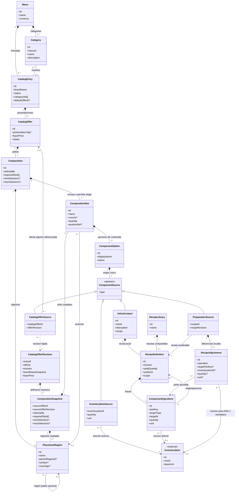

# Modelo de dominio del catálogo — MCCC

**Estado:** propuesta estructural consolidada.  
**Alcance:** Bounded Context de Menú/Catálogo.  
**Propósito:** describir qué ofrece el restaurante, cómo se compone cada oferta y qué decisiones de inclusión de slots y contenido declara el catálogo. La configuración definida aquí termina al determinar los slots incluidos y su opción de contenido; no define el procesamiento de una orden ni un motor de configuración.

## 1. Resumen del diseño

### 1.1. Estructura general

El menú contiene un catálogo común de categorías y entradas comerciales (`CatalogEntry`). Una entrada puede pertenecer a varias categorías y ofrece una o más presentaciones vendibles (`CatalogOffer`). La oferta no repite el nombre de su entrada: su etiqueta `presentationTag` es opcional y descriptiva. Por ejemplo, «Hamburguesa de la Casa · Grande» resulta de combinar el nombre comercial con la presentación.

**Toda `CatalogOffer` tiene una `Composition` de uno o más `CompositionSlot`.** Esta estructura representa tanto una bebida o un espagueti individual —un único slot— como un combo de varias pizzas. No existe una clasificación previa y excluyente de la oferta como «ingrediente», «preparación» o «combo»; la composición determina qué contiene.

Cada slot identifica una posición o función del producto («Primera pizza», «Bebida», «Plato principal»), su cantidad incluida, su tiempo de servicio sugerido, una ubicación espacial opcional y un conjunto de `ComponentOption`. Una opción es una **aparición definida en ese slot**, no la definición global del producto que referencia. Dos slots pueden ofrecer la misma oferta como alternativa de contenido.

Una `ComponentOption` tiene exactamente un contenido polimórfico:

- **`INLINE`:** una receta definida localmente para esa opción.
- **`INVENTORY_ITEM`:** artículo o ingrediente del catálogo externo de Inventario.
- **`PREPARATION`:** receta de una biblioteca reutilizable de Catálogo, utilizada tal cual o adaptada mediante ajustes locales.
- **`CATALOG_OFFER`:** referencia a otra oferta vendible con su propia composición y alternativas de contenido.

### 1.2. Dos niveles de selección, sin confundirlos

**Nivel 1 — inclusión de slots, definido por `Composition`:**

- `selectable = false`: **todos** los slots de la composición están incluidos. `requiredSlots`, `minSelections` y `maxSelections` no aplican.
- `selectable = true`: `requiredSlots` identifica **slots obligatorios e inamovibles**. El comensal elige además entre los restantes según `minSelections` y `maxSelections`.
- Los límites se aplican **solo a slots elegibles**, excluyendo los obligatorios incluidos en `requiredSlots`.

**Nivel 2 — contenido de cada slot incluido:** cada slot tiene una o más `ComponentOption`. Si contiene una única opción, su contenido está determinado; si ofrece varias alternativas, se elige la que ocupa ese slot. Incluso un slot obligatorio puede tener varias alternativas de contenido. Elegir incluir un slot y elegir su contenido son decisiones distintas.

**Ejemplo:** un combo con `selectable = false` tiene obligatoriamente «Pizza 1», «Pizza 2» y «Bebida»; dentro de «Pizza 1» todavía puede elegirse entre hawaiana o pepperoni. En otro menú, `selectable = true` puede fijar «Bebida» mediante `requiredSlots` y permitir elegir entre uno y dos slots adicionales de entrada, fuerte o postre.

### 1.3. Recetas y responsabilidades

Inventario **posee** la identidad de sus artículos/ingredientes y su stock. Catálogo los referencia mediante identificadores externos, y **posee** la definición de recetas, cantidades y ajustes locales de preparación. No se introduce un servicio Kitchen ni una segunda entidad autoritativa de ingrediente dentro de Catálogo.

Una `RecipeDefinition` contiene líneas `ComponentIngredient` con cantidad y unidad. Cada línea apunta a un `InventoryItem` o, cuando una preparación reutilizable es parte de otra receta, a una `RecipeDefinition` de biblioteca. Una `PreparationSource` referencia una receta publicada y puede declarar `RecipeAdjustment` sobre partes concretas: mantiene la receta de biblioteca como fuente común y explicita sus diferencias sin editarla globalmente. Cuando `INLINE` representa una preparación, utiliza una receta propia de esa opción. Una receta de biblioteca puede utilizarse tal cual, sin ajustes.

`CompositionSnapshot` conserva de forma inmutable la composición publicada de una revisión de oferta. Pertenece únicamente a `CatalogOfferRevision`; no es contenido vigente ni se utiliza como destino de `InlineContent`. `InlineContent` contiene una receta local de alcance propio.

No se requieren tres recetas independientes para una hamburguesa chica, mediana y grande: las ofertas pueden reutilizar una receta y declarar cantidades o ajustes administrativos propios en sus fuentes de preparación.

### 1.4. Regla comercial de precios

`CatalogOffer.basePrice` es el **precio base fijo de la oferta tal como se venda, independientemente de qué slots u opciones de su composición se seleccionen**. Una oferta con diferentes slots no suma automáticamente los precios base de otros slots. `CompositionSlot`, `ComponentOption` y la selección entre ellos **no aportan cargos a `basePrice`**.

El catálogo **solo declara** el precio base: no calcula el precio final, no evalúa cambios de una orden y no determina aquí el algoritmo de cobro.

### 1.5. Límites del modelo

Se definen identidades, referencias y estructuras necesarias para que el dominio sea inequívoco; **no** se prescriben tablas, claves foráneas, arquitectura de persistencia, API, eventos ni motor de resolución. La cantidad pedida, las elecciones concretas, los asientos, los tiempos de marcha, la disponibilidad en tiempo real, la facturación y el cálculo de precio de una orden pertenecen a otros modelos.

Una entrada solo puede eliminarse definitivamente si está archivada y ninguna de sus ofertas mantiene referencias vigentes externas. Una oferta solo puede eliminarse individualmente si está inactiva, no mantiene referencias vigentes externas, no es la oferta indicada por `defaultOfferId` de su entrada y su eliminación no deja una entrada activa sin una oferta activa y válida. Las referencias desde `CatalogOfferSource` bloquean la eliminación de la oferta afectada o de su entrada. `defaultOfferId` bloquea únicamente la eliminación individual de esa oferta; al eliminar la entrada completa, el vínculo poseído se retira con ella. La operación rechazada no modifica los recursos dependientes. Las definiciones y estructuras poseídas exclusivamente por el recurso eliminado pueden retirarse junto con él; las revisiones históricas permanecen inmutables y consultables por `offerId` y `revision`.

---

## 2. Resumen de entidades

| Entidad | Descripción |
|---|---|
| `Menu` | Menú propietario del conjunto de categorías y entradas comerciales. |
| `Category` | Categoría reutilizable del menú que clasifica varias entradas. |
| `CatalogEntry` | Identidad comercial y administración de un producto de la carta. |
| `CatalogOffer` | Presentación vendible vigente con precio base y composición propia. |
| `CatalogOfferRevision` | Instantánea histórica e inmutable de una revisión publicada de oferta, consultable aunque se elimine su oferta vigente. |
| `Composition` | Define el conjunto de slots y las reglas para incluirlos en la oferta. |
| `CompositionSnapshot` | Composición publicada e inmutable que forma parte de una `CatalogOfferRevision` histórica. |
| `CompositionSlot` | Posición funcional o espacial que aporta contenido a la composición. |
| `PlacementRegion` | Región o ubicación semántica donde se aplica un slot. |
| `ComponentOption` | Alternativa de contenido admitida dentro de un slot. |
| `ComponentSource` | Tipo conceptual de contenido que identifica el origen único de una opción. |
| `InlineContent` | Contenido local de una `ComponentOption` que contiene una receta de alcance local. |
| `InventoryItemSource` | Referencia a un artículo o ingrediente cuyo catálogo pertenece a Inventario. |
| `PreparationSource` | Referencia a una receta reutilizable con ajustes locales opcionales. |
| `CatalogOfferSource` | Referencia a otra oferta comercial reutilizada como componente. |
| `InventoryItem` *(externa)* | Artículo o ingrediente autoritativo de Inventario al que Catálogo hace referencia. |
| `RecipeLibrary` | Colección de recetas compartidas administradas por Catálogo. |
| `RecipeDefinition` | Composición física base de una preparación, con rendimiento y líneas de receta. |
| `ComponentIngredient` | Aparición identificable de un ingrediente o preparación dentro de una receta. |
| `RecipeAdjustment` | Diferencia local respecto de una receta reutilizable, referida a una parte identificable. |

---

## 3. Desglose de entidades

Las marcas **obligatorio**, **opcional** y **derivado** expresan necesidades de dominio. Los identificadores son conceptuales y no presuponen un tipo de clave de base de datos. Las listas vacías se permiten únicamente cuando las reglas de publicación de su entidad lo indican.

### 3.1. `Menu`

**Atributos:** `id`, `name`, `currency`, `categories[]`, `entries[]`.

**Relaciones:** contiene múltiples `Category` y `CatalogEntry`.

**Reglas e invariantes:** los identificadores de categorías y entradas son únicos en su ámbito; cada entrada se clasifica usando categorías del mismo menú. La categoría se administra una sola vez, no dentro de cada oferta.

### 3.2. `Category`

**Atributos:** `id`, `menuId`, `name`, `description`.

**Relaciones:** pertenece a un menú; clasifica cero o más entradas. Una entrada puede tener varias categorías (relación conceptual muchos a muchos).

**Reglas e invariantes:** no se duplica una entrada por asignarla a más de una categoría; la asignación puede almacenarse como `categoryIds[]` en el modelo de dominio sin convertir la tabla de unión futura en una entidad de negocio obligatoria.

### 3.3. `CatalogEntry`

**Atributos:** `id`, `menuId`, `brandName`, `description`, `imageRef`, `status: ACTIVE | INACTIVE | ARCHIVED`, `categoryIds[]`, `defaultOfferId?`, `offers[]`.

**Relaciones:** pertenece a `Menu`; tiene múltiples categorías y múltiples `CatalogOffer`.

**Reglas e invariantes:** `brandName` es el nombre comercial autoritativo. Puede guardarse una entrada incompleta, pero una entrada `ACTIVE` y publicable debe disponer de al menos una oferta `ACTIVE` y válida. El archivado es reversible y desarchivar deja siempre la entrada `INACTIVE`. El estado de una entrada no modifica automáticamente los estados administrativos de sus ofertas. Las categorías no alteran recetas ni composiciones. Solo una entrada `ARCHIVED` admite eliminación definitiva; se rechaza mientras cualquiera de sus ofertas mantenga referencias vigentes externas desde `CatalogOfferSource`, sin modificar los recursos referenciantes. Cuando no existen dichas referencias, la entrada y sus definiciones vigentes poseídas pueden eliminarse en conjunto. `defaultOfferId` es una relación poseída por la entrada y se retira junto con ella, por lo que no bloquea su eliminación completa. Las revisiones históricas publicadas permanecen inmutables y consultables.

### 3.4. `CatalogOffer`

**Atributos:** `id`, `entryId`, `presentationTag`, `basePrice`, `status: ACTIVE | INACTIVE`, `offerImageRef`, `composition`.

**Relaciones:** pertenece a una `CatalogEntry` y contiene exactamente una `Composition`. Puede ser referenciada por múltiples `CatalogOfferSource`. Sus revisiones publicadas producen `CatalogOfferRevision` independientes de la definición vigente.

**Reglas e invariantes:** no duplica `brandName`. Su nombre visible resulta de la entrada y la presentación opcional. `presentationTag` describe, pero **no determina cantidades físicas**. `basePrice` no depende del contenido elegido en los slots; las ofertas hijas referenciadas no se suman automáticamente. Una oferta `ACTIVE` y válida solo se publica bajo una entrada `ACTIVE`; una entrada `ACTIVE` necesita al menos una oferta `ACTIVE` y válida. El estado de la oferta es independiente del estado de su entrada. Solo una oferta `INACTIVE` puede eliminarse individualmente, siempre que no esté referenciada por una definición vigente mediante `CatalogOfferSource`, no sea el `defaultOfferId` de su entrada y su eliminación no deje una entrada `ACTIVE` sin oferta `ACTIVE` y válida. La eliminación se rechaza sin modificar los recursos referenciantes. Sus estructuras poseídas exclusivamente pueden eliminarse con la oferta; sus revisiones históricas publicadas permanecen inmutables y consultables aunque la definición vigente desaparezca. La cantidad de ofertas solicitadas pertenece a una orden futura, no a esta entidad.

### 3.4.1. `CatalogOfferRevision`

**Atributos:** `entryId`, `offerId`, `revision`, `brandNameSnapshot`, `presentationTag?`, `basePrice`, `status`, `offerImageRef?`, `compositionSnapshot`.

**Relaciones:** conserva la definición publicada de una `CatalogOffer` identificada por `offerId` y `revision`; contiene una `CompositionSnapshot` histórica. No depende de que permanezcan la entrada o la oferta vigente.

**Reglas e invariantes:** es inmutable. La eliminación de una `CatalogOffer` o de su `CatalogEntry` puede retirar la definición vigente, pero no elimina las revisiones históricas publicadas. Una revisión puede seguir consultándose mediante `offerId` y `revision` aunque ya no exista la definición vigente correspondiente. Las referencias conservadas en una revisión histórica permanecen intactas aunque ya no exista la definición vigente.

### 3.5. `Composition`

**Atributos:** `id`, `offerId`, `selectable`, `requiredSlots[]` (identificadores de slots), `minSelections?`, `maxSelections?`, `slots[]`, `placementRegions[]?`.

**Relaciones:** pertenece a una oferta y contiene uno o más `CompositionSlot`; puede definir regiones usadas por los slots.

**Reglas e invariantes:**

- Si `selectable = false`, todos los slots se incluyen; `requiredSlots` está vacío y los límites de elección no aplican.
- Si `selectable = true`, `requiredSlots` contiene únicamente slots propios, distintos y **siempre incluidos**. No pueden desmarcarse al ordenar.
- Los otros slots son elegibles. `minSelections` y `maxSelections` limitan **cuántos de esos otros slots** se pueden incluir; los obligatorios no consumen ese cupo.
- Debe cumplirse `0 <= minSelections <= maxSelections <= número de slots elegibles`; para una composición que exige elegir alguno, `minSelections >= 1`. No se permite una composición seleccionable sin slots elegibles.
- `requiredSlots` no almacena decisiones concretas de una orden ni `ComponentOption`.
- Es válida una composición con **un solo slot**. Si no es seleccionable, ese slot representa todo el contenido de la oferta.

### 3.5.1. `CompositionSnapshot`

**Atributos:** `sourceOfferId`, `sourceOfferRevision`, `selectable`, `requiredSlots[]`, `minSelections?`, `maxSelections?`, `slots[]`, `placementRegions[]?`.

**Relaciones:** pertenece a una `CatalogOfferRevision` y conserva la composición publicada correspondiente a esa revisión.

**Reglas e invariantes:** conserva de forma inmutable la composición publicada de una revisión, incluidos slots, alternativas de contenido y reglas de selección. Sus identidades internas pertenecen al ámbito de la revisión histórica.

### 3.6. `CompositionSlot`

**Atributos:** `id`, `compositionId`, `name`, `course?`, `quantity` (unidades incluidas al incorporar el slot), `positionRef?`, `options[]`.

**Relaciones:** pertenece a una `Composition` vigente o a una `CompositionSnapshot` histórica; contiene una o más `ComponentOption`; opcionalmente referencia una `PlacementRegion` de su composición. En una instantánea, `compositionId` identifica la composición de su revisión histórica.

**Reglas e invariantes:**

- El slot representa un **lugar o función** («Pizza 1», «Guarnición», «Bebida»), no uno de los cuatro tipos de origen.
- `positionRef` es ubicación espacial, **no** un indicador de obligatorio/elegible. El carácter obligatorio lo decide `Composition`.
- `quantity` indica cuántas unidades de contenido incorpora esa posición.
- Un slot incluido debe concretarse con una de sus opciones. Si solo tiene una, no necesita una decisión entre alternativas; si tiene varias, la selección de contenido es independiente de la inclusión del slot.
- `course` es una sugerencia de tiempo de servicio, no un estado de marcha.

### 3.7. `PlacementRegion` (no realizar, ni contemplar la funcionalidad de cobertura por el momento. De momento name solo representa una etiqueta descriptiva, los demás atributos se dejan como opcionales para futuras implementaciones)

**Atributos:** `id`, `compositionId`, `name`, `parentRegionId?`, `surface?`, `coverage?`.

**Relaciones:** se define dentro de una `Composition` vigente o de una `CompositionSnapshot` histórica; puede tener región padre y ser referenciada por slots de esa misma composición.

**Reglas e invariantes:** permite nombrar `LEFT`, `RIGHT` o `CRUST` y, cuando corresponda, una cobertura proporcional. Una región no implica selección ni modifica por sí misma el precio. Las regiones de superficies diferentes no tienen por qué sumar 100 % entre sí; la orilla completa y las mitades de una pizza son superficies distintas. El catálogo declara la ubicación, no el algoritmo de consumo de ingredientes.

### 3.8. `ComponentOption`

**Atributos:** `id`, `slotId`, `displayName`, `status: ACTIVE | INACTIVE`, `source` (exactamente uno).

**Relaciones:** pertenece a un `CompositionSlot`; contiene un `ComponentSource` concreto.

**Reglas e invariantes:** es una aparición contextual. Dos `ComponentOption` con el mismo destino siguen siendo alternativas distintas dentro del slot. `displayName` puede sobrescribir la etiqueta contextual, sin redefinir la identidad global de Inventario, receta u oferta. Una opción inactiva no se ofrece como alternativa nueva. No contiene un precio de contribución al `basePrice`. Si su origen referencia una oferta vigente, esa referencia impide eliminar individualmente la oferta o eliminar su entrada; la eliminación se rechaza sin modificar la referencia ni sus recursos contenedores.

### 3.9. `ComponentSource` (tipo conceptual)

**Atributos:** `type: INLINE | INVENTORY_ITEM | PREPARATION | CATALOG_OFFER`.

**Relaciones:** especialización exclusiva hacia `InlineContent`, `InventoryItemSource`, `PreparationSource` o `CatalogOfferSource`.

**Reglas e invariantes:** cada `ComponentOption` posee una sola variante válida de contenido. El origen no se declara simultáneamente en `CatalogOffer` ni se separa en cuatro listas de slots.

### 3.10. `InlineContent`

**Atributos:** `id`, `name?`, `recipe`, `description?`.

**Relaciones:** es contenido local de una sola `ComponentOption` mediante `ComponentSource`. Contiene una `RecipeDefinition` de alcance local.

**Reglas e invariantes:** permite definir una preparación directamente dentro de una alternativa sin crear una receta reutilizable. Puede usar artículos de Inventario y preparaciones reutilizables existentes. No copia ni redefine la identidad autoritativa de los artículos de Inventario.

### 3.11. `InventoryItemSource`

**Atributos:** `inventoryItemId`, `quantity`, `unit`, `displayNameSnapshot?`.

**Relaciones:** referencia exactamente un `InventoryItem` externo.

**Reglas e invariantes:** cantidad positiva y unidad compatible con la unidad del artículo. Los datos de nombre pueden ser una vista o instantánea descriptiva, no otra definición autoritativa. Una venta de artículo directo no exige receta artificial.

### 3.12. `PreparationSource`

**Atributos:** `recipeId`, `recipeRevision`, `name?`, `adjustments[]`.

**Relaciones:** referencia una `RecipeDefinition` publicada de `RecipeLibrary`; puede incluir `RecipeAdjustment` propios de esa aparición.

**Reglas e invariantes:** con `adjustments[]` vacío utiliza la receta tal cual. Para ajustar administrativamente la definición de base en esa aparición, se parte de sus líneas y se declaran ajustes explícitos. Los cambios locales no mutan la receta reutilizable ni otros usos de ella.

### 3.13. `CatalogOfferSource`

**Atributos:** `catalogOfferId`, `offerRevision`, `displayNameSnapshot?`.

**Relaciones:** referencia obligatoriamente una `CatalogOfferRevision` identificada por `catalogOfferId` y `offerRevision`. En una definición vigente también referencia la `CatalogOffer` correspondiente; en una revisión histórica esta definición vigente puede haber sido eliminada.

**Reglas e invariantes:** conserva el carácter de unidad vendible y la composición propia de la oferta hija sin copiarla como una nueva receta. Dos slots que referencian la misma oferta son apariciones independientes. Se evitan ciclos de referencias entre ofertas. Su precio base individual no se suma al de la oferta padre. En una definición vigente, esta referencia impide eliminar individualmente la oferta de destino o eliminar su entrada; la operación se rechaza sin modificar la referencia ni el recurso que la contiene. En una revisión histórica, la referencia permanece asociada a la revisión conservada aunque la definición vigente correspondiente deje de existir.

### 3.14. `InventoryItem` (concepto externo)

**Atributos de referencia:** `id`, `name`, `baseUnit` (definidos por Inventario; Catálogo no los administra).

**Relaciones:** puede ser referenciado por `InventoryItemSource`, `ComponentIngredient` y `RecipeAdjustment`.

**Reglas e invariantes:** Catálogo no crea ni cambia su identidad o existencias. Los límites de stock no forman parte de la validez estructural de la receta.

### 3.15. `RecipeLibrary`

**Atributos:** `id`, `name`, `recipes[]`.

**Relaciones:** reúne múltiples `RecipeDefinition` reutilizables.

**Reglas e invariantes:** es un catálogo **de recetas**, no de ofertas; una salsa puede existir sin venderse individualmente. Distingue recetas registradas y reutilizables de recetas privadas de `InlineContent`.

### 3.16. `RecipeDefinition`

**Atributos:** `id`, `name`, `description?`, `revision`, `scope: INLINE | LIBRARY`, `yieldQuantity`, `yieldUnit`, `ingredients[]`, `status: ACTIVE | INACTIVE`.

**Relaciones:** pertenece a `InlineContent` cuando esta contiene una receta local, o a `RecipeLibrary` según su alcance; contiene una o más líneas `ComponentIngredient`.

**Reglas e invariantes:** define ingredientes y cantidades de referencia para un rendimiento determinado; sus líneas tienen identidad estable dentro de su revisión. Puede incorporar artículos de Inventario y preparaciones reutilizables. Una receta compartida no se cambia retroactivamente en sus usos existentes: los cambios administrativos producen revisión. Se impiden ciclos de recetas. Una receta **no** es una lista de productos comerciales incluidos en un combo.

### 3.17. `ComponentIngredient`

**Atributos:** `id`, `recipeId`, `partKey`, `displayName?` (descriptivo), `targetType: INVENTORY_ITEM | RECIPE`, `targetId`, `targetRevision?`, `quantity`, `unit`.

**Relaciones:** pertenece a una `RecipeDefinition`; referencia un artículo de Inventario o una receta reutilizable.

**Reglas e invariantes:** `partKey` identifica la aparición concreta y evita confundir dos usos del mismo ingrediente. Cantidad y unidad son obligatorias. Los ajustes administrativos que operan sobre una línea apuntan a una línea `INVENTORY_ITEM` de la receta aplicable; para ajustar internamente una subreceta debe exponerse explícitamente una preparación adaptada, no apuntar tácitamente a una línea de otro ámbito.

### 3.18. `RecipeAdjustment`

**Atributos:** `id`, `preparationSourceId`, `operation: ADD | REMOVE | OVERRIDE_QUANTITY | REPLACE_INVENTORY_ITEM`, `targetPartKey?`, `inventoryItemId?`, `quantity?`, `unit?`.

**Relaciones:** pertenece a una `PreparationSource`; referencia la parte de receta ajustada y, en altas o sustituciones de un ingrediente directo, el artículo de Inventario.

**Reglas e invariantes:** expresa diferencias **administrativas** de una preparación reutilizada, no decisiones de una orden ni cargos. `REMOVE`, `OVERRIDE_QUANTITY` y `REPLACE_INVENTORY_ITEM` requieren una línea de origen compatible; `ADD` necesita un ingrediente y cantidad. Ajustar una receta no significa editar la biblioteca global.

### 3.19. Reglas transversales de coherencia

1. Las referencias externas se hacen por identidad explícita; igualdad numérica entre identificadores de contextos diferentes **no** implica identidad compartida.
2. `CatalogOffer`, `Composition`, `CompositionSlot` y `ComponentOption` son conceptos diferentes incluso en una oferta con un único slot y una única opción.
3. Una selección obligatoria de slot (`requiredSlots`) no determina automáticamente qué `ComponentOption` se usa si el slot tiene varias alternativas.
4. Las referencias recursivas entre ofertas y recetas no pueden producir ciclos.
5. Las versiones publicadas de recetas y ofertas referenciadas deben poder identificarse sin alterar retroactivamente composiciones ya publicadas. Las revisiones de ofertas eliminadas permanecen consultables por `offerId` y `revision`.
6. El catálogo declara `basePrice`, pero **no** contiene un `finalPrice` ni cálculos sobre selección de slots.
7. `RecipeAdjustment` conserva el alcance administrativo local de `PreparationSource`; una referencia a oferta hija conserva la composición propia de esa oferta.
8. Una `CatalogEntry` `ARCHIVED` o una `CatalogOffer` `INACTIVE` no puede eliminarse mientras alguna definición vigente del catálogo mantenga una referencia externa hacia una oferta afectada mediante `CatalogOfferSource`. La operación se rechaza sin modificar los recursos dependientes. Las estructuras poseídas exclusivamente por el recurso eliminado pueden eliminarse con él y las revisiones históricas permanecen inmutables. `defaultOfferId` impide eliminar individualmente la oferta indicada, pero es una relación poseída por su entrada y se retira con ella al eliminar la entrada completa.

---

## 4. Diagrama de clases del dominio

El diagrama siguiente resume el modelo. Composición (`*--`) representa pertenencia conceptual; asociación o dependencia indica referencia, no una clave foránea prescrita. Las cuatro subclases de `ComponentSource` son **alternativas excluyentes**; `InlineContent` contiene una receta local y `CompositionSnapshot` pertenece únicamente a `CatalogOfferRevision`. `InventoryItem` pertenece a otro Bounded Context. Los campos resumidos del diagrama están desglosados en la sección 3.

### 4.1. Menú, composición y tipos de contenido

> Cada `CatalogEntry` usa categorías del mismo menú; una entrada `ACTIVE` debe tener al menos una oferta `ACTIVE` y válida. Solo se publican ofertas `ACTIVE` y válidas bajo una entrada `ACTIVE`. Cambiar el estado de la entrada no cambia automáticamente los estados de sus ofertas, ni viceversa. Si `selectable = false`, se incluyen todos los slots, `requiredSlots` queda vacío y no aplican límites de selección. Si `selectable = true`, `requiredSlots` identifica slots propios, distintos y siempre incluidos; solo los demás son elegibles para seleccionar y satisfacer `minSelections`/`maxSelections` (`0 ≤ min ≤ max ≤ elegibles`; si se exige elegir, `min ≥ 1`). Los slots obligatorios no se eligen ni consumen ese cupo, y una composición seleccionable necesita al menos un elegible. Incluir un slot y elegir su `ComponentOption` son decisiones distintas.
>
> `positionRef` indica una ubicación espacial opcional, no si el slot es obligatorio o elegible; `course` sugiere un tiempo de servicio, no un estado de marcha.
>
> Esta vista describe definiciones del catálogo; no modela selecciones ni procesamiento de órdenes, cálculo del precio final, disponibilidad en tiempo real o gestión de stock.
>
> `CatalogOffer.basePrice` es fijo para la oferta: ni las selecciones de slots ni las ofertas hijas referenciadas lo incrementan automáticamente. `presentationTag` solo describe la presentación; no determina cantidades físicas.
>
> Inventario es dueño de la identidad de `InventoryItem` y del stock; Catálogo mantiene referencias externas y no administra existencias. La validez estructural de una receta no depende de disponibilidad.
>
> Las cuatro variantes de `ComponentSource` son excluyentes. `InlineContent` contiene una `RecipeDefinition` de alcance local; `CatalogOfferRevision` contiene su `CompositionSnapshot` histórica con slots, opciones y reglas de selección. Cada `ComponentIngredient` referencia exactamente un `InventoryItem` **o** una `RecipeDefinition` reutilizable de `RecipeLibrary` cuando `targetType = RECIPE`. `RecipeAdjustment` apunta a una línea de origen cuando la operación la requiere y a `InventoryItem` para `ADD` o `REPLACE_INVENTORY_ITEM`.
>
> Las referencias recursivas entre ofertas y recetas no pueden formar ciclos. `CatalogOfferSource` siempre fija una `CatalogOfferRevision`; en una definición vigente también existe la `CatalogOffer` referenciada, mientras una revisión histórica puede conservar solo el vínculo a la revisión publicada. Si una oferta o su entrada tiene una referencia vigente externa, la eliminación se rechaza sin cambiar la `ComponentOption`, la oferta contenedora ni sus estados, y no crea revisiones nuevas. La eliminación de la entrada completa retira su `defaultOfferId` poseído; este vínculo sí impide eliminar individualmente la oferta indicada. Las `CatalogOfferRevision` y sus `CompositionSnapshot` permanecen consultables por `offerId` y `revision`. `PlacementRegion.name` es una etiqueta descriptiva; `surface` y `coverage` son atributos opcionales reservados para el futuro y no implican comportamiento de cobertura.
