# Modelo de dominio del catálogo — MCCC

**Estado:** propuesta estructural consolidada.  
**Alcance:** Bounded Context de Menú/Catálogo.  
**Propósito:** describir qué ofrece el restaurante y cómo se compone cada oferta mediante slots, opciones de contenido y cantidades de selección. La configuración definida aquí termina al determinar la composición y sus opciones; no define el procesamiento de una orden ni un motor de configuración.

## 1. Resumen del diseño

### 1.1. Estructura general

El menú contiene un catálogo común de categorías y entradas comerciales (`CatalogEntry`). Una entrada puede pertenecer a varias categorías y contiene sus ofertas (`CatalogOffer`); cada oferta es individualmente vendible y seleccionable. La oferta no repite el nombre de su entrada: su etiqueta `presentationTag` es opcional y descriptiva. Por ejemplo, «Hamburguesa de la Casa · Grande» resulta de combinar el nombre comercial con la presentación.

**Toda `CatalogOffer` tiene una `Composition` —composición, el conjunto de slots— formada por uno o más `CompositionSlot`.** Todos los slots pertenecen estructuralmente a la composición y cada slot `ACTIVE` participa en la oferta; los slots `INACTIVE` no generan rondas. Esta estructura representa tanto una bebida o un espagueti individual —un único slot— como un combo de varias pizzas. No existe una clasificación previa y excluyente de la oferta como «ingrediente», «preparación» o «combo»; la composición determina qué contiene.

Cada `CompositionSlot` —slot— contiene una o más `SlotOption` —opciones— para una función del producto («Primera pizza», «Bebida», «Plato principal») y puede incluir un tiempo de servicio sugerido. Su estado es derivado: es `ACTIVE` si contiene al menos una opción `ACTIVE` y `INACTIVE` si no contiene ninguna. Cada slot `ACTIVE` participa y genera `CompositionSlot.quantity` rondas; en cada ronda se elige exactamente una opción `ACTIVE`. Si un slot tiene una sola opción `ACTIVE`, esta se aplica en cada ronda.

Al configurar una oferta, se puede elegir otra `CatalogOffer` como plantilla y copiar sus slots y opciones a la composición en curso. Las definiciones copiadas pasan a pertenecer a la composición destino y se pueden editar de forma independiente. Conservan el estado de sus opciones y sus referencias a Inventario y a revisiones de recetas, pero no la identidad ni el precio de la oferta plantilla; no queda una referencia a esa oferta ni sincronización posterior. El estado de cada slot copiado se deriva de las opciones copiadas.

La cantidad de rondas pertenece al slot: por ejemplo, si un slot `ACTIVE` tiene `CompositionSlot.quantity` igual a 3, se realizan tres elecciones en ese slot y en cada una se elige una de sus opciones activas. Los slots `INACTIVE` no generan rondas. Las opciones no tienen una cantidad de selección propia.

Una `SlotOption` tiene exactamente un contenido polimórfico:

- **`INVENTORY_ITEM`:** artículo o ingrediente del catálogo externo de Inventario.
- **`RECIPE`:** referencia por identificador y revisión a una `RecipeDefinition` de `RecipeLibrary`.

### 1.2. Slots y rondas de selección

Todos los slots pertenecen estructuralmente a la `Composition` y todo slot `ACTIVE` participa; los slots `INACTIVE` no se seleccionan ni generan rondas. `CompositionSlot.quantity` determina cuántas veces se elige una opción `ACTIVE` del slot y, en cada ronda, se elige exactamente una. Si un slot tiene una sola opción `ACTIVE`, esta se aplica en cada ronda. La cantidad del origen `InventoryItemSource` conserva su significado de cantidad y unidad del artículo.

### 1.3. Recetas y responsabilidades

Inventario **posee** la identidad de sus artículos/ingredientes, su unidad de medida y su stock. Catálogo los referencia mediante identificadores externos y **posee** las definiciones de recetas. No se introduce un servicio Kitchen ni una segunda entidad autoritativa de ingrediente dentro de Catálogo.

Una `RecipeDefinition` define nombre, descripción, instrucciones en texto y una o más líneas `ComponentIngredient`. Cada línea representa un ingrediente seleccionado de Inventario e indica su cantidad; al seleccionarlo y al consultar o editar la receta, se muestra la unidad autoritativa de ese artículo. Al configurar una opción, se puede seleccionar una receta existente o crearla desde ese flujo; en ambos casos pertenece a `RecipeLibrary` y `SlotOption` la referencia por identificador y revisión.

`CompositionSnapshot` conserva de forma inmutable los slots y opciones locales de la composición publicada en una revisión de oferta y pertenece únicamente a `CatalogOfferRevision`.

Las ofertas pueden reutilizar una receta mediante referencias al mismo identificador y revisión.

### 1.4. Regla comercial de precios

`CatalogOffer.basePrice` es el **precio base fijo de la oferta tal como se venda**. Los slots, sus opciones y las rondas de selección no aportan cargos a `basePrice`. Al copiar slots desde una oferta plantilla, no se copia ni se suma el precio base de esa oferta.

El catálogo **solo declara** el precio base: no calcula el precio final, no evalúa cambios de una orden y no determina aquí el algoritmo de cobro.

### 1.5. Límites del modelo

Se definen identidades, referencias y estructuras necesarias para que el dominio sea inequívoco; **no** se prescriben tablas, claves foráneas, arquitectura de persistencia, API, eventos ni motor de resolución. La cantidad pedida, las elecciones concretas, los asientos, los tiempos de marcha, la disponibilidad en tiempo real, la facturación y el cálculo de precio de una orden pertenecen a otros modelos.

Una entrada solo puede eliminarse definitivamente si está archivada. Una oferta solo puede eliminarse individualmente si está inactiva y su eliminación no deja una entrada activa sin una oferta activa y válida. Las definiciones y estructuras poseídas exclusivamente por el recurso eliminado pueden retirarse junto con él; las revisiones históricas permanecen inmutables y consultables por `offerId` y `revision`.

---

## 2. Resumen de entidades

| Entidad | Descripción |
|---|---|
| `Menu` | Menú propietario del conjunto de categorías y entradas comerciales. |
| `Category` | Categoría reutilizable del menú que clasifica varias entradas. |
| `CatalogEntry` | Identidad comercial que contiene las ofertas de un producto de la carta. |
| `CatalogOffer` | Oferta individualmente vendible y seleccionable, con precio base y composición propia. |
| `CatalogOfferRevision` | Instantánea histórica e inmutable de una revisión publicada de oferta, consultable aunque se elimine su oferta vigente. |
| `Composition` | Composición que contiene uno o más slots y pertenece a una oferta. |
| `CompositionSnapshot` | Composición publicada e inmutable que forma parte de una `CatalogOfferRevision` histórica. |
| `CompositionSlot` | Slot con opciones de contenido; su actividad se deriva de sus opciones y cada slot activo genera rondas. |
| `SlotOption` | Opción de contenido disponible en un slot. |
| `ComponentSource` | Tipo conceptual que identifica el origen único de una `SlotOption`. |
| `InventoryItemSource` | Referencia a un artículo o ingrediente cuyo catálogo pertenece a Inventario. |
| `RecipeSource` | Referencia por identificador y revisión a una receta de la biblioteca. |
| `InventoryItem` *(externa)* | Artículo o ingrediente autoritativo de Inventario al que Catálogo hace referencia. |
| `RecipeLibrary` | Colección propietaria de las recetas administradas por Catálogo. |
| `RecipeDefinition` | Definición versionada con datos textuales y líneas de ingredientes de Inventario. |
| `ComponentIngredient` | Aparición identificable de un artículo de Inventario dentro de una receta. |

---

## 3. Desglose de entidades

Las marcas **obligatorio**, **opcional** y **derivado** expresan necesidades de dominio. Los identificadores son conceptuales y no presuponen un tipo de clave de base de datos. Las listas vacías se permiten únicamente cuando las reglas de publicación de su entidad lo indican.

### 3.1. `Menu`

**Atributos:** `id`, `name`, `currency`, `categories[]`, `entries[]`.

**Relaciones:** contiene múltiples `Category` y `CatalogEntry`.

**Reglas e invariantes:** los identificadores de categorías y entradas son únicos en su ámbito; cada entrada se clasifica usando categorías del mismo menú. La categoría se administra una sola vez, no dentro de cada oferta.

### 3.2. `Category`

**Atributos:** `id`, `menuId`, `name`, `description`.

**Relaciones:** pertenece a un menú; clasifica cero o más entradas. Una entrada puede tener varias categorías (relación conceptual muchos a muchos).

**Reglas e invariantes:** no se duplica una entrada por asignarla a más de una categoría; la asignación puede almacenarse como `categoryIds[]` en el modelo de dominio sin convertir la tabla de unión futura en una entidad de negocio obligatoria.

### 3.3. `CatalogEntry`

**Atributos:** `id`, `menuId`, `brandName`, `description`, `imageRef`, `status: ACTIVE | INACTIVE | ARCHIVED`, `categoryIds[]`, `offers[]`.

**Relaciones:** pertenece a `Menu`; tiene múltiples categorías y múltiples `CatalogOffer`.

**Reglas e invariantes:** `brandName` es el nombre comercial autoritativo. La entrada contiene sus ofertas. Puede guardarse una entrada incompleta. Su estado `ACTIVE` es administrativo e independiente de las ofertas: puede conservarse aunque no tenga una oferta `ACTIVE` válida, pero en ese caso no se publica ni se muestra en el catálogo. Solo se publica una entrada `ACTIVE` si tiene al menos una oferta `ACTIVE` y válida. El archivado es reversible y desarchivar deja siempre la entrada `INACTIVE`. El estado de una entrada no modifica automáticamente los estados administrativos de sus ofertas. Las categorías no alteran recetas ni composiciones. Solo una entrada `ARCHIVED` admite eliminación definitiva; sus definiciones vigentes poseídas pueden eliminarse en conjunto. Las revisiones históricas publicadas permanecen inmutables y consultables.

### 3.4. `CatalogOffer`

**Atributos:** `id`, `entryId`, `presentationTag`, `basePrice`, `status: ACTIVE | INACTIVE`, `offerImageRef`, `composition`.

**Relaciones:** pertenece a una `CatalogEntry` y contiene exactamente una `Composition`. Sus revisiones publicadas producen `CatalogOfferRevision` independientes de la definición vigente.

**Reglas e invariantes:** no duplica `brandName`. Su nombre visible resulta de la entrada y la presentación opcional. `presentationTag` describe, pero **no determina cantidades físicas**. `basePrice` no depende de las opciones de sus slots; copiar slots desde otra oferta no suma su precio base. El dominio distingue la habilitación administrativa de la oferta de su estado efectivo. Si una oferta administrativamente habilitada queda sin slots `ACTIVE`, pasa automáticamente a `INACTIVE`; cuando al menos un slot vuelve a `ACTIVE`, la oferta se reactiva automáticamente si seguía habilitada administrativamente. Una inactivación administrativa explícita prevalece y mantiene la oferta `INACTIVE` hasta una nueva activación administrativa. La entrada no cambia de estado por estas transiciones. La composición debe ser válida para activar administrativamente la oferta. Solo se publica una oferta `ACTIVE` y válida bajo una entrada `ACTIVE`; una entrada `ACTIVE` sin oferta `ACTIVE` válida permanece sin publicarse. El estado de la oferta es independiente del de su entrada, salvo las transiciones derivadas de la composición descritas aquí. Cada oferta se puede seleccionar y vender de forma individual. Solo una oferta `INACTIVE` puede eliminarse individualmente si su eliminación no deja una entrada `ACTIVE` sin oferta `ACTIVE` y válida. Sus estructuras poseídas exclusivamente pueden eliminarse con la oferta; sus revisiones históricas publicadas permanecen inmutables y consultables aunque la definición vigente desaparezca. La cantidad de ofertas solicitadas pertenece a una orden futura, no a esta entidad.

### 3.4.1. `CatalogOfferRevision`

**Atributos:** `entryId`, `offerId`, `revision`, `brandNameSnapshot`, `presentationTag?`, `basePrice`, `status`, `offerImageRef?`, `compositionSnapshot`.

**Relaciones:** conserva la definición publicada de una `CatalogOffer` identificada por `offerId` y `revision`; contiene una `CompositionSnapshot` histórica. No depende de que permanezcan la entrada o la oferta vigente.

**Reglas e invariantes:** es inmutable. La eliminación de una `CatalogOffer` o de su `CatalogEntry` puede retirar la definición vigente, pero no elimina las revisiones históricas publicadas. Una revisión puede seguir consultándose mediante `offerId` y `revision` aunque ya no exista la definición vigente correspondiente. Las referencias conservadas en una revisión histórica permanecen intactas aunque ya no exista la definición vigente.

### 3.5. `Composition`

**Atributos:** `id`, `offerId`, `slots[]`.

**Relaciones:** pertenece a una oferta y contiene uno o más `CompositionSlot`.

**Reglas e invariantes:**

- La composición contiene uno o más slots; todo slot `ACTIVE` participa en la selección y los slots `INACTIVE` no generan rondas.
- Si ningún slot de la composición permanece `ACTIVE`, la oferta pasa automáticamente a `INACTIVE`. Cuando al menos un slot vuelve a `ACTIVE`, la oferta se reactiva automáticamente si seguía habilitada administrativamente. Una inactivación administrativa explícita permanece vigente hasta una nueva activación administrativa.

### 3.5.1. `CompositionSnapshot`

**Atributos:** `slots[]`.

**Relaciones:** pertenece a una `CatalogOfferRevision` y conserva la composición publicada correspondiente a esa revisión.

**Reglas e invariantes:** conserva de forma inmutable la composición publicada de una revisión, incluidos sus slots, opciones con sus estados y cantidades de selección. El estado del slot se deriva de las opciones conservadas en la instantánea. Sus identidades internas pertenecen al ámbito de la revisión histórica. No conserva la identidad de una oferta que se usó como plantilla al configurar la composición.

### 3.6. `CompositionSlot`

**Atributos:** `id`, `compositionId`, `name`, `status: ACTIVE | INACTIVE` (derivado), `quantity`, `course?`, `options[]`.

**Relaciones:** pertenece a una `Composition` vigente o a una `CompositionSnapshot` histórica y contiene una o más `SlotOption`. En una instantánea, `compositionId` identifica la composición de su revisión histórica.

**Reglas e invariantes:**

- El slot contiene opciones para una función del producto («Pizza 1», «Guarnición», «Bebida»).
- `status` es `ACTIVE` si al menos una opción del slot tiene estado `ACTIVE`; de lo contrario es `INACTIVE`. No se administra por separado. El cambio del estado de las opciones actualiza el estado derivado del slot.
- Todo slot `ACTIVE` participa en la selección; un slot `INACTIVE` no puede seleccionarse y no genera rondas.
- `quantity` indica cuántas rondas de selección tiene el slot. En cada ronda se elige exactamente una opción `ACTIVE`; si el slot tiene una sola opción `ACTIVE`, esta se aplica en cada ronda.
- Si está presente, `course` acepta exactamente `entrada`, `plato fuerte`, `postre` o `bebida`; es una sugerencia de tiempo de servicio, no un estado de marcha.

### 3.7. `SlotOption`

**Atributos:** `id`, `slotId`, `displayName`, `status: ACTIVE | INACTIVE`, `source` (exactamente uno).

**Relaciones:** pertenece a un `CompositionSlot`; contiene un `ComponentSource` concreto.

**Reglas e invariantes:** es una opción local de un slot. Dos `SlotOption` con el mismo origen siguen siendo opciones distintas. `displayName` puede sobrescribir la etiqueta contextual, sin redefinir la identidad global del artículo o receta. Una opción inactiva no se presenta como opción para una nueva selección; si todas las opciones del slot están inactivas, el estado derivado del slot es `INACTIVE`. La opción no tiene cantidad de selección propia ni aporta un precio a `basePrice`.

### 3.8. `ComponentSource` (tipo conceptual)

**Atributos:** `type: INVENTORY_ITEM | RECIPE`.
**Atributos:** `type: INVENTORY_ITEM | RECIPE`.

**Relaciones:** especialización exclusiva hacia `InventoryItemSource` o `RecipeSource`.

**Reglas e invariantes:** cada `SlotOption` posee un solo origen válido de contenido.

### 3.9. `InventoryItemSource`

**Atributos:** `inventoryItemId`, `quantity`, `unit`, `displayNameSnapshot?`.

**Relaciones:** referencia exactamente un `InventoryItem` externo.

**Reglas e invariantes:** cantidad positiva y unidad compatible con la unidad del artículo. Los datos de nombre pueden ser una vista o instantánea descriptiva, no otra definición autoritativa. Una venta de artículo directo no exige receta artificial.

### 3.10. `RecipeSource`

**Atributos:** `recipeId`, `recipeRevision`.
**Atributos:** `recipeId`, `recipeRevision`.

**Relaciones:** referencia por `recipeId` y `recipeRevision` una `RecipeDefinition` publicada de `RecipeLibrary`.

**Reglas e invariantes:** la opción referencia la receta sin modificar sus datos. Puede apuntar a una receta existente o a una recién creada durante la configuración; en ambos casos la receta pertenece a `RecipeLibrary` y la referencia fija su identificador y revisión.

### 3.11. `InventoryItem` (concepto externo)

**Atributos de referencia:** `id`, `name`, `baseUnit` (definidos por Inventario; Catálogo no los administra).

**Relaciones:** puede ser referenciado por `InventoryItemSource` y `ComponentIngredient`.

**Reglas e invariantes:** Inventario es autoridad de identidad y unidad del artículo. Catálogo muestra `baseUnit` al seleccionar un ingrediente y al consultar o editar su receta, y no crea ni cambia la identidad, unidad o existencias del artículo. Los límites de stock no forman parte de la validez estructural de la receta.

### 3.12. `RecipeLibrary`

**Atributos:** `id`, `name`, `recipes[]`.

**Relaciones:** reúne las definiciones vigentes y las revisiones históricas publicadas de `RecipeDefinition`.

**Reglas e invariantes:** es el conjunto propietario de las definiciones vigentes de receta y conserva sus revisiones históricas publicadas. Una receta puede existir sin venderse individualmente y se administra en esta biblioteca independientemente de si se eligió de ella o se creó durante la configuración de una opción.

### 3.13. `RecipeDefinition`

**Atributos:** `id`, `name`, `description`, `instructions: Text`, `revision`, `yieldQuantity`, `yieldUnit`, `ingredients[]`, `status: ACTIVE | INACTIVE`.

**Relaciones:** pertenece siempre a `RecipeLibrary`; contiene una o más líneas `ComponentIngredient`, cada una referida a un `InventoryItem`.

**Reglas e invariantes:** define nombre, descripción, instrucciones textuales y al menos una línea de ingrediente de Inventario con cantidad. El artículo seleccionado y su unidad se consultan desde Inventario; la unidad se muestra al seleccionar el artículo y al consultar o editar la receta. Las líneas tienen identidad estable dentro de su revisión y guardan cantidad y unidad compatible con la del artículo. Editar una receta publicada crea una revisión nueva; cada revisión publicada permanece inmutable y las referencias de `SlotOption` fijan `id` y revisión, sin cambios retroactivos. Eliminar la definición vigente solo se permite cuando ninguna oferta vigente, activa o inactiva, mantiene una referencia `RecipeSource` a su `recipeId`, cualquiera que sea la revisión referenciada. La eliminación no retira las revisiones históricas publicadas. Una receta **no** es una lista de productos comerciales incluidos en una oferta.

### 3.14. `ComponentIngredient`

**Atributos:** `id`, `recipeId`, `inventoryItemId`, `quantity`, `unit`.
**Atributos:** `id`, `recipeId`, `inventoryItemId`, `quantity`, `unit`.

**Relaciones:** pertenece a una `RecipeDefinition` y referencia exactamente un artículo de Inventario.

**Reglas e invariantes:** cada línea tiene una identidad propia y referencia un `InventoryItem`. Cantidad y unidad son obligatorias. La unidad de Inventario se muestra al seleccionar el artículo y al consultar o editar la receta; la unidad de la línea debe ser compatible con `InventoryItem.baseUnit`. No se definen conversiones.

### 3.15. Reglas transversales de coherencia

1. Las referencias externas se hacen por identidad explícita; igualdad numérica entre identificadores de contextos diferentes **no** implica identidad compartida.
2. `CatalogOffer`, `Composition` (composición, conjunto de slots), `CompositionSlot` (slot) y `SlotOption` (opción) son conceptos diferentes incluso en una oferta con un único slot y una única opción.
3. Todos los slots pertenecen estructuralmente a la composición; todo slot `ACTIVE` genera `quantity` rondas y los slots `INACTIVE` no generan rondas. En cada ronda se elige exactamente una opción `ACTIVE`. Si ningún slot permanece `ACTIVE`, la oferta se inactiva automáticamente y se reactiva al recuperar un slot `ACTIVE` solo si seguía habilitada administrativamente; una inactivación administrativa explícita permanece hasta una nueva activación administrativa.
4. Cada versión publicada de una receta se identifica por `recipeId` y revisión y no altera retroactivamente las ofertas que la referencian. Las revisiones de ofertas eliminadas permanecen consultables por `offerId` y `revision`.
5. El catálogo declara `basePrice`, pero **no** contiene un `finalPrice` ni cálculos sobre selección de slots.
6. Una definición vigente de receta solo puede eliminarse si ninguna oferta vigente, activa o inactiva, mantiene una referencia `RecipeSource` a su `recipeId`, cualquiera que sea la revisión referenciada. Si existe una referencia, la eliminación se rechaza sin cambios; las revisiones históricas publicadas se conservan.
7. Una `CatalogEntry` `ARCHIVED` puede eliminarse junto con sus definiciones vigentes poseídas. Una `CatalogOffer` `INACTIVE` puede eliminarse individualmente si su eliminación no deja una entrada activa sin oferta activa y válida. Las revisiones históricas permanecen inmutables.

---

## 4. Diagrama de clases del dominio

El diagrama siguiente resume el modelo. Composición (`*--`) representa pertenencia conceptual; asociación o dependencia indica referencia, no una clave foránea prescrita. Las dos subclases de `ComponentSource` son **alternativas excluyentes**; toda `RecipeDefinition` pertenece a `RecipeLibrary`, y `CompositionSnapshot` pertenece únicamente a `CatalogOfferRevision`. `InventoryItem` pertenece a otro Bounded Context. Los campos resumidos del diagrama están desglosados en la sección 3.

### 4.1. Menú, composición y tipos de contenido

```mermaid
classDiagram
    direction TB
    class Menu {
        +id
        +name
        +currency
    }
    class Category {
        +id
        +menuId
        +name
        +description
    }
    class CatalogEntry {
        +id
        +brandName
        +status
        +categoryIds[]
    }
    class CatalogOffer {
        +id
        +presentationTag?
        +basePrice
        +status
    }
    class CatalogOfferRevision {
        +entryId
        +offerId
        +revision
        +brandNameSnapshot
        +basePrice
    }
    class Composition {
        +id
        +slots[]
    }
    class CompositionSnapshot {
        +slots[]
    }
    class CompositionSlot {
        +id
        +name
        +status (derived)
        +quantity
        +course?
    }
    class SlotOption {
        +id
        +displayName
        +status
    }
    class ComponentSource {
        <<abstract>>
        +type
    }
    class InventoryItemSource {
        +inventoryItemId
        +quantity
        +unit
    }
    class RecipeSource {
        +recipeId
        +recipeRevision
    }
    class InventoryItem {
        <<external>>
        +id
        +name
        +baseUnit
    }
    class RecipeLibrary {
        +id
        +name
    }
    class RecipeDefinition {
        +id
        +name
        +description
        +instructions
        +revision
        +yieldQuantity
        +yieldUnit
    }
    class ComponentIngredient {
        +id
        +inventoryItemId
        +quantity
        +unit
    }
    Menu "1" *-- "0..*" Category : categorias
    Menu "1" *-- "0..*" CatalogEntry : entradas
    Category "0..*" -- "0..*" CatalogEntry : clasifica
    CatalogEntry "1" *-- "0..*" CatalogOffer : presentaciones
    CatalogOffer "1" *-- "1" Composition : define
    CatalogOfferRevision "1" *-- "1" CompositionSnapshot : definicion historica
    Composition "1" *-- "1..*" CompositionSlot : contiene slots
    CompositionSnapshot "1" *-- "1..*" CompositionSlot : slots de la revision
    CompositionSlot "1" *-- "1..*" SlotOption : opciones
    SlotOption "1" *-- "1" ComponentSource : origen unico

    ComponentSource <|-- InventoryItemSource
    ComponentSource <|-- RecipeSource

    InventoryItemSource "0..*" --> "1" InventoryItem : articulo externo
    RecipeLibrary "1" *-- "0..*" RecipeDefinition : definiciones y revisiones
    RecipeSource "0..*" --> "1" RecipeDefinition : receta y revision fijadas
    RecipeDefinition "1" *-- "1..*" ComponentIngredient : lineas
    ComponentIngredient "0..*" --> "1" InventoryItem : ingrediente
```

> Cada `CatalogEntry` usa categorías del mismo menú. Su estado `ACTIVE` es administrativo; solo se publica si tiene al menos una oferta `ACTIVE` y válida, y puede permanecer `ACTIVE` pero oculta si no la tiene. Solo se publican ofertas `ACTIVE` y válidas bajo una entrada `ACTIVE`. Cambiar el estado de la entrada no cambia el estado administrativo de sus ofertas, y las transiciones de estado de una oferta no cambian el estado administrativo de la entrada. Una composición contiene uno o más slots.
>
> Si está presente, `course` acepta exactamente `entrada`, `plato fuerte`, `postre` o `bebida` y sugiere un tiempo de servicio, no un estado de marcha.
>
> Esta vista describe definiciones del catálogo; no modela elecciones concretas ni procesamiento de órdenes, cálculo del precio final, disponibilidad en tiempo real o gestión de stock.
>
> `CompositionSlot` (slot) es `ACTIVE` cuando al menos una `SlotOption` (opción) está `ACTIVE`, y `INACTIVE` cuando ninguna lo está. Todo slot `ACTIVE` participa y genera `quantity` rondas; un slot `INACTIVE` no se selecciona ni genera rondas. En cada ronda se elige exactamente una opción `ACTIVE`. Si un slot tiene una sola opción `ACTIVE`, esta se aplica en cada ronda. Las opciones no tienen una cantidad de selección propia. Si ningún slot permanece `ACTIVE`, la oferta pasa automáticamente a `INACTIVE`; al volver a estar `ACTIVE` al menos un slot, la oferta se reactiva automáticamente solo si seguía habilitada administrativamente. La inactivación administrativa explícita se mantiene hasta una nueva activación administrativa.
>
> `CatalogOffer.basePrice` es fijo para la oferta: sus slots y opciones no lo incrementan. Copiar slots desde otra oferta no copia ni suma el precio base de esa oferta. `presentationTag` solo describe la presentación; no determina cantidades físicas.
>
> Inventario es dueño de la identidad de `InventoryItem` y del stock; Catálogo mantiene referencias externas y no administra existencias. La validez estructural de una receta no depende de disponibilidad.
>
> Los dos tipos de `ComponentSource` son excluyentes. `RecipeSource` referencia una `RecipeDefinition` de `RecipeLibrary` por identificador y revisión; la receta puede elegirse de la biblioteca o definirse durante la configuración de `SlotOption`, y en ambos casos queda guardada en la misma biblioteca. `CatalogOfferRevision` contiene su `CompositionSnapshot` histórica con los slots, estados de opciones y rondas de selección. Al copiar una composición, el destino conserva los slots, estados de opciones y fuentes; el estado de cada slot se vuelve a derivar de sus opciones. Cada `ComponentIngredient` referencia un `InventoryItem` de Inventario y guarda cantidad y unidad compatible. La unidad autoritativa del artículo se muestra al seleccionar el ingrediente y al consultar o editar la receta.
>
> Editar una receta publicada crea una revisión nueva y no cambia las referencias existentes. Eliminar la definición vigente se permite solo si ninguna oferta vigente, activa o inactiva, mantiene una referencia `RecipeSource` a su `recipeId`, cualquiera que sea la revisión referenciada; el rechazo por uso no cambia datos y las revisiones históricas publicadas se conservan. Las `CatalogOfferRevision` y sus `CompositionSnapshot` permanecen consultables por `offerId` y `revision`.
