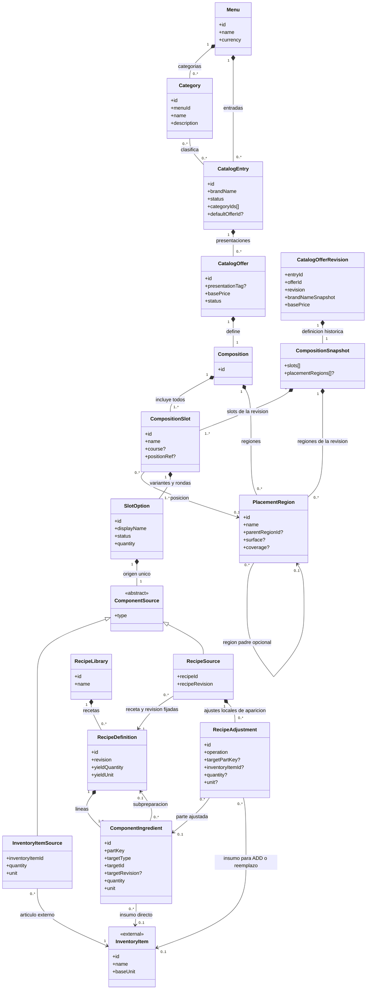

# Modelo de dominio del catálogo — MCCC

**Estado:** propuesta estructural consolidada.  
**Alcance:** Bounded Context de Menú/Catálogo.  
**Propósito:** describir qué ofrece el restaurante y cómo se compone cada oferta mediante slots, opciones de contenido y cantidades de selección. La configuración definida aquí termina al determinar la composición y sus opciones; no define el procesamiento de una orden ni un motor de configuración.

## 1. Resumen del diseño

### 1.1. Estructura general

El menú contiene un catálogo común de categorías y entradas comerciales (`CatalogEntry`). Una entrada puede pertenecer a varias categorías y ofrece una o más presentaciones vendibles (`CatalogOffer`). La oferta no repite el nombre de su entrada: su etiqueta `presentationTag` es opcional y descriptiva. Por ejemplo, «Hamburguesa de la Casa · Grande» resulta de combinar el nombre comercial con la presentación.

**Toda `CatalogOffer` tiene una `Composition` de uno o más `CompositionSlot` y todos sus slots forman parte de la oferta.** Esta estructura representa tanto una bebida o un espagueti individual —un único slot— como un combo de varias pizzas. No existe una clasificación previa y excluyente de la oferta como «ingrediente», «preparación» o «combo»; la composición determina qué contiene.

Cada `CompositionSlot` agrupa una o más `SlotOption` (variantes) y puede identificar una posición o función del producto («Primera pizza», «Bebida», «Plato principal»), un tiempo de servicio sugerido y una ubicación espacial opcional. Si el slot contiene una única `SlotOption`, esta se toma por defecto. Si contiene varias, cada ronda de selección elige exactamente una opción activa.

Al configurar una oferta, se puede elegir otra `CatalogOffer` como plantilla y copiar sus slots y opciones a la composición en curso. Las definiciones copiadas pasan a pertenecer a la composición destino y se pueden editar de forma independiente. Conservan sus referencias a Inventario y a revisiones de recetas, pero no la identidad ni el precio de la oferta plantilla; no queda una referencia a esa oferta ni sincronización posterior.

`SlotOption.quantity` indica cuántas rondas de selección presenta el slot. Por ejemplo, con cuatro opciones y cantidad 2, se presentan dos elecciones independientes, cada una con las cuatro opciones disponibles. Si las opciones de un mismo slot tienen cantidades distintas, cómo se determina el número de rondas queda pendiente en `OPEN-006`.

Una `SlotOption` tiene exactamente un contenido polimórfico:

- **`INVENTORY_ITEM`:** artículo o ingrediente del catálogo externo de Inventario.
- **`RECIPE`:** referencia a una `RecipeDefinition` de `RecipeLibrary`, utilizada tal cual o con ajustes administrativos locales para esa aparición.

### 1.2. Slots y rondas de selección

Todos los slots de la `Composition` se incluyen en la oferta. La selección se realiza dentro de cada slot: si contiene una única `SlotOption`, esta se toma por defecto; si contiene varias, en cada ronda se elige exactamente una opción activa. La cantidad de rondas se expresa con `SlotOption.quantity`; la cantidad del origen `InventoryItemSource` conserva su significado de cantidad y unidad del artículo.

### 1.3. Recetas y responsabilidades

Inventario **posee** la identidad de sus artículos/ingredientes y su stock. Catálogo los referencia mediante identificadores externos, y **posee** la definición de recetas, cantidades y ajustes locales de preparación. No se introduce un servicio Kitchen ni una segunda entidad autoritativa de ingrediente dentro de Catálogo.

Una `RecipeDefinition` contiene líneas `ComponentIngredient` con cantidad y unidad. Cada línea apunta a un `InventoryItem` o, cuando una preparación es parte de otra receta, a una `RecipeDefinition` de `RecipeLibrary`. `RecipeSource` referencia una revisión publicada por `recipeId` y `recipeRevision`, y puede declarar `RecipeAdjustment` sobre partes concretas de esa aparición. Al configurar una opción, se puede seleccionar una receta existente por su identificador o definir una receta desde ese flujo; en ambos casos la receta pertenece a `RecipeLibrary` y `SlotOption` la referencia por identificador y revisión. Una receta puede utilizarse tal cual, sin ajustes.

`CompositionSnapshot` conserva de forma inmutable los slots y opciones locales de la composición publicada en una revisión de oferta y pertenece únicamente a `CatalogOfferRevision`.

No se requieren tres recetas independientes para una hamburguesa chica, mediana y grande: las ofertas pueden reutilizar una receta y declarar cantidades o ajustes administrativos propios en sus `RecipeSource`.

### 1.4. Regla comercial de precios

`CatalogOffer.basePrice` es el **precio base fijo de la oferta tal como se venda**. Los slots, sus opciones y las rondas de selección no aportan cargos a `basePrice`. Al copiar slots desde una oferta plantilla, no se copia ni se suma el precio base de esa oferta.

El catálogo **solo declara** el precio base: no calcula el precio final, no evalúa cambios de una orden y no determina aquí el algoritmo de cobro.

### 1.5. Límites del modelo

Se definen identidades, referencias y estructuras necesarias para que el dominio sea inequívoco; **no** se prescriben tablas, claves foráneas, arquitectura de persistencia, API, eventos ni motor de resolución. La cantidad pedida, las elecciones concretas, los asientos, los tiempos de marcha, la disponibilidad en tiempo real, la facturación y el cálculo de precio de una orden pertenecen a otros modelos.

Una entrada solo puede eliminarse definitivamente si está archivada. Una oferta solo puede eliminarse individualmente si está inactiva, no es la oferta indicada por `defaultOfferId` de su entrada y su eliminación no deja una entrada activa sin una oferta activa y válida. `defaultOfferId` bloquea únicamente la eliminación individual de esa oferta; al eliminar la entrada completa, el vínculo poseído se retira con ella. Las definiciones y estructuras poseídas exclusivamente por el recurso eliminado pueden retirarse junto con él; las revisiones históricas permanecen inmutables y consultables por `offerId` y `revision`.

---

## 2. Resumen de entidades

| Entidad | Descripción |
|---|---|
| `Menu` | Menú propietario del conjunto de categorías y entradas comerciales. |
| `Category` | Categoría reutilizable del menú que clasifica varias entradas. |
| `CatalogEntry` | Identidad comercial y administración de un producto de la carta. |
| `CatalogOffer` | Presentación vendible vigente con precio base y composición propia. |
| `CatalogOfferRevision` | Instantánea histórica e inmutable de una revisión publicada de oferta, consultable aunque se elimine su oferta vigente. |
| `Composition` | Define uno o más slots, todos incluidos en la oferta. |
| `CompositionSnapshot` | Composición publicada e inmutable que forma parte de una `CatalogOfferRevision` histórica. |
| `CompositionSlot` | Grupo de una o más opciones de contenido para una posición funcional o espacial. |
| `PlacementRegion` | Región o ubicación semántica donde se aplica un slot. |
| `SlotOption` | Variante de contenido y cantidad de rondas de selección de un slot. |
| `ComponentSource` | Tipo conceptual que identifica el origen único de una `SlotOption`. |
| `InventoryItemSource` | Referencia a un artículo o ingrediente cuyo catálogo pertenece a Inventario. |
| `RecipeSource` | Referencia a una receta de la biblioteca con ajustes locales opcionales para esa aparición. |
| `InventoryItem` *(externa)* | Artículo o ingrediente autoritativo de Inventario al que Catálogo hace referencia. |
| `RecipeLibrary` | Colección propietaria de las recetas administradas por Catálogo. |
| `RecipeDefinition` | Definición de receta con rendimiento y líneas de ingredientes. |
| `ComponentIngredient` | Aparición identificable de un ingrediente o preparación dentro de una receta. |
| `RecipeAdjustment` | Diferencia local respecto de una receta, referida a una parte identificable. |

---

## 3. Desglose de entidades

Las marcas **obligatorio**, **opcional** y **derivado** expresan necesidades de dominio. Los identificadores son conceptuales y no presuponen un tipo de clave de base de datos. Las listas vacías se permiten únicamente cuando las reglas de publicación de su entidad lo indican.

### 3.1. `Menu`

**Atributos:** `id`, `name`, `currency`, `categories[]`, `entries[]`.

**Relaciones:** contiene múltiples `Category` y `CatalogEntry`.

**Reglas e invariantes:** los identificadores de categorías y entradas son únicos en su ámbito; cada entrada se clasifica usando categorías del mismo menú. La categoría se administra una sola vez, no dentro de cada oferta.

### 3.2. `Category`

**Atributos:** `id`, `menuId`, `name`, `description`.

**Relaciones:** pertenece a un menú; clasifica cero o más entradas. Una entrada puede tener varias categorías (relación conceptual muchos a muchos).

**Reglas e invariantes:** no se duplica una entrada por asignarla a más de una categoría; la asignación puede almacenarse como `categoryIds[]` en el modelo de dominio sin convertir la tabla de unión futura en una entidad de negocio obligatoria.

### 3.3. `CatalogEntry`

**Atributos:** `id`, `menuId`, `brandName`, `description`, `imageRef`, `status: ACTIVE | INACTIVE | ARCHIVED`, `categoryIds[]`, `defaultOfferId?`, `offers[]`.

**Relaciones:** pertenece a `Menu`; tiene múltiples categorías y múltiples `CatalogOffer`.

**Reglas e invariantes:** `brandName` es el nombre comercial autoritativo. Puede guardarse una entrada incompleta, pero una entrada `ACTIVE` y publicable debe disponer de al menos una oferta `ACTIVE` y válida. El archivado es reversible y desarchivar deja siempre la entrada `INACTIVE`. El estado de una entrada no modifica automáticamente los estados administrativos de sus ofertas. Las categorías no alteran recetas ni composiciones. Solo una entrada `ARCHIVED` admite eliminación definitiva; sus definiciones vigentes poseídas pueden eliminarse en conjunto. `defaultOfferId` es una relación poseída por la entrada y se retira junto con ella, por lo que no bloquea su eliminación completa. Las revisiones históricas publicadas permanecen inmutables y consultables.

### 3.4. `CatalogOffer`

**Atributos:** `id`, `entryId`, `presentationTag`, `basePrice`, `status: ACTIVE | INACTIVE`, `offerImageRef`, `composition`.

**Relaciones:** pertenece a una `CatalogEntry` y contiene exactamente una `Composition`. Sus revisiones publicadas producen `CatalogOfferRevision` independientes de la definición vigente.

**Reglas e invariantes:** no duplica `brandName`. Su nombre visible resulta de la entrada y la presentación opcional. `presentationTag` describe, pero **no determina cantidades físicas**. `basePrice` no depende de las opciones de sus slots; importar slots desde otra oferta no suma su precio base. Una oferta `ACTIVE` y válida solo se publica bajo una entrada `ACTIVE`; una entrada `ACTIVE` necesita al menos una oferta `ACTIVE` y válida. El estado de la oferta es independiente del estado de su entrada. Solo una oferta `INACTIVE` puede eliminarse individualmente si no es el `defaultOfferId` de su entrada y su eliminación no deja una entrada `ACTIVE` sin oferta `ACTIVE` y válida. Sus estructuras poseídas exclusivamente pueden eliminarse con la oferta; sus revisiones históricas publicadas permanecen inmutables y consultables aunque la definición vigente desaparezca. La cantidad de ofertas solicitadas pertenece a una orden futura, no a esta entidad.

### 3.4.1. `CatalogOfferRevision`

**Atributos:** `entryId`, `offerId`, `revision`, `brandNameSnapshot`, `presentationTag?`, `basePrice`, `status`, `offerImageRef?`, `compositionSnapshot`.

**Relaciones:** conserva la definición publicada de una `CatalogOffer` identificada por `offerId` y `revision`; contiene una `CompositionSnapshot` histórica. No depende de que permanezcan la entrada o la oferta vigente.

**Reglas e invariantes:** es inmutable. La eliminación de una `CatalogOffer` o de su `CatalogEntry` puede retirar la definición vigente, pero no elimina las revisiones históricas publicadas. Una revisión puede seguir consultándose mediante `offerId` y `revision` aunque ya no exista la definición vigente correspondiente. Las referencias conservadas en una revisión histórica permanecen intactas aunque ya no exista la definición vigente.

### 3.5. `Composition`

**Atributos:** `id`, `offerId`, `slots[]`, `placementRegions[]?`.

**Relaciones:** pertenece a una oferta y contiene uno o más `CompositionSlot`; puede definir regiones usadas por los slots.

**Reglas e invariantes:**

- La composición contiene uno o más slots y todos se incluyen en la oferta.
- La selección, cuando aplica, ocurre entre las opciones del slot y no determina qué slots se incluyen.

### 3.5.1. `CompositionSnapshot`

**Atributos:** `slots[]`, `placementRegions[]?`.

**Relaciones:** pertenece a una `CatalogOfferRevision` y conserva la composición publicada correspondiente a esa revisión.

**Reglas e invariantes:** conserva de forma inmutable la composición publicada de una revisión, incluidos slots, opciones y cantidades de selección. Sus identidades internas pertenecen al ámbito de la revisión histórica. No conserva la identidad de una oferta que se usó como plantilla al configurar la composición.

### 3.6. `CompositionSlot`

**Atributos:** `id`, `compositionId`, `name`, `course?`, `positionRef?`, `options[]`.

**Relaciones:** pertenece a una `Composition` vigente o a una `CompositionSnapshot` histórica; contiene una o más `SlotOption`; opcionalmente referencia una `PlacementRegion` de su composición. En una instantánea, `compositionId` identifica la composición de su revisión histórica.

**Reglas e invariantes:**

- El slot agrupa variantes para una posición o función («Pizza 1», «Guarnición», «Bebida»).
- `positionRef` indica ubicación espacial opcional.
- Si el slot contiene una única `SlotOption`, esta se toma por defecto. Si contiene varias, cada ronda exige elegir exactamente una opción activa.
- `course` es una sugerencia de tiempo de servicio, no un estado de marcha.

### 3.7. `PlacementRegion` (no realizar, ni contemplar la funcionalidad de cobertura por el momento. De momento name solo representa una etiqueta descriptiva, los demás atributos se dejan como opcionales para futuras implementaciones)

**Atributos:** `id`, `compositionId`, `name`, `parentRegionId?`, `surface?`, `coverage?`.

**Relaciones:** se define dentro de una `Composition` vigente o de una `CompositionSnapshot` histórica; puede tener región padre y ser referenciada por slots de esa misma composición.

**Reglas e invariantes:** permite nombrar `LEFT`, `RIGHT` o `CRUST` y, cuando corresponda, una cobertura proporcional. Una región no implica selección ni modifica por sí misma el precio. Las regiones de superficies diferentes no tienen por qué sumar 100 % entre sí; la orilla completa y las mitades de una pizza son superficies distintas. El catálogo declara la ubicación, no el algoritmo de consumo de ingredientes.

### 3.8. `SlotOption`

**Atributos:** `id`, `slotId`, `displayName`, `status: ACTIVE | INACTIVE`, `quantity`, `source` (exactamente uno).

**Relaciones:** pertenece a un `CompositionSlot`; contiene un `ComponentSource` concreto.

**Reglas e invariantes:** es una variante local de un slot. Dos `SlotOption` con el mismo origen siguen siendo opciones distintas. `displayName` puede sobrescribir la etiqueta contextual, sin redefinir la identidad global del artículo o receta. Una opción inactiva no se presenta como opción para una nueva selección. `quantity` es la cantidad de rondas de selección del slot, no la cantidad/unidad del artículo de Inventario. En un mismo slot, si las opciones tienen cantidades distintas, el número de rondas queda sin resolver conforme a `OPEN-006`. La opción no aporta un precio a `basePrice`.

### 3.9. `ComponentSource` (tipo conceptual)

**Atributos:** `type: INVENTORY_ITEM | RECIPE`.

**Relaciones:** especialización exclusiva hacia `InventoryItemSource` o `RecipeSource`.

**Reglas e invariantes:** cada `SlotOption` posee un solo origen válido de contenido.

### 3.10. `InventoryItemSource`

**Atributos:** `inventoryItemId`, `quantity`, `unit`, `displayNameSnapshot?`.

**Relaciones:** referencia exactamente un `InventoryItem` externo.

**Reglas e invariantes:** cantidad positiva y unidad compatible con la unidad del artículo. Los datos de nombre pueden ser una vista o instantánea descriptiva, no otra definición autoritativa. Una venta de artículo directo no exige receta artificial.

### 3.11. `RecipeSource`

**Atributos:** `recipeId`, `recipeRevision`, `name?`, `adjustments[]`.

**Relaciones:** referencia por `recipeId` y `recipeRevision` una `RecipeDefinition` publicada de `RecipeLibrary`; puede incluir `RecipeAdjustment` propios de esa aparición.

**Reglas e invariantes:** con `adjustments[]` vacío utiliza la receta tal cual. Para ajustar administrativamente la definición de base en esa aparición, se parte de sus líneas y se declaran ajustes explícitos. Los cambios locales no mutan la receta ni otros usos de ella. La opción puede apuntar a una receta ya registrada o a una receta recién definida durante la configuración; en ambos casos la receta queda guardada en `RecipeLibrary` y la opción conserva la referencia a una revisión identificada.

### 3.12. `InventoryItem` (concepto externo)

**Atributos de referencia:** `id`, `name`, `baseUnit` (definidos por Inventario; Catálogo no los administra).

**Relaciones:** puede ser referenciado por `InventoryItemSource`, `ComponentIngredient` y `RecipeAdjustment`.

**Reglas e invariantes:** Catálogo no crea ni cambia su identidad o existencias. Los límites de stock no forman parte de la validez estructural de la receta.

### 3.13. `RecipeLibrary`

**Atributos:** `id`, `name`, `recipes[]`.

**Relaciones:** reúne todas las `RecipeDefinition` del catálogo.

**Reglas e invariantes:** es el conjunto propietario de todas las `RecipeDefinition` del catálogo, no de ofertas; una salsa puede existir sin venderse individualmente. Cada receta se administra en esta biblioteca independientemente de si se eligió una receta existente o se definió durante la configuración de una opción.

### 3.14. `RecipeDefinition`

**Atributos:** `id`, `name`, `description?`, `revision`, `yieldQuantity`, `yieldUnit`, `ingredients[]`, `status: ACTIVE | INACTIVE`.

**Relaciones:** pertenece siempre a `RecipeLibrary`; contiene una o más líneas `ComponentIngredient`.

**Reglas e invariantes:** define ingredientes y cantidades de referencia para un rendimiento determinado; sus líneas tienen identidad estable dentro de su revisión. Puede incorporar artículos de Inventario y otras recetas de `RecipeLibrary`. Una receta no se cambia retroactivamente en sus usos existentes: los cambios administrativos producen una revisión. `SlotOption` referencia la receta por identificador y revisión, tanto si se seleccionó de la biblioteca como si se definió durante su configuración. Se impiden ciclos de recetas. Una receta **no** es una lista de productos comerciales incluidos en un combo.

### 3.15. `ComponentIngredient`

**Atributos:** `id`, `recipeId`, `partKey`, `displayName?` (descriptivo), `targetType: INVENTORY_ITEM | RECIPE`, `targetId`, `targetRevision?`, `quantity`, `unit`.

**Relaciones:** pertenece a una `RecipeDefinition`; referencia un artículo de Inventario o una `RecipeDefinition` de `RecipeLibrary`.

**Reglas e invariantes:** `partKey` identifica la aparición concreta y evita confundir dos usos del mismo ingrediente. Cantidad y unidad son obligatorias. Cuando `targetType = RECIPE`, `targetRevision` identifica la revisión publicada de la receta referenciada. Los ajustes administrativos que operan sobre una línea apuntan a una línea `INVENTORY_ITEM` de la receta aplicable; para cambiar la composición interna de una subreceta se crea una revisión identificable en `RecipeLibrary` y se referencia esa revisión explícitamente.

### 3.16. `RecipeAdjustment`

**Atributos:** `id`, `recipeSourceId`, `operation: ADD | REMOVE | OVERRIDE_QUANTITY | REPLACE_INVENTORY_ITEM`, `targetPartKey?`, `inventoryItemId?`, `quantity?`, `unit?`.

**Relaciones:** pertenece a una `RecipeSource`; referencia la parte de receta ajustada y, en altas o sustituciones de un ingrediente directo, el artículo de Inventario.

**Reglas e invariantes:** expresa diferencias **administrativas** de esta aparición de una receta, no decisiones de una orden ni cargos. `REMOVE`, `OVERRIDE_QUANTITY` y `REPLACE_INVENTORY_ITEM` requieren una línea de origen compatible; `ADD` necesita un ingrediente y cantidad. Ajustar una receta no significa editar la receta de la biblioteca ni las otras apariciones.

### 3.17. Reglas transversales de coherencia

1. Las referencias externas se hacen por identidad explícita; igualdad numérica entre identificadores de contextos diferentes **no** implica identidad compartida.
2. `CatalogOffer`, `Composition`, `CompositionSlot` y `SlotOption` son conceptos diferentes incluso en una oferta con un único slot y una única opción.
3. Todos los slots de una composición se incluyen; cuando un slot tiene varias opciones, cada ronda elige exactamente una.
4. Los ciclos entre recetas están prohibidos. Las versiones publicadas de recetas deben poder identificarse sin alterar retroactivamente composiciones ya publicadas. Las revisiones de ofertas eliminadas permanecen consultables por `offerId` y `revision`.
5. El catálogo declara `basePrice`, pero **no** contiene un `finalPrice` ni cálculos sobre selección de slots.
6. `RecipeAdjustment` conserva el alcance administrativo de la aparición `RecipeSource`.
7. Una `CatalogEntry` `ARCHIVED` puede eliminarse junto con sus definiciones vigentes poseídas. Una `CatalogOffer` `INACTIVE` puede eliminarse individualmente si no es la oferta indicada por `defaultOfferId` y su eliminación no deja una entrada activa sin oferta activa y válida. Las revisiones históricas permanecen inmutables. `defaultOfferId` se retira con su entrada al eliminarla completa.

---

## 4. Diagrama de clases del dominio

El diagrama siguiente resume el modelo. Composición (`*--`) representa pertenencia conceptual; asociación o dependencia indica referencia, no una clave foránea prescrita. Las dos subclases de `ComponentSource` son **alternativas excluyentes**; toda `RecipeDefinition` pertenece a `RecipeLibrary`, y `CompositionSnapshot` pertenece únicamente a `CatalogOfferRevision`. `InventoryItem` pertenece a otro Bounded Context. Los campos resumidos del diagrama están desglosados en la sección 3.

### 4.1. Menú, composición y tipos de contenido

> Cada `CatalogEntry` usa categorías del mismo menú; una entrada `ACTIVE` debe tener al menos una oferta `ACTIVE` y válida. Solo se publican ofertas `ACTIVE` y válidas bajo una entrada `ACTIVE`. Cambiar el estado de la entrada no cambia automáticamente los estados de sus ofertas, ni viceversa. Todos los slots de una composición se incluyen.
>
> `positionRef` indica una ubicación espacial opcional; `course` sugiere un tiempo de servicio, no un estado de marcha.
>
> Esta vista describe definiciones del catálogo; no modela elecciones concretas ni procesamiento de órdenes, cálculo del precio final, disponibilidad en tiempo real o gestión de stock.
>
> Si un slot contiene una sola `SlotOption`, esta se toma por defecto. Si contiene varias, en cada ronda se selecciona exactamente una opción activa; `SlotOption.quantity` indica cuántas rondas presenta el slot. Cuando las cantidades de opciones de un mismo slot difieren, la resolución queda pendiente en `OPEN-006`.
>
> `CatalogOffer.basePrice` es fijo para la oferta: sus slots y opciones no lo incrementan. Copiar slots desde otra oferta no copia ni suma el precio base de esa oferta. `presentationTag` solo describe la presentación; no determina cantidades físicas.
>
> Inventario es dueño de la identidad de `InventoryItem` y del stock; Catálogo mantiene referencias externas y no administra existencias. La validez estructural de una receta no depende de disponibilidad.
>
> Las dos variantes de `ComponentSource` son excluyentes. `RecipeSource` referencia una `RecipeDefinition` de `RecipeLibrary` por identificador y revisión; la receta puede elegirse de la biblioteca o definirse durante la configuración de `SlotOption`, y en ambos casos queda guardada en la misma biblioteca. `CatalogOfferRevision` contiene su `CompositionSnapshot` histórica con slots, opciones y cantidades de selección. Cada `ComponentIngredient` referencia exactamente un `InventoryItem` **o** una `RecipeDefinition` de `RecipeLibrary` cuando `targetType = RECIPE`, fijando su revisión. `RecipeAdjustment` apunta a una línea de origen cuando la operación la requiere y a `InventoryItem` para `ADD` o `REPLACE_INVENTORY_ITEM`.
>
> Los ciclos entre recetas están prohibidos. Las `CatalogOfferRevision` y sus `CompositionSnapshot` permanecen consultables por `offerId` y `revision`. `PlacementRegion.name` es una etiqueta descriptiva; `surface` y `coverage` son atributos opcionales reservados para el futuro y no implican comportamiento de cobertura.
