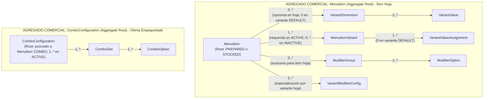
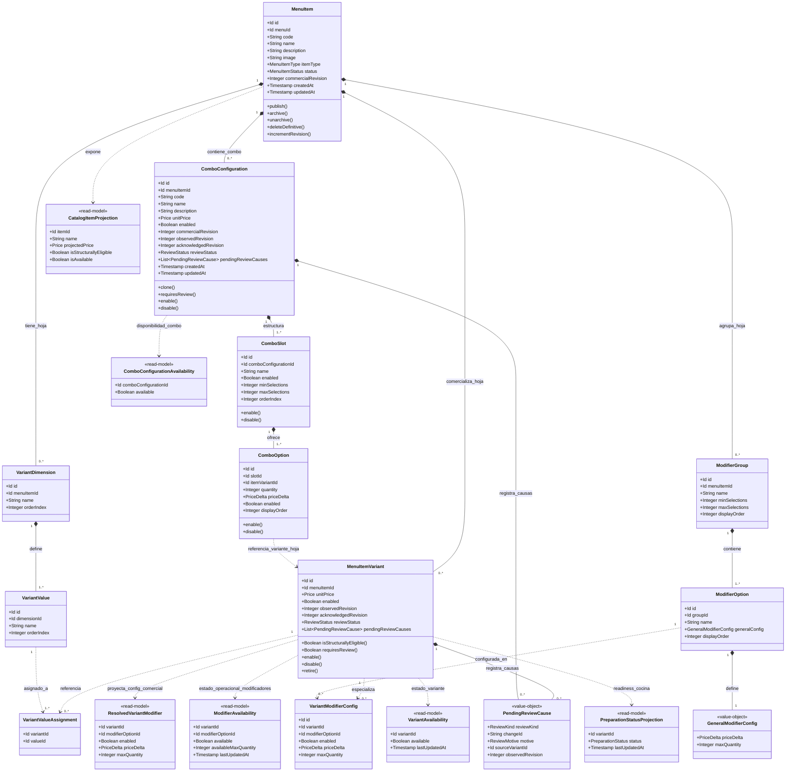
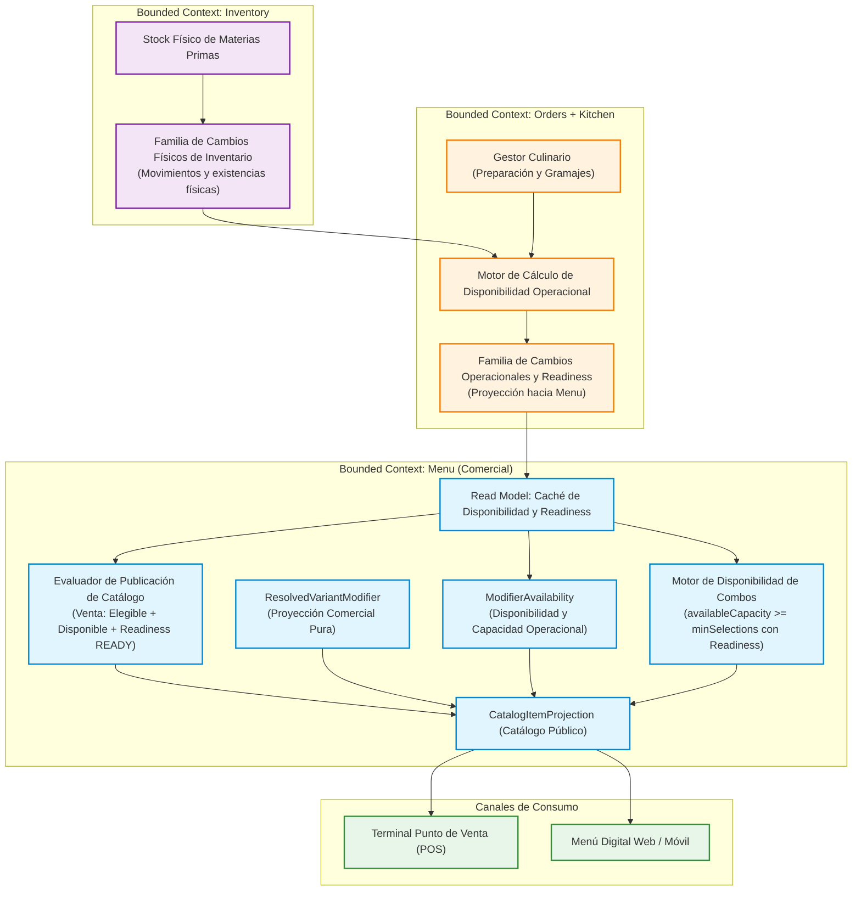

# Arquitectura de Dominio del Servicio Menu

## Modelo de Dominio

## Agregados y Límites de Consistencia

El subsistema de Menú modela y gestiona la oferta comercial del restaurante garantizando consistencia transaccional y encapsulamiento estricto. Conforme a las fronteras de bounded contexts delimitadas en la Auditoría 4, el modelo de dominio de Menú está estrictamente desacoplado de las entidades culinarias (preparación, ingredientes físicos, gramajes) y de las entidades de inventario físico (stock en almacén, unidades de medida de compra).

Se identifican dos agregados comerciales principales:

### Agregado MenuItem

1. **Límite de Consistencia:** Encapsula la definición de un artículo de catálogo, su árbol combinatorio de presentaciones vendibles hoja (`MenuItemVariant`), sus dimensiones comerciales (`VariantDimension`, cardinalidad `0..*` para admitir variantes técnicas `DEFAULT`), sus grupos de modificadores comerciales (`ModifierGroup`) y la especialización de modificadores por variante (`VariantModifierConfig`). Los ítems de tipo `COMBO` no poseen variantes, dimensiones ni modificadores.
2. **Invariantes del Agregado:**
   - La raíz `MenuItem` garantiza que, en estado `ACTIVE`, todo ítem hoja cuente con al menos una variante vendible con una combinación única y completa de valores de dimensión (`INV-MENU-001`), o bien la variante técnica `DEFAULT` sin dimensiones. Se permite registrar definiciones y capacidades incompletas mientras el elemento permanezca en estado `INACTIVE`.
   - Las opciones de modificadores pertenecen al ítem hoja. Las configuraciones de modificadores por variante (`VariantModifierConfig`) se identifican por la tupla `(variantId, modifierOptionId)` y especializan `enabled`, `priceDelta` y `maxQuantity` para la variante (`INV-MENU-002`), mientras que `ModifierGroup` custodia los límites enteros $0 \le \text{minSelections} \le \text{maxSelections}$ y `ModifierOption` aporta la configuración general `generalConfig` con `priceDelta` y `maxQuantity`.
   - Mantiene la trazabilidad de revisiones comerciales inmutables (`commercialRevision`), detectando desalineaciones y registrando causas lógicas de revisión (`pendingReviewCauses`) ante cambios comerciales o culinarios notificados (`REV-001`, `REV-003`). La presencia de revisiones pendientes no bloquea la disponibilidad operacional para la venta.
3. **Exclusiones Explícitas del Agregado:**
   - No contiene entidades que representen preparación (ingredientes y cantidades) ni directivas de modificación culinaria (efectos de un modificador).
   - No contiene dependencias directas ni atributos hacia ítems físicos de stock

### Agregado ComboConfiguration

1. **Límite de Consistencia:** Encapsula la oferta agrupada de múltiples presentaciones hoja bajo una regla de precio empaquetado absoluto autoritativo propio (`unitPrice`). Está asociado unívocamente a un `MenuItem` de tipo `COMBO` (que requiere al menos una configuración en estado `ACTIVE`, permitiendo definiciones incompletas en `INACTIVE`).
2. **Invariantes del Agregado:**
   - La raíz `ComboConfiguration` controla sus slots o espacios de selección (`ComboSlot`).
   - Cada slot define sus restricciones de cardinalidad ($0 \le \text{minSelections} \le \text{maxSelections}$). En estado `ACTIVE` del `MenuItem` COMBO contenedor, la capacidad vendible de los slots obligatorios se evalúa exclusivamente dentro de configuraciones habilitadas (`ComboConfiguration` con `enabled = true`) y para ranuras con `enabled = true` (`INV-MENU-005`, `REQ-MENU-COM-006`), quedando excluidas las configuraciones y slots con `enabled = false`; en `INACTIVE` se admiten definiciones y capacidades incompletas.
   - Cada slot contiene una o más opciones (`ComboOption`) que referencian directamente una variante vendible hoja concreta (`itemVariantId`) con una cantidad física entera positiva de unidades completas (`quantity >= 1`) y un delta de precio explícito (`priceDelta`).
   - Mantiene el registro de causas lógicas de revisión (`pendingReviewCauses`) ante alteraciones no atendidas en variantes componentes o propagación de cambios culinarios. El estado de revisión pendiente no bloquea la disponibilidad operacional para la venta.
   - Controla las operaciones de clonación y copia profunda de configuración (`COM-004`, `COM-005`), asignando identificadores nuevos a nivel agregado y slot sin depender de heurísticas, y exigiendo mapeo explícito de slots (`sourceSlotId -> targetSlotId`) en copias hacia configuraciones existentes.
3. **Exclusiones Explícitas del Agregado:**
   - No gestiona la disponibilidad operativa en tiempo real; dicha disponibilidad se calcula dinámicamente mediante proyecciones de lectura a partir de las opciones disponibles y su estado de preparación culinaria (`COM-006`, `AVL-002`, `AVL-006`).

---

## Entidades y Atributos Principales

A continuación se detallan las entidades pertenecientes a los agregados comerciales de Menú:

| Entidad                    | Agregado                  | Responsabilidad Comercial                                                                                                                                                                                                                                                                                                                                                                                                                                                                                                                                                                                                                                                                                                                                                                                                                                                                                                                                                                                                                                                                                                                                                                                                                         | Atributos Principales                                                                                                                                                                                                                                                                                                                                                                                                                                                                                      |
| :------------------------- | :------------------------ | :------------------------------------------------------------------------------------------------------------------------------------------------------------------------------------------------------------------------------------------------------------------------------------------------------------------------------------------------------------------------------------------------------------------------------------------------------------------------------------------------------------------------------------------------------------------------------------------------------------------------------------------------------------------------------------------------------------------------------------------------------------------------------------------------------------------------------------------------------------------------------------------------------------------------------------------------------------------------------------------------------------------------------------------------------------------------------------------------------------------------------------------------------------------------------------------------------------------------------------------------ | :--------------------------------------------------------------------------------------------------------------------------------------------------------------------------------------------------------------------------------------------------------------------------------------------------------------------------------------------------------------------------------------------------------------------------------------------------------------------------------------------------------- |
| **MenuItem**               | MenuItem (Root)           | Raíz del artículo de catálogo. Define identidad comercial, código, nombre, descripción, tipo (`PREPARED`, `STOCKED`, `COMBO`), estado de ciclo de vida (`ACTIVE`, `INACTIVE`, `ARCHIVED`) y revisión comercial. Cardinalidad por tipo: hoja requiere al menos una variante habilitada en `ACTIVE`; COMBO requiere al menos una `ComboConfiguration` habilitada en `ACTIVE` y no admite variantes, dimensiones ni modificadores. Es la única entidad con ciclo de vida `status`. Admite archivado reversible donde desarchivar produce obligatoriamente `INACTIVE`, requiriendo que una activación posterior hacia `ACTIVE` sea explícita y revalide conjuntamente elegibilidad estructural, dependencias y preparación (manteniendo preparación y readiness bajo la autoridad exclusiva de Orders + Kitchen) antes de ofrecer el artículo para nuevas ventas, y eliminación definitiva solo desde `ARCHIVED` bajo el predicado canónico de ausencia total de dependencias, referencias históricas necesarias para trazabilidad (tales como órdenes de venta pasadas en Orders + Kitchen, preparación en Kitchen, uso en combos o revisiones anteriores, no exhaustivas) y restricciones de retención (legales, fiscales, contables u operativas). | `id` (Identificador lógico), `menuId` (Identificador del `Menu` propietario), `code` (Texto), `name` (Texto), `description` (Texto), `image` (Referencia de imagen), `itemType` (Enum: `PREPARED`, `STOCKED`, `COMBO`), `status` (Enum: `ACTIVE`, `INACTIVE`, `ARCHIVED`), `commercialRevision` (Entero positivo), `createdAt` (Timestamp), `updatedAt` (Timestamp).                                                                                                                                       |
| **VariantDimension**       | MenuItem                  | Eje de diferenciación estructural del ítem hoja (e.g., Tamaño, Tipo de Pan). Cardinalidad opcional `0..*` (0 para variante técnica `DEFAULT`).                                                                                                                                                                                                                                                                                                                                                                                                                                                                                                                                                                                                                                                                                                                                                                                                                                                                                                                                                                                                                                                                                                    | `id` (Identificador lógico), `menuItemId` (Identificador de `MenuItem` hoja), `name` (Texto), `orderIndex` (Entero).                                                                                                                                                                                                                                                                                                                                                                                       |
| **VariantValue**           | MenuItem                  | Opción o coordenada discreta dentro de una dimensión (e.g., Mediano, Grande).                                                                                                                                                                                                                                                                                                                                                                                                                                                                                                                                                                                                                                                                                                                                                                                                                                                                                                                                                                                                                                                                                                                                                                     | `id` (Identificador lógico), `dimensionId` (Identificador de `VariantDimension`), `name` (Texto), `orderIndex` (Entero).                                                                                                                                                                                                                                                                                                                                                                                   |
| **MenuItemVariant**        | MenuItem                  | Presentación vendible concreta de un ítem hoja. Custodia el precio unitario absoluto autoritativo (conforme a OPEN-010). No posee ciclo de vida formal ni estado `ARCHIVED`; se controla mediante `enabled: boolean` (habilitación/retiro), distinguiendo el retiro lógico con conservación histórica (`enabled = false`, ante referencias de trazabilidad) de la destrucción física (solo si nunca fue publicada ni referenciada). Target de revisión culinaria.                                                                                                                                                                                                                                                                                                                                                                                                                                                                                                                                                                                                                                                                                                                                                                                 | `id` (Identificador lógico), `menuItemId` (Identificador de `MenuItem` hoja), `unitPrice` (Magnitud numérica), `enabled` (Booleano), `observedRevision` (Contador de revisión), `acknowledgedRevision` (Contador de revisión), `reviewStatus` (Enum: `UP_TO_DATE`, `REVIEW_REQUIRED`), `pendingReviewCauses` (Colección lógica de `PendingReviewCause`), `createdAt` (Timestamp), `updatedAt` (Timestamp).                                                                                                 |
| **VariantValueAssignment** | MenuItem                  | Asignación asociativa de valor de dimensión a una variante específica.                                                                                                                                                                                                                                                                                                                                                                                                                                                                                                                                                                                                                                                                                                                                                                                                                                                                                                                                                                                                                                                                                                                                                                            | `variantId` (Identificador de `MenuItemVariant`), `valueId` (Identificador de `VariantValue`).                                                                                                                                                                                                                                                                                                                                                                                                             |
| **ModifierGroup**          | MenuItem                  | Agrupador comercial de opciones de personalización vinculadas al ítem hoja.                                                                                                                                                                                                                                                                                                                                                                                                                                                                                                                                                                                                                                                                                                                                                                                                                                                                                                                                                                                                                                                                                                                                                                       | `id` (Identificador lógico), `menuItemId` (Identificador de `MenuItem` hoja), `name` (Texto), `minSelections` (Entero >= 0), `maxSelections` (Entero >= minSelections), `displayOrder` (Entero).                                                                                                                                                                                                                                                                                                           |
| **ModifierOption**         | MenuItem                  | Opción de personalización comercial dentro de un grupo (e.g., Queso Extra, Salsa). Contiene la estructura anidada `generalConfig` que agrupa `priceDelta` y `maxQuantity`.                                                                                                                                                                                                                                                                                                                                                                                                                                                                                                                                                                                                                                                                                                                                                                                                                                                                                                                                                                                                                                                                        | `id` (Identificador lógico), `groupId` (Identificador de `ModifierGroup`), `name` (Texto), `generalConfig` (Estructura anidada que contiene `priceDelta` como valor monetario y `maxQuantity` como entero >= 0), `displayOrder` (Entero).                                                                                                                                                                                                                                                                  |
| **VariantModifierConfig**  | MenuItem                  | Especialización comercial de una opción de modificador para una variante hoja concreta (`variantId`, `modifierOptionId`).                                                                                                                                                                                                                                                                                                                                                                                                                                                                                                                                                                                                                                                                                                                                                                                                                                                                                                                                                                                                                                                                                                                         | `id` (Identificador lógico), `variantId` (Identificador de `MenuItemVariant`), `modifierOptionId` (Identificador de `ModifierOption`), `enabled` (Booleano), `priceDelta` (Valor monetario), `maxQuantity` (Entero >= 0).                                                                                                                                                                                                                                                                                  |
| **ComboConfiguration**     | ComboConfiguration (Root) | Raíz de la oferta empaquetada asociada a `MenuItem` COMBO. Define código, nombre, precio unitario absoluto propio (conforme a OPEN-010), bandera de habilitación local `enabled: boolean` y revisión comercial. Target de revisión comercial o propagada. No posee estado administrativo de ciclo de vida ni `ARCHIVED`; se controla localmente mediante `enabled: boolean`, distinguiendo el retiro lógico (`enabled = false` con conservación histórica ante referencias de trazabilidad) de la destrucción física (solo si nunca fue publicada ni referenciada).                                                                                                                                                                                                                                                                                                                                                                                                                                                                                                                                                                                                                                                                               | `id` (Identificador lógico), `menuItemId` (Identificador de `MenuItem` COMBO), `code` (Texto), `name` (Texto), `description` (Texto), `unitPrice` (Magnitud numérica), `enabled` (Booleano), `commercialRevision` (Entero positivo), `observedRevision` (Contador de revisión), `acknowledgedRevision` (Contador de revisión), `reviewStatus` (Enum: `UP_TO_DATE`, `REVIEW_REQUIRED`), `pendingReviewCauses` (Colección lógica de `PendingReviewCause`), `createdAt` (Timestamp), `updatedAt` (Timestamp). |
| **ComboSlot**              | ComboConfiguration        | Ranura de elección dentro del combo (e.g., Plato Fuerte, Bebida). Contiene bandera de habilitación local `enabled: boolean`, distinguiendo el retiro lógico (`enabled = false` con conservación histórica ante referencias de trazabilidad) de la destrucción física (solo si nunca fue publicado ni referenciado).                                                                                                                                                                                                                                                                                                                                                                                                                                                                                                                                                                                                                                                                                                                                                                                                                                                                                                                               | `id` (Identificador lógico), `comboConfigurationId` (Identificador de `ComboConfiguration`), `name` (Texto), `enabled` (Booleano), `minSelections` (Entero >= 0), `maxSelections` (Entero >= minSelections), `orderIndex` (Entero).                                                                                                                                                                                                                                                                        |
| **ComboOption**            | ComboConfiguration        | Opción asignada a una ranura de combo. Referencia directamente una variante hoja concreta con cantidad física entera positiva, delta de precio y bandera de habilitación local `enabled: boolean`, distinguiendo el retiro lógico (`enabled = false` con conservación histórica ante referencias de trazabilidad) de la destrucción física (solo si nunca fue publicada ni referenciada).                                                                                                                                                                                                                                                                                                                                                                                                                                                                                                                                                                                                                                                                                                                                                                                                                                                         | `id` (Identificador lógico), `slotId` (Identificador de `ComboSlot`), `itemVariantId` (Identificador de `MenuItemVariant` hoja obligatoria), `quantity` (Entero positivo >= 1), `priceDelta` (Valor monetario), `enabled` (Booleano), `displayOrder` (Entero).                                                                                                                                                                                                                                             |

---

### Value Objects

Los Value Objects modelan conceptos inmutables del dominio sin identidad propia persistente, garantizando validación semántica compartida. En conformidad con OPEN-010, Menú trata los precios a nivel lógico como magnitudes numéricas (`unitPrice`, `priceDelta`), sin adoptar un Value Object `Money` cerrado, columnas de catálogo de moneda ni decisiones físicas de precisión, redondeo, signo o almacenamiento, las cuales permanecen abiertas, preservando las restricciones de selección y límites de cantidad confirmados en ADR-005:

#### PreparationStatus (Proyectado)

- **Definición:** Estado proyectado de forma independiente desde el servicio de _Orders + Kitchen_ que indica exclusivamente el readiness operacional culinario de cocina, desacoplado de `VariantAvailability` y de la disponibilidad agregada de catálogo.
- **Valores Permitidos:**
  - `READY`: La variante cuenta con una preparación activa completa y lista para ser despachada operacionalmente en cocina.
  - `INCOMPLETE`: La variante carece de preparación válida o presenta formulación técnica incompleta informada por Orders + Kitchen. Se excluyen explícitamente `reviewStatus` y cualquier revisión administrativa como causa.
- **Semántica de Venta:** Cuando una variante requiere preparación culinaria (`PREPARED`), el estado `INCOMPLETE` impide su disponibilidad operacional para la venta. El estado de revisión (`reviewStatus`) y sus causas permanecen estrictamente independientes y una revisión pendiente no bloquea por sí sola la venta.
- **Inmutabilidad en Menú:** El catálogo de Menú solo consume y proyecta este valor; no puede alterarlo arbitrariamente mediante comandos comerciales.

#### DimensionSelection

- **Definición:** Par ordenado inmutable `(dimensionId, valueId)` que identifica unívocamente una coordenada dentro del espacio cartesiano de variantes de un ítem.

#### PriceDelta

- **Definición:** Ajuste aditivo de precio aplicable a una opción de modificador o a una opción de combo (magnitud numérica conforme a OPEN-010).

#### RevisionMetadata

- **Definición:** Estructura inmutable que captura la traza de versión de un cambio de revisión: `revisionNumber` (Entero positivo), `timestamp` (Timestamp). Conforme a las directrices de auditoría, se eliminan los atributos prescriptivos de autoría física, preservando los metadatos conceptuales de ADR-006 sin esquema físico.

#### PendingReviewCause

- **Definición:** Estructura inmutable de valor lógico (sin esquema físico prescrito) que captura la causa de una desalineación o revisión pendiente en una `MenuItemVariant` o `ComboConfiguration`:
  - `reviewKind`: Naturaleza de la revisión (`CULINARY` para cambios originados en cocina; `COMMERCIAL` para cambios en variantes o configuraciones comerciales).
  - `changeId`: Identificador lógico unívoco del evento o mutación que originó la desalineación.
  - `motive`: Motivo comercial o culinario estructurado (`PRICE`, `COMPOSITION`, `MODIFIERS`, `STATUS`).
  - `sourceVariantId`: Identificador lógico opcional de la `MenuItemVariant` origen (utilizado cuando una causa culinaria o comercial se propaga a las configuraciones de combo que la referencian).
  - `observedRevision`: Número de revisión comercial o culinaria en el momento de la observación.

---

### Proyecciones de Consulta (Read Models)

Para satisfacer las demandas de consulta de alto rendimiento de clientes web, móviles y terminales POS, el subsistema implementa modelos de lectura optimizados que combinan la estructura comercial con el estado operacional reportado por Cocina:

#### ResolvedVariantModifier (DTO de Lectura Comercial)

- **Responsabilidad:** Proyectar la configuración comercial final de modificadores para una variante concreta (`MOD-005`, `REQ-MENU-038`).
- **Lógica de Resolución:**
  1. Si existe un registro `VariantModifierConfig` para la tupla `(variantId, modifierOptionId)`, la proyección toma sus valores específicos de `enabled`, `priceDelta` y `maxQuantity`.
  2. En ausencia de dicho registro, la proyección toma por defecto los valores generales de `ModifierOption.generalConfig` (`priceDelta`, `maxQuantity`) y `enabled = true` por defecto en la variante sin requerir un campo `ModifierOption.enabled`.
  3. Expone exclusivamente los valores comerciales efectivos finales (`variantId`, `modifierOptionId`, `enabled`, `priceDelta`, `maxQuantity`).
  4. **Aislamiento Comercial y Exclusión de Campos Operacionales:** No incluye indicadores de disponibilidad operativa en tiempo real, capacidades máximas operacionales (`availableMaxQuantity`), directivas de preparación física (`ADD`, `OMIT`), preparación ni referencias a almacenes de inventario. La disponibilidad y capacidad operacional se representan de forma desacoplada y exclusiva a través de `ModifierAvailability(variantId, modifierOptionId)`.

#### VariantAvailability (Read Model de Cocina)

- **Responsabilidad:** Almacenar en caché local el estado operativo suministrado por _Orders + Kitchen_ mediante el contrato separado de proyecciones de catálogo pendiente en `OPEN-007`, desacoplado del readiness culinario y de la disponibilidad agregada.
- **Estructura:** `variantId`, `available` (Booleano), `lastUpdatedAt` (Timestamp).
- **Semántica de Venta:** Para variantes de tipo `PREPARED`, la disponibilidad para la venta exige adicionalmente `PreparationStatus == READY`. El estado de revisión (`reviewStatus`) y las causas en `pendingReviewCauses` no bloquean la disponibilidad operativa ni la venta.

#### PreparationStatus (Read Model de Readiness de Cocina)

- **Responsabilidad:** Almacenar en caché local el estado de readiness culinario suministrado de forma independiente por _Orders + Kitchen_ mediante el contrato de proyecciones de catálogo pendiente en `OPEN-007`.
- **Estructura:** `variantId`, `status` (`READY` | `INCOMPLETE`), `lastUpdatedAt` (Timestamp).
- **Semántica de Venta:** Define `INCOMPLETE` exclusivamente por readiness operacional inválido o incompleto informado por Kitchen; excluye explícitamente `reviewStatus` y revisiones administrativas.

#### ModifierAvailability (Read Model de Cocina)

- **Responsabilidad:** Almacenar en caché local el estado operativo de modificadores suministrado por _Orders + Kitchen_ mediante el contrato separado de proyecciones de catálogo pendiente en `OPEN-007`.
- **Estructura e Identidad:** Identidad lógica compuesta por `(variantId, modifierOptionId)`, `available` (Booleano), `availableMaxQuantity` (Entero), `lastUpdatedAt` (Timestamp).
- **Semántica Multivariante:** La clave compuesta por `variantId` y `modifierOptionId` representa de forma exclusiva las disponibilidades y capacidades operacionales máximas diferenciadas para una misma opción de modificador entre distintas variantes de un mismo ítem hoja, preservando `availableMaxQuantity` en todas las consultas y proyecciones.

#### ComboConfigurationAvailability (Proyección Dinámica)

- **Responsabilidad:** Calcular en tiempo de consulta la disponibilidad operativa de un combo completo (`COM-006`, `AVL-002`, `AVL-006`).
- **Estructura:** `comboConfigurationId`, `available` (Booleano).
- **Algoritmo de Proyección:**
  1. Si `ComboConfiguration.enabled == false`, la configuración proyecta directamente `available = false`.
  2. Para cada `ComboSlot` perteneciente a la configuración:
     - Si el slot está deshabilitado (`ComboSlot.enabled == false`), queda excluido de la evaluación y no afecta la disponibilidad de la configuración.
     - Si el slot está habilitado (`ComboSlot.enabled == true`), se computa `availableCapacity` = Conteo de opciones (`ComboOption`) habilitadas (`enabled == true`) cuyo componente hoja referenciado sea estructuralmente elegible (`variant.enabled == true` y `variant.menuItem.status == ACTIVE`), presente `available = true` y, para variantes `PREPARED`, cuente con `PreparationStatus == READY`. Cada opción aporta a lo sumo 1 selección a `availableCapacity`, independientemente de `ComboOption.quantity`.
     - Si `minSelections > 0` y `availableCapacity < minSelections`, el slot habilitado se marca como insatisfecho/no disponible (`isSlotAvailable = false`).
  3. El combo completo proyecta `ComboConfigurationAvailability.available = true` si y sólo si TODOS sus slots obligatorios habilitados (`enabled == true` y `minSelections > 0`) presentan `isSlotAvailable = true`.
  4. La existencia de revisiones pendientes en el combo o en sus variantes componentes no bloquea la disponibilidad operativa del combo.

#### CatalogItemProjection

- **Responsabilidad:** Proyección pública integral consumida por el menú digital y POS (`AVL-001`).
- **Regla de Publicación:** Presenta el ítem y sus variantes diferenciando explícitamente entre elegibilidad estructural (`isStructurallyEligible`) y disponibilidad agregada de catálogo (`isAvailable`). Para variantes preparadas, la disponibilidad exige `PreparationStatus == READY`. Proyecta el precio comercial conforme a REQ-MENU-PRC-002 (`$X`, `Desde $X` o ausencia de precio numérico).

#### SlotPriceReference (DTO de Lectura Informativa)

- **Responsabilidad:** Exponer para cada `ComboSlot` y sus opciones base (`baseOptionIds`) la referencia visual de precios requerida por `REQ-MENU-REV-005`.
- **Atributos:** `slotId`, `baseOptionIds`, `saved` (suma de `savedUnitPrice * quantity`), `current` (suma de `currentUnitPrice * quantity`), `difference` (diferencia firmada `current - saved`).
- **Carácter Informativo:** Es una proyección estrictamente visual y administrativa que no altera el precio unitario del combo (`ComboConfiguration.unitPrice`).

---

### Diagramas Estructurales y de Comportamiento

#### Diagrama de Clases del Dominio Comercial

A continuación se presenta el modelo estructural de entidades comerciales de Menú y sus proyecciones de lectura, evidenciando el desacoplamiento de conceptos culinarios y de inventario:

#### Diagrama de Estados: 5 Dimensiones Ortogonales

El estado operativo y comercial de un elemento del menú se determina por la composición ortogonal de cinco dimensiones independientes (`BR-MENU-019`):

```mermaid
stateDiagram-v2
    direction TB

    state "Dimensión 1: Ciclo de Vida Administrativo y Habilitación" as D1 {
        state "MenuItem (Catálogo: Hoja y Combo)" as D1_Item {
            [*] --> Inactivo_Item : Creación
            Inactivo_Item : INACTIVE (Edición / Guardado incompleto)
            Inactivo_Item --> Activo_Item : Activar (Completitud e invariantes válidas)
            Activo_Item : ACTIVE (Vigente en catálogo)
            Activo_Item --> Inactivo_Item : Desactivar (Suspensión comercial)
            Activo_Item --> Archivado_Item : Archivar (Reversible)
            Inactivo_Item --> Archivado_Item : Archivar (Reversible)
            Archivado_Item : ARCHIVED (Retirado de catálogo / Histórico)
            Archivado_Item --> Inactivo_Item : Desarchivar (Produce INACTIVE; posterior activación exige revalidar elegibilidad, dependencias y preparación bajo Orders + Kitchen)
            Archivado_Item --> Eliminado_Item : Eliminación definitiva (Sin dependencias, referencias históricas ni retención)
            Eliminado_Item : Destrucción física
        }

        state "Componentes Internos (MenuItemVariant, ComboConfiguration, Slot, Option)" as D1_Comp {
            [*] --> Habilitado_Comp : Creación (enabled = true)
            [*] --> Deshabilitado_Comp : Creación (enabled = false)
            Habilitado_Comp : enabled = true (Participa en definición activa)
            Deshabilitado_Comp : enabled = false (Retirado / excluido; conserva identidad si referenciado)
            Habilitado_Comp --> Deshabilitado_Comp : Deshabilitar o retirar (enabled = false)
            Deshabilitado_Comp --> Habilitado_Comp : Habilitar (enabled = true)
            Deshabilitado_Comp --> Eliminado_Fisico_Comp : Destrucción física (Solo si nunca publicado ni referenciado)
            Habilitado_Comp --> Eliminado_Fisico_Comp : Destrucción física (Solo si nunca publicado ni referenciado)
            Eliminado_Fisico_Comp : Destrucción física
        }
    }

    state "Dimensión 2: Elegibilidad Estructural (Reglas Comerciales)" as D2 {
        [*] --> NoElegible_D2
        NoElegible_D2 : STRUCTURALLY_INELIGIBLE
        NoElegible_D2 : (Incompleto o datos faltantes)
        NoElegible_D2 --> Elegible_D2 : Cumple completitud comercial
        Elegible_D2 : STRUCTURALLY_ELIGIBLE
        Elegible_D2 : (Definición comercial íntegra)
        Elegible_D2 --> NoElegible_D2 : Desactivación o error de estructura
    }

    state "Dimensión 3: Disponibilidad Operativa (Proyección Cocina)" as D3 {
        [*] --> NoDisponible_D3
        NoDisponible_D3 : OPERATIONALLY_UNAVAILABLE
        NoDisponible_D3 : (Sin capacidad o insumos en cocina)
        NoDisponible_D3 --> Disponible_D3 : Actualización de proyección (Capacidad OK)
        Disponible_D3 : OPERATIONALLY_AVAILABLE
        Disponible_D3 : (Insumos listos para despacho)
        Disponible_D3 --> NoDisponible_D3 : Quiebre de stock en Cocina
    }

    state "Dimensión 4: Completitud Culinaria / Readiness (Proyección Cocina)" as D4 {
        [*] --> Incompleto_D4
        Incompleto_D4 : PREPARATION_INCOMPLETE
        Incompleto_D4 : (Sin preparación o en formulación)
        Incompleto_D4 : [En variantes PREPARED: Bloquea disponibilidad para venta]
        Incompleto_D4 --> Listo_D4 : Actualización de proyección (Preparación activa lista)
        Listo_D4 : PREPARATION_READY
        Listo_D4 : (Preparación aprobada y lista operacionalmente)
        Listo_D4 --> Incompleto_D4 : Preparación invalidada o modificada
    }

    state "Dimensión 5: Supervisión y Seguimiento de Revisiones (reviewStatus)" as D5 {
        state "Aplica a: MenuItemVariant (Culinaria) y ComboConfiguration (Comercial / Propagada)" as D5_Scope {
            [*] --> SinRevision_D5
            SinRevision_D5 : UP_TO_DATE
            SinRevision_D5 : (observedRevision == acknowledgedRevision)
            SinRevision_D5 --> RequiereRevision_D5 : Registro de PendingReviewCause (PRICE, COMPOSITION, MODIFIERS, STATUS)
            RequiereRevision_D5 : REVIEW_REQUIRED
            RequiereRevision_D5 : (observedRevision > acknowledgedRevision)
            RequiereRevision_D5 : [Independiente: NO bloquea disponibilidad ni venta]
            RequiereRevision_D5 --> SinRevision_D5 : Confirmación formal administrativa (acknowledgedRevision = observedRevision)
        }
    }
```

#### Diagrama de Flujo: Proyección y Propagación de Disponibilidad

Este diagrama describe cómo los eventos operacionales de la cocina e inventario se transforman en proyecciones de disponibilidad en Menú sin violar el aislamiento de contextos:

---

## Arquitectura y Límites del Sistema

### Diagrama de Contexto de Bounded Contexts

El sistema se estructura en Bounded Contexts estrictamente desacoplados, conservando aislamiento lógico entre dominios y comunicación asíncrona mediante publicación de eventos de negocio:

```mermaid
flowchart LR
    Admin["Administrador / Gerente Comercial"] -->|Operaciones de Administración de Catálogo| MenuService["Bounded Context: MENU<br/>- Catálogo Comercial<br/>- Precios Absolutos y Variantes<br/>- Modificadores Comerciales<br/>- Proyecciones de Disponibilidad<br/>- Gestión de Revisiones"]

    MenuService -->|Familia de Cambios Estructurales de Catálogo<br/>| IntegrationChannel["Canal de Integración Asíncrono"]

    IntegrationChannel -->|Notificaciones de Catálogo| KitchenService["Bounded Context: ORDERS + KITCHEN<br/>- Fichas Técnicas / Preparación<br/>- Gramajes y Preparación Culinaria<br/>- Interpretación Física de Modificadores<br/>- Cálculo de Readiness Culinario<br/>- Cálculo de Disponibilidad Operacional<br/>- Comandas y Snapshots de Órdenes"]

    KitchenService -->|Proyecciones de Disponibilidad, Readiness y Avisos Culinarios<br/>| IntegrationChannel
    IntegrationChannel -->|Consumo de Disponibilidad y Readiness| MenuService

    KitchenService <-->|Requerimientos de Insumos y Consulta de Stock| InventoryService["Bounded Context: INVENTORY<br/>- Almacenes y Recursos Físicos<br/>- Stock Físico y Mermas<br/>- Movimientos y Reservas"]

    POSClient["Terminal POS / Canales de Venta"] -->|1. Consulta de Catálogo y Proyecciones| MenuService
    POSClient -->|2. Creación de Comanda con Snapshot| KitchenService

    classDef menuBox fill:#e1f5fe,stroke:#0288d1,stroke-width:2px;
    classDef kitchenBox fill:#fff3e0,stroke:#f57c00,stroke-width:2px;
    classDef invBox fill:#f3e5f5,stroke:#7b1fa2,stroke-width:2px;
    classDef busBox fill:#fce4ec,stroke:#c2185b,stroke-width:2px;

    class MenuService menuBox;
    class KitchenService kitchenBox;
    class InventoryService invBox;
    class IntegrationChannel busBox;
```

---

### Patrones de Interacción y Comunicación

1. **Separación de Responsabilidades de Consulta y Comando (CQRS):**
   - **Lado de Comando (Escritura):** Administrado exclusivamente por las raíces de agregado `MenuItem` y `ComboConfiguration`. Aplica validación transaccional estricta, comprobación de invariantes combinatorias, incremento de números de revisión y generación de cambios o notificaciones conceptuales del catálogo.
   - **Lado de Consulta (Lectura):** Gestionado mediante proyecciones desnormalizadas (`CatalogItemProjection`, `ResolvedVariantModifier`, `ModifierAvailability`). Estas proyecciones combinan el estado del catálogo comercial con la caché local de disponibilidad y readiness suministrada por el contrato separado de proyecciones Menu ↔ Orders + Kitchen.
2. **Comunicación Asíncrona Desacoplada:**
   - La integración inter-contexto entre Menú, Cocina e Inventario se efectúa mediante mecanismos asíncronos y desacoplados. El plano de proyecciones de catálogo y el plano operacional de órdenes e inventario mantienen contratos separados.
   - Menú atiende las solicitudes de catálogo a partir de su propio almacenamiento y modelos de lectura locales, sin depender de llamadas sincrónicas de bloqueo a otros servicios durante la consulta pública.
   - La selección concreta del middleware o tecnología de transporte de ambos planos permanece abierta conforme a `OPEN-007`.
3. **Resiliencia y Degradación Aceptable (Graceful Degradation):**
   - En caso de indisponibilidad temporal del canal de eventos o del servicio de Cocina, el subsistema de Menú continúa sirviendo el catálogo comercial utilizando el último estado de disponibilidad conocido en su caché local.
   - Si una variante o modificador no cuenta con registro de disponibilidad en caché, el catálogo asume por defecto `OPERATIONALLY_UNAVAILABLE` para evitar vender ítems que no puedan ser despachados físicamente.

---

### Aislamiento Lógico y Reglas de Integración

1. **Aislamiento Lógico entre Bounded Contexts:**
   - Cada bounded context mantiene ownership exclusivo sobre sus datos y su estado interno.
   - Ningún otro servicio accede directamente a las estructuras internas de Menú. Las referencias inter-contexto se limitan estrictamente a identificadores lógicos opacos.
   - Los datos externos provenientes de otros bounded contexts son tratados exclusivamente como proyecciones, snapshots o modelos de lectura en caché, sin constituir fuentes autoritativas secundarias.
   - Menú es propietario de la definición del catálogo comercial, incluidos sus precios y límites de selección. Orders + Kitchen mantiene una proyección propia de esa definición para validar los límites y resolver los precios aplicables a la selección concreta al aceptar una orden. Esta proyección no comparte entidades ni almacenamiento lógico con Menú y no transfiere el ownership del catálogo.
   - La topología e implementación física de persistencia permanece explícitamente abierta; la arquitectura garantiza aislamiento lógico y no acceso directo a estructuras internas sin prescribir si los servicios comparten o separan físicamente bases de datos o tablas de almacenamiento.
2. **Inexistencia de Entidades Culinarias en Menú:**
   - El modelo comercial de Menú no contiene entidades de preparación, directivas de modificación física (`ingredient_effects`), ni referencias a insumos de almacén (`inventoryItemId`). Orders + Kitchen posee la preparación culinaria asociada a cada variante `PREPARED`, incluidas sus preparación e instrucciones y los efectos físicos de sus modificadores.
3. **Snapshots de Pedidos en Orders + Kitchen:**
   - Antes de aceptar una orden, _Orders + Kitchen_ valida la selección concreta frente a los límites comerciales definidos por Menú y resuelve los precios aplicables usando su propia proyección del catálogo, sin requerir bloqueos sobre el agregado de Menú.
   - Al aceptar la orden, _Orders + Kitchen_ registra un snapshot inmutable de los ítems seleccionados, incluyendo la revisión comercial observada (`commercialRevision`) y los precios facturados; conserva la selección aceptada para su procesamiento culinario conforme a la preparación que posee para cada variante `PREPARED`.
