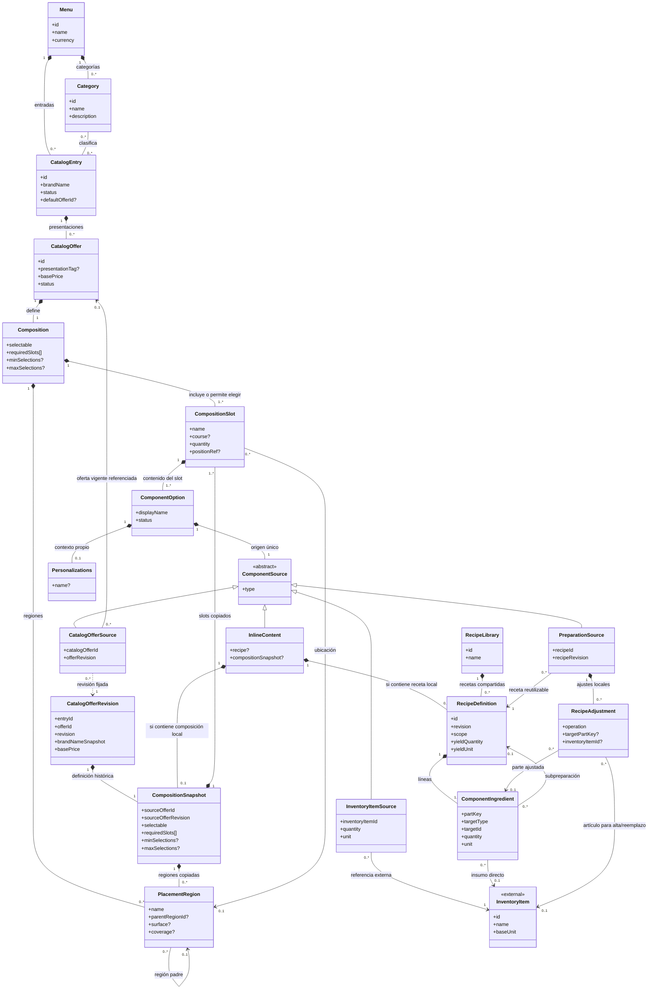
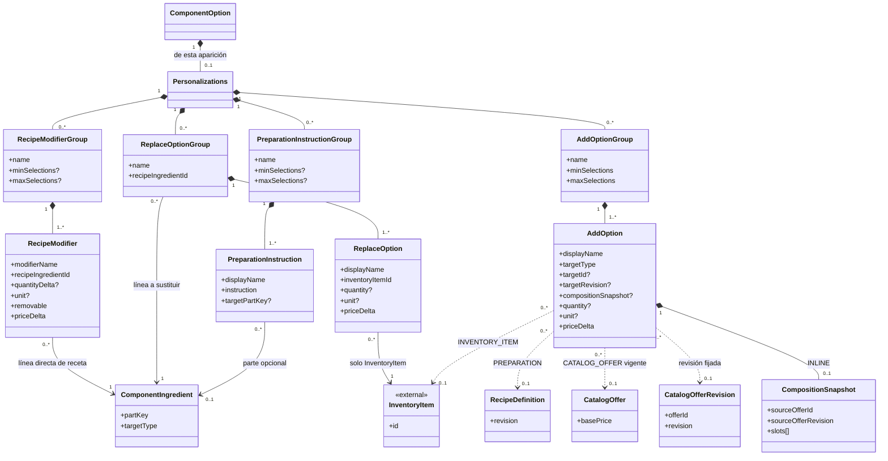
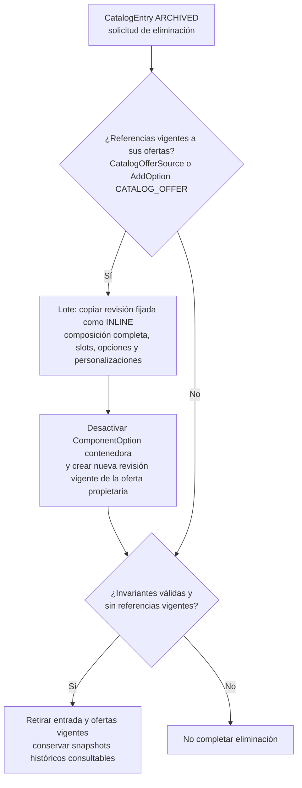
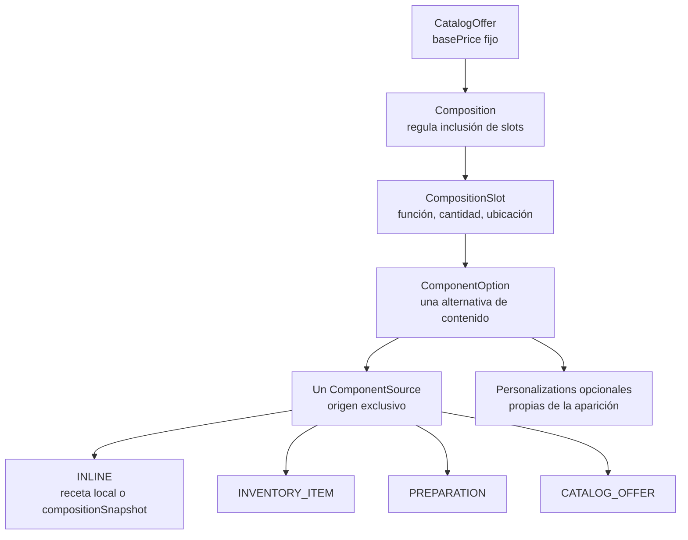
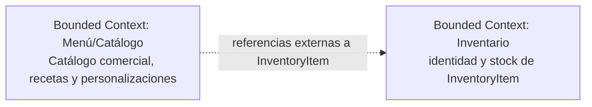

# Arquitectura de Dominio del Servicio Menu

## Modelo de Dominio

El modelo de Menú/Catálogo describe categorías, entradas comerciales, ofertas, composiciones, contenidos posibles, recetas y personalizaciones declaradas. Menu contiene categorías y entradas; Category clasifica CatalogEntry; y CatalogEntry administra el nombre comercial, sus categorías y ofertas. Toda oferta vendible tiene una Composition de uno o más CompositionSlot, incluso cuando representa un producto individual.

CatalogOffer declara un precio base fijo y una presentación opcional; Composition define la inclusión de slots, y cada ComponentOption determina el contenido admitido para una aparición concreta. Catálogo administra las definiciones y cantidades de receta y las personalizaciones. Inventario conserva la identidad y el stock de InventoryItem, al que Catálogo referencia externamente.

## Agregados y Límites de Consistencia

Las relaciones siguientes expresan propiedad y composición conceptual del modelo. No prescriben agregados transaccionales, persistencia ni claves físicas.

### Menú y catálogo comercial

Menu contiene categorías y entradas comerciales. Category clasifica cero o más CatalogEntry y una entrada puede clasificarse en varias categorías del mismo menú. CatalogEntry es la identidad comercial con nombre autoritativo, descripción, estado, imagen y ofertas vendibles. Una entrada activa/publicable requiere al menos una oferta válida; puede archivarse y, al desarchivarse, queda inactiva.

### Oferta y composición

CatalogEntry puede tener CatalogOffer; una entrada activa/publicable requiere al menos una oferta válida. Cada CatalogOffer posee exactamente una Composition y su basePrice describe el precio fijo de esa oferta. Su nombre visible combina el nombre comercial de la entrada con la presentación opcional; presentationTag es descriptiva y no determina cantidades físicas. Composition contiene uno o más CompositionSlot y puede declarar PlacementRegion. Cada slot posee una o más ComponentOption, cada una como aparición contextual de un contenido. La opción referencia exactamente un origen y puede declarar sus propias personalizaciones.

RecipeLibrary reúne recetas reutilizables. InlineContent contiene exactamente una receta local o una copia local de la composición completa de una oferta, con sus slots, opciones y personalizaciones; PreparationSource referencia una receta publicada y sus ajustes locales; CatalogOfferSource referencia otra oferta vendible. AddOption puede contener también una copia local de composición. InventoryItem y su stock siguen bajo Inventario.

La eliminación definitiva de una CatalogEntry archivada abarca sus ofertas vigentes. Si otras ofertas las referencian mediante CatalogOfferSource o mediante AddOption de tipo CATALOG_OFFER, el lote desactiva cada ComponentOption que contiene esas referencias y convierte cada referencia en una composición INLINE copiada de la revisión publicada fijada de la oferta referenciada. Las ofertas que contienen las opciones afectadas reciben nuevas revisiones vigentes. El lote solo permite retirar la entrada y sus ofertas vigentes después de completar las conversiones y comprobar que ninguna definición vigente conserva referencias a ellas; si no puede conservar las invariantes del catálogo, no completa la eliminación. Las revisiones históricas publicadas permanecen inmutables y los snapshots de las revisiones eliminadas siguen disponibles para consulta histórica.

## Entidades y Atributos Principales

La siguiente tabla resume los 29 conceptos del modelo, sus responsabilidades, atributos y relaciones. CatalogEntry declara ACTIVE, INACTIVE o ARCHIVED; CatalogOffer, ComponentOption y RecipeDefinition declaran ACTIVE o INACTIVE. Los identificadores son conceptuales: no prescriben claves de base de datos ni un esquema de almacenamiento.

| Entidad o concepto | Responsabilidad | Atributos y relaciones principales |
| :--- | :--- | :--- |
| Menu | Propietario del conjunto de categorías y entradas comerciales. | id, name, currency; contiene Category y CatalogEntry. |
| Category | Categoría reutilizable que clasifica entradas. | id, menuId, name, description; pertenece a Menu y clasifica cero o más CatalogEntry. |
| CatalogEntry | Identidad comercial y administración de un producto de la carta. | id, menuId, brandName, description, imageRef, status, categoryIds[], defaultOfferId?; pertenece a Menu, tiene ofertas y usa categorías del mismo menú. |
| CatalogOffer | Presentación vendible con precio base y composición propia. | id, entryId, presentationTag?, basePrice, status, offerImageRef; pertenece a CatalogEntry, contiene exactamente una Composition y puede ser referenciada por CatalogOfferSource o AddOption. Las revisiones publicadas se conservan como snapshots históricos consultables. |
| CatalogOfferRevision | Instantánea inmutable de una revisión publicada de oferta. | entryId, offerId, revision, brandNameSnapshot, basePrice, compositionSnapshot; conserva la composición consultable aunque se elimine la oferta vigente. |
| Composition | Define slots y reglas para incluirlos en una oferta. | id, offerId, selectable, requiredSlots[], minSelections?, maxSelections?, slots[], placementRegions[]?; pertenece a CatalogOffer. |
| CompositionSnapshot | Copia local completa de la composición de una revisión de oferta. | sourceOfferId, sourceOfferRevision, selectable, requiredSlots[], minSelections?, maxSelections?, slots[], placementRegions[]?; conserva slots, opciones y personalizaciones en su ámbito local o histórico. sourceOfferId y sourceOfferRevision registran la procedencia de la copia; no mantienen una referencia vigente a CatalogOffer. |
| CompositionSlot | Posición funcional o espacial que aporta contenido. | id, compositionId, name, course?, quantity, positionRef?, options[]; pertenece a Composition y contiene una o más ComponentOption. |
| PlacementRegion | Región o ubicación semántica descriptiva de una composición. | id, compositionId, name, parentRegionId?, surface?, coverage?; puede tener región padre y ser referida por CompositionSlot. |
| ComponentOption | Aparición contextual de contenido admitida en un slot. | id, slotId, displayName, status, source, personalizations?; pertenece a CompositionSlot y posee un ComponentSource. |
| ComponentSource | Tipo conceptual del origen único de una opción. | type: INLINE, INVENTORY_ITEM, PREPARATION o CATALOG_OFFER; especialización exclusiva en InlineContent, InventoryItemSource, PreparationSource o CatalogOfferSource. |
| InlineContent | Contenido definido localmente en una opción. | id, name?, recipe? o compositionSnapshot?, description?; pertenece a una ComponentOption y contiene exactamente una RecipeDefinition local o una copia local de la composición completa de una revisión de oferta, con slots, opciones y personalizaciones. |
| InventoryItemSource | Referencia directa a un artículo externo de Inventario. | inventoryItemId, quantity, unit, displayNameSnapshot?; referencia exactamente un InventoryItem. |
| PreparationSource | Uso de una receta reutilizable, con ajustes locales opcionales. | recipeId, recipeRevision, name?, adjustments[]; referencia RecipeDefinition publicada de RecipeLibrary y posee RecipeAdjustment. |
| CatalogOfferSource | Referencia a la revisión identificada de otra oferta vendible con su composición. | catalogOfferId, offerRevision, displayNameSnapshot?; identifica la oferta vigente y su CatalogOfferRevision conservada. En una definición vigente se convierte a InlineContent antes de eliminar la oferta de origen. |
| InventoryItem | Artículo o ingrediente cuya identidad y stock son de Inventario. | id, name, baseUnit; concepto externo referenciado por InventoryItemSource, ComponentIngredient, AddOption y ReplaceOption. |
| RecipeLibrary | Colección de recetas reutilizables administradas por Catálogo. | id, name, recipes[]; contiene RecipeDefinition de alcance LIBRARY. |
| RecipeDefinition | Definición física base de una preparación con rendimiento y líneas. | id, name, description?, revision, scope, yieldQuantity, yieldUnit, ingredients[], status; pertenece a InlineContent o RecipeLibrary. |
| ComponentIngredient | Aparición identificable de un ingrediente o preparación en una receta. | id, recipeId, partKey, displayName?, targetType, targetId, targetRevision?, quantity, unit; apunta a InventoryItem o a una RecipeDefinition reutilizable. |
| RecipeAdjustment | Diferencia administrativa local sobre una receta reutilizada. | id, preparationSourceId, operation, targetPartKey?, inventoryItemId?, quantity?, unit?; pertenece a PreparationSource y apunta a la parte de origen cuando la operación lo requiere. |
| Personalizations | Conjunto opcional de personalizaciones para una ComponentOption concreta. | id, name?, recipeModifierGroups[], addOptionGroups[], replaceOptionGroups[], preparationInstructionGroups[]; pertenece a exactamente una ComponentOption. |
| RecipeModifierGroup | Agrupa cambios permitidos a ingredientes ya existentes en la receta efectiva. | id, personalizationsId, name, minSelections?, maxSelections?, modifiers[]; contiene RecipeModifier. |
| RecipeModifier | Cambio de cantidad o eliminación sobre una línea existente de receta. | id, groupId, modifierName, recipeIngredientId/partKey, recipeIngredientName?, quantityDelta?, unit?, removable, priceDelta; apunta a ComponentIngredient de la receta efectiva. |
| AddOptionGroup | Limita cuántas alternativas adicionales se eligen para una opción incorporada. | id, personalizationsId, name, minSelections, maxSelections, addOptions[]; contiene AddOption. |
| AddOption | Contenido adicional declarado como personalización. | id, groupId, displayName, targetType: INLINE, INVENTORY_ITEM, PREPARATION o CATALOG_OFFER, targetId?, targetRevision?, compositionSnapshot?, quantity?, unit?, priceDelta; contiene exactamente un destino: InventoryItem, preparación reutilizable, CatalogOffer o copia local INLINE de la composición completa de una oferta. |
| ReplaceOptionGroup | Identifica una línea de receta directa que puede sustituirse. | id, personalizationsId, name, recipeIngredientId/partKey, recipeIngredientName?, replaceOptions[]; pertenece a Personalizations y apunta a un ingrediente de la receta efectiva. |
| ReplaceOption | Alternativa de reemplazo de un ingrediente de Inventario. | id, groupId, displayName, inventoryItemId, quantity?, unit?, priceDelta; referencia solo InventoryItem. |
| PreparationInstructionGroup | Agrupa instrucciones de elaboración o servicio seleccionables. | id, personalizationsId, name, preparationInstructions[], minSelections?, maxSelections?; contiene PreparationInstruction. |
| PreparationInstruction | Instrucción estructurada que no altera por sí misma cantidades físicas. | id, groupId, displayName, instruction, targetPartKey?; pertenece a PreparationInstructionGroup y puede referir una parte identificable. |

### Selección de composición y contenido

La decisión de incluir un slot y la decisión de qué contenido ocupa ese slot son distintas:

- Con selectable = false se incluyen todos los slots; requiredSlots queda vacío y minSelections/maxSelections no aplican.
- Con selectable = true, requiredSlots identifica slots propios, distintos e inamovibles. Los demás slots son elegibles; minSelections y maxSelections limitan solo cuántos de ellos se incluyen. Los obligatorios no consumen ese cupo.
- Debe cumplirse 0 ≤ minSelections ≤ maxSelections ≤ cantidad de slots elegibles. Si la composición exige elegir alguno, minSelections ≥ 1; una composición seleccionable necesita slots elegibles.
- Todo slot incluido se concreta con una de sus ComponentOption. Una opción única determina su contenido; varias opciones permiten elegir el contenido dentro de ese slot, incluso si el slot es obligatorio.
- quantity expresa unidades incluidas en la posición. Si dos unidades deben personalizarse por separado, se modelan como slots distintos.
- course sugiere un tiempo de servicio. positionRef señala ubicación espacial y no determina obligatoriedad.
- PlacementRegion.name es una etiqueta descriptiva; surface y coverage son opcionales y quedan reservados para futuras implementaciones, sin comportamiento de cobertura en este modelo.
- Una ComponentOption INACTIVE no se ofrece como nueva alternativa.

### Recetas, personalizaciones y precios

Inventory posee la identidad de InventoryItem y el stock. Catálogo administra RecipeDefinition, cantidades y las posibilidades de personalización declaradas. ComponentIngredient apunta a InventoryItem o, para una preparación reutilizable anidada, a una receta de RecipeLibrary. Las recetas publicadas se identifican por revisión; no se alteran retroactivamente. Los ciclos entre recetas se impiden.

INLINE contiene exactamente una receta local o un compositionSnapshot local de la composición completa de una revisión de oferta, incluidas sus alternativas y personalizaciones; PREPARATION reutiliza una RecipeDefinition de RecipeLibrary, tal cual o con RecipeAdjustment local; INVENTORY_ITEM referencia un artículo externo; CATALOG_OFFER conserva una oferta vendible con su composición. Una AddOption puede usar INLINE con un compositionSnapshot local en lugar de referenciar una oferta. Las personalizaciones pertenecen a cada aparición de ComponentOption y no se mezclan entre apariciones que comparten un destino. Las opciones de receta requieren una receta efectiva en su propio ámbito.

InventoryItemSource declara cantidad positiva y unidad compatible con el artículo; su displayNameSnapshot es descriptivo y no crea identidad de Inventario. RecipeAdjustment usa ADD, REMOVE, OVERRIDE_QUANTITY o REPLACE_INVENTORY_ITEM: ADD requiere ingrediente y cantidad, y las demás operaciones sobre una parte requieren una línea de origen compatible. Los ajustes son locales a PreparationSource y no cambian la receta compartida. RecipeModifier altera o elimina una línea existente de Inventario de la receta efectiva; AddOptionGroup y los grupos de reemplazo/instrucciones limitan sus propias elecciones. AddOptionGroup se aplica a una opción ya incorporada y no a la inclusión de slots.

CatalogOffer.basePrice es fijo para la oferta, independientemente de los slots y contenidos elegidos. Ni CompositionSlot, ComponentOption ni una oferta hija aportan cargos automáticos a ese precio. priceDelta expresa un importe declarado para una personalización; el modelo no calcula el precio final de una orden. Una sustitución puede declarar delta cero, positivo o negativo. Las instrucciones de preparación no añaden, quitan ni reemplazan cantidades.

### Diagramas Estructurales y de Comportamiento

#### Diagrama de Clases del Dominio Comercial

Las dos vistas siguientes resumen un solo modelo. La composición representa pertenencia conceptual; las asociaciones y dependencias representan referencias y no prescriben claves foráneas.

InlineContent contiene exactamente una receta local o un compositionSnapshot local de la composición completa, incluidos slots, opciones y personalizaciones. En una definición vigente, CatalogOfferSource requiere la oferta referenciada; una referencia histórica se resuelve mediante CatalogOfferRevision aunque la oferta vigente se haya eliminado. RecipeDefinition pertenece a InlineContent o a RecipeLibrary según scope. ComponentIngredient apunta a InventoryItem o a una receta reutilizable, nunca a ambos a la vez. RecipeAdjustment apunta a una parte de origen cuando operation lo requiere; ADD y REPLACE_INVENTORY_ITEM usan InventoryItem.

AddOption selecciona exactamente un destino: InventoryItem, una receta reutilizable de RecipeLibrary (PREPARATION), CatalogOffer o un compositionSnapshot local (INLINE). En el último caso la copia incluye slots, opciones y personalizaciones de la revisión fijada de la oferta. RecipeModifier y ReplaceOptionGroup apuntan a líneas directas de InventoryItem de la receta efectiva de esa opción; no alcanzan líneas internas de una oferta hija.

#### Estados comerciales

CatalogEntry declara status ACTIVE, INACTIVE o ARCHIVED. El archivado de CatalogEntry es reversible; al desarchivarlo, la entrada queda INACTIVE. CatalogOffer y ComponentOption declaran ACTIVE o INACTIVE; RecipeDefinition también declara ACTIVE o INACTIVE. Una entrada publicable necesita una oferta válida y una oferta activa necesita una composición válida. Estos estados describen definiciones de catálogo; course no es un estado de marcha y el documento no define transiciones adicionales para las demás entidades.

La eliminación definitiva solo parte de CatalogEntry ARCHIVED. En un lote sobre las definiciones vigentes, cada referencia a sus ofertas por CatalogOfferSource o AddOption CATALOG_OFFER se convierte en una copia INLINE de la composición completa de la revisión publicada fijada, y se desactiva la ComponentOption que la contiene. Cada oferta propietaria de una opción afectada obtiene una nueva revisión vigente. El lote elimina las definiciones vigentes de la entrada y sus ofertas solo cuando todas las conversiones conservan las invariantes y ya no quedan referencias vigentes a ellas. Las revisiones históricas no se reescriben y sus snapshots permanecen consultables.

#### Selección de una oferta

La vista expresa definiciones del catálogo; no representa la selección de una orden concreta.

## Arquitectura y Límites del Sistema

### Diagrama de Contexto de Bounded Contexts

El límite de Menú/Catálogo contiene las definiciones comerciales y culinarias descritas aquí. Inventario mantiene la identidad de sus artículos y el stock; el catálogo conserva referencias externas a InventoryItem.

La relación expresa que Catálogo referencia identidades cuyo origen y stock pertenecen a Inventario.

### Patrones de Interacción y Comunicación

El modelo establece datos de catálogo y reglas para describir ofertas, composición, recetas y personalizaciones. La cantidad pedida, las elecciones concretas de una orden, asientos, tiempos operacionales de marcha, disponibilidad en tiempo real, facturación y cálculo del precio final pertenecen a otros modelos. El documento no selecciona patrones de lectura/escritura, mecanismos de comunicación, APIs, eventos ni tecnologías de transporte.

### Aislamiento Lógico y Reglas de Integración

1. Menu es propietario de sus Category y CatalogEntry. CatalogEntry posee CatalogOffer; CatalogOffer posee Composition; las composiciones contienen slots y apariciones de contenido.
2. Catálogo define las recetas y las cantidades de sus ComponentIngredient, así como los ajustes administrativos locales de PreparationSource y las personalizaciones declaradas por ComponentOption.
3. Inventario posee la identidad de InventoryItem y su stock. Catálogo referencia InventoryItem mediante identidades explícitas; igualdad numérica entre identificadores de contextos diferentes no establece identidad compartida.
4. La validez estructural de una receta no depende de existencias de Inventario. Catálogo no administra el stock externo.
5. CatalogOffer.basePrice y priceDelta son datos declarados por el catálogo. El dominio no calcula precios finales de pedidos ni suma precios base de slots, opciones u ofertas hijas.
6. Las referencias recursivas entre ofertas y recetas no pueden formar ciclos. Las versiones publicadas de ofertas y recetas referenciadas se identifican sin alterar retroactivamente composiciones ya publicadas.
7. La eliminación de una entrada archivada transforma en un lote todas las referencias vigentes a sus ofertas, tanto de CatalogOfferSource como de AddOption CATALOG_OFFER: desactiva la ComponentOption contenedora, sustituye la referencia por un compositionSnapshot INLINE completo y publica una nueva revisión vigente de la oferta propietaria. Solo entonces se eliminan las definiciones vigentes de la entrada y sus ofertas. Si alguna conversión no preserva las invariantes, el lote no completa la eliminación. Las revisiones históricas y los snapshots de las ofertas eliminadas permanecen consultables.
8. Las relaciones descritas son conceptuales. No prescriben tablas, claves foráneas, APIs, eventos, motor de resolución ni arquitectura de persistencia.
