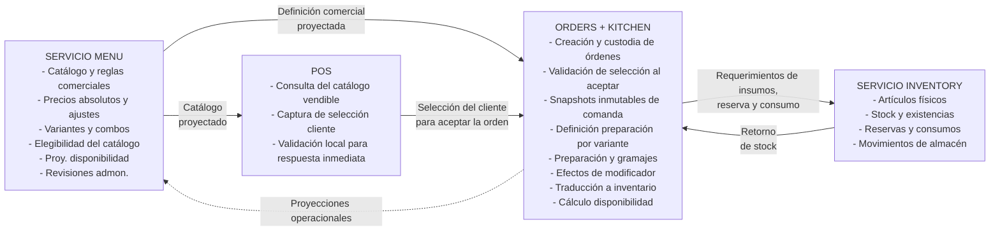
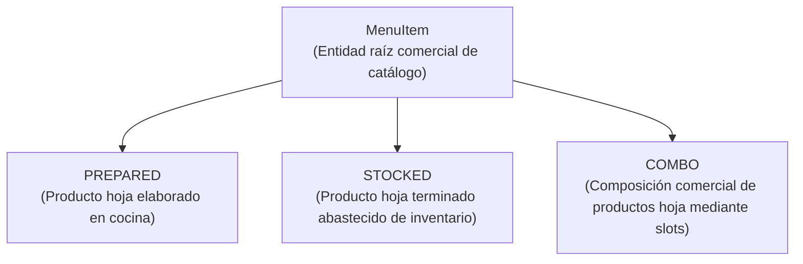

# Contexto, Alcance y Lenguaje del Dominio

## Responsabilidades del Bounded Context Menu

El servicio Menu es la autoridad exclusiva sobre la **oferta de catálogo vendible** del restaurante. Sus responsabilidades se concentran en responder tres preguntas comerciales fundamentales:

1. ¿Qué productos o paquetes se venden al cliente?
2. ¿Cómo puede el cliente configurar o personalizar comercialmente su selección?
3. ¿Cuánto cuesta cada producto, opción o combinación ofrecida?

En consecuencia, las responsabilidades de Menu abarcan:

- Administrar el catálogo de productos comerciales y su clasificación (categorías).
- Definir las dimensiones vendibles de un `MenuItem` (`DimensionValues`) y las configuraciones de un `Combo`.
- Definir la política de precio comercial: cada `MenuItemVariant` (`PREPARED` o `STOCKED`) y cada `ComboConfiguration` tienen un precio unitario absoluto definido en el catálogo; el precio de una variante hoja no se deriva de Preparación ni de existencias. Las opciones de combo y los modificadores pueden aportar los ajustes relativos definidos por Menu. Una variante hoja personalizada usa su `unitPrice` y los ajustes de los modificadores seleccionados; una selección de combo usa el precio de su `ComboConfiguration` y los ajustes de las opciones de combo y los modificadores seleccionados para sus variantes componentes, sin sumar los precios regulares de esas variantes. Orders + Kitchen aplica esta política a la selección aceptada y conserva el resultado comercial en el snapshot de la orden.
- Modelar las dimensiones comerciales y sus valores para variantes hoja, de carácter opcional para admitir la variante técnica `DEFAULT` sin dimensiones.
- Proveer la variante técnica `DEFAULT` para productos hoja sin dimensiones comerciales explícitas.
- Definir grupos y opciones de modificadores comerciales, así como excepciones de configuración por variante (`VariantModifierConfig`).
- Proyectar hacia canales de venta (POS) las opciones comerciales resueltas (`ResolvedVariantModifier`) y la presentación visual de precios (`CatalogItemProjection`).
- Gestionar los estados administrativos (`ACTIVE`, `INACTIVE` y `ARCHIVED` para `MenuItem` uniforme para `PREPARED`, `STOCKED` y `COMBO`, con archivado reversible hacia `INACTIVE` y eliminación definitiva únicamente desde `ARCHIVED` condicionada a la ausencia total de dependencias, referencias históricas necesarias para trazabilidad y restricciones de retención; y habilitación/deshabilitación local `enabled: boolean` para componentes internos sin `ARCHIVED`, distinguiendo retiro lógico de destrucción física) y validar la integridad y elegibilidad estructural de la configuración comercial para nuevas ventas, admitiendo definiciones incompletas en `INACTIVE` y exigiendo validez íntegra en `ACTIVE`. Esta validación concierne a la definición del catálogo; Menu no selecciona artículos por el cliente ni crea o valida transaccionalmente la orden.
- Hacer conceptualmente disponible la identidad y definición de una variante `PREPARED` aún en construcción para que Orders + Kitchen pueda asociarle su preparación concreta antes de que Menu permita activar y ofrecer esa variante. Menu conserva la autoridad sobre la oferta y sus condiciones comerciales; Orders + Kitchen conserva la preparación y comunica su readiness operacional.
- Recibir y proyectar las señales operacionales publicadas por Orders + Kitchen: readiness de preparación (`PreparationStatus`) y disponibilidad granular (`VariantAvailability` y `ModifierAvailability`, cuya identidad lógica compuesta está formada por `variantId` y `modifierOptionId`, proyectando `available` y `availableMaxQuantity`).
- Propagar la disponibilidad operacional sobre composiciones comerciales: opciones de combo, slots (`availableCapacity`) y configuraciones de combo (`ComboConfigurationAvailability`), donde `PreparationStatus == INCOMPLETE` en variantes que requieren preparación impide su disponibilidad para venta, mientras que una revisión pendiente no bloquea la disponibilidad.
- Administrar el ciclo de supervisión de revisiones comerciales y culinarias (`reviewStatus` aplicable a `MenuItemVariant` para cambios culinarios y a `ComboConfiguration` para cambios comerciales o culinarios propagados), manteniendo el seguimiento desacoplado mediante `observedRevision`, `acknowledgedRevision` y causas estructuradas (`PRICE`, `COMPOSITION`, `MODIFIERS`, `STATUS`).
- Versionar inmutablemente las definiciones comerciales de catálogo (`<number>_<ISO8601>`).

## Límites de Contexto y Ownership de Datos

La arquitectura global del sistema divide responsabilidades en tres bounded contexts autónomos y complementarios:

Los principios de ownership y límites de contexto son:

1. **Menu es la autoridad comercial:** Define y custodia qué se vende, su estructura, precios, reglas de modificadores y configuración de combos; valida la integridad y elegibilidad de esas definiciones. El precio unitario absoluto de una variante hoja o configuración de combo es un dato comercial definido en Menu, no un cálculo derivado de ingredientes o existencias. Los ajustes de precio de opciones y modificadores también se definen comercialmente en Menu. Menu proyecta estos datos para consumo de POS y Orders + Kitchen, pero no elige la selección del cliente, crea órdenes ni aplica las restricciones de una selección al aceptar una orden. `Sala` es un microservicio independiente de reservaciones y mesas, no un canal de consumo de la UI del POS. Menu **no posee** Preparación, ingredientes, gramajes, instrucciones físicas de cocina, existencias en almacén ni órdenes de venta.
2. **Orders + Kitchen es la autoridad transaccional, culinaria y operacional:** Es un único servicio y bounded context en el que órdenes y preparación comparten internamente el modelo operativo y culinario. Custodia qué pidió el cliente y cómo se ejecuta físicamente; crea y custodia las órdenes transaccionales, comandas y sus snapshots inmutables de venta. Menu valida la integridad y elegibilidad estructural de la definición comercial; al aceptar una orden, Orders + Kitchen aplica a la selección los límites de grupos, cantidades, opciones y slots definidos por Menu, usando su proyección local del catálogo y la revisión comercial aplicable. Esta aplicación no convierte a Orders + Kitchen en dueño de las reglas ni de los precios comerciales. Aplica a la selección la política de precio definida por Menu y preserva el resultado y la revisión correspondiente en el snapshot de la orden. Custodia preparaciones culinarias, revisiones de preparación (`PreparationRevision`), gramajes e instrucciones de cocina. Asocia la preparación a la `MenuItemVariant` concreta de tipo `PREPARED` mediante su ID o identidad lógica de Menu e interpreta físicamente los modificadores (adición u omisión de insumos). Es el único servicio responsable de traducir variantes y modificadores a requerimientos de artículos de inventario, evaluar con Inventory las existencias físicas y calcular y publicar la disponibilidad operacional y el readiness de preparación hacia Menu.
3. **POS consume y presenta el catálogo:** Consulta las definiciones comerciales vendibles que proyecta Menu y captura la selección del cliente. Puede aplicar las restricciones proyectadas para dar retroalimentación inmediata durante la interacción, pero esa comprobación local no es autoritativa ni sustituye la aplicación de las reglas al aceptar y custodiar la orden en Orders + Kitchen.
4. **Inventory es la autoridad física:** Custodia exclusivamente las existencias físicas de artículos e insumos en bodega, almacenes y cocina, así como los movimientos, reservas y consumos ejecutados. Inventory no conoce qué es un `MenuItem`, un combo, un modificador comercial ni una regla culinaria. Responde sobre cantidades y recursos físicos ante Orders + Kitchen.
5. **Aislamiento lógico, ownership exclusivo e identificadores opacos:** Cada bounded context mantiene ownership exclusivo sobre sus datos y su estado interno, sin acceso directo a estructuras internas entre servicios. Las referencias entre dominios se realizan exclusivamente mediante identificadores escalares opacos (`itemVariantId`, `modifierOptionId`, `inventoryItemId`), preservando el aislamiento lógico y manteniendo explícitamente abierta la topología e implementación física de persistencia. Orders + Kitchen puede mantener una proyección local del catálogo comercial, identificada por los IDs lógicos y la revisión comercial aplicable; esa proyección es un modelo de lectura propio, no entidades ni almacenamiento compartidos con Menu.
6. **Naturaleza de los datos replicados:** Cualquier dato originado en otro servicio que resida en Menu (por ejemplo, el espejo de disponibilidad o readiness) o en Orders + Kitchen (por ejemplo, la proyección local de definiciones y reglas comerciales de Menu) constituye una **proyección**, **snapshot** o **caché**, y jamás una segunda fuente autoritativa. La replicación conceptual no transfiere ownership de las reglas, datos fuente ni estado interno.

## Taxonomía Fundamental del Menú

El catálogo comercial del servicio Menu se estructura a partir de tres tipos de entradas bajo la raíz comercial `MenuItem`:

1. **Productos Hoja (`PREPARED` y `STOCKED`):**
   - Representan unidades de venta directa e independiente.
   - Utilizan obligatoriamente **variantes** (`MenuItemVariant`). Cada variante constituye una presentación vendible concreta del producto (ej. Pizza Individual, Pareja, Familiar; o Refresco 355 ml, 600 ml, 1 L). Poseen una bandera `enabled: boolean` para su habilitación en la definición vigente. En estado `MenuItem.status == ACTIVE` exigen al menos una variante habilitada (`enabled == true`) vendible válida; en `INACTIVE` se admiten definiciones en construcción.
   - Poseen grupos de modificadores comerciales (`ModifierGroup`) que pertenecen al item hoja y aplican a sus variantes.
   - Poseen opcionalmente dimensiones comerciales (`VariantDimension`) y valores (`VariantValue`). La ausencia de dimensiones comerciales habilita la variante técnica `DEFAULT`.
   - Se asocian opcionalmente a una categoría de productos (`ItemCategory`) bajo clasificaciones comerciales (`PLATILLO`, `BEBIDA`, `POSTRE`, `COMPLEMENTO`).
   - **Distinción entre PREPARED y STOCKED en Menu:** Para Menu, la distinción entre `PREPARED` y `STOCKED` es una clasificación comercial de catálogo. Menu no conoce la preparación de un item `PREPARED` ni el artículo de inventario o cantidad de retiro de un item `STOCKED`. Orders + Kitchen asocia internamente la preparación culinaria o la resolución física correspondiente a cada variante vendible. Para `PREPARED`, la variante concreta debe poder identificarse en la definición en construcción para que Orders + Kitchen pueda asociarle su preparación antes de que Menu la active; la definición administrativa `INACTIVE` no se ofrece por ello al POS.
2. **Combos (`COMBO`):**
   - Representan paquetes comerciales estructurados compuestos por elecciones de productos hoja. No son productos `PREPARED` ni `STOCKED`. Como todo `MenuItem`, poseen ciclo de vida comercial uniforme (`status`: `ACTIVE`, `INACTIVE`, `ARCHIVED`).
   - Se configuran mediante una o más configuraciones comerciales (`ComboConfiguration`), cada una con precio unitario absoluto propio, bandera `enabled: boolean` y uno o más espacios de selección (`ComboSlot`). En `MenuItem.status == ACTIVE` exigen al menos una configuración habilitada con capacidad suficiente; en `INACTIVE` se permiten configuraciones preliminares.
   - Cada slot posee una bandera `enabled: boolean` y contiene opciones de combo (`ComboOption`), también con bandera `enabled: boolean`, que apuntan **directamente** a variantes hoja vendibles concretas (`itemVariantId`), con una cantidad entera positiva de unidades físicas completas (`quantity >= 1`) y un delta de precio (`priceDelta`).
   - **Ausencia de variantes, dimensiones y modificadores en el modelo de Combo:** Un combo no posee `MenuItemVariant`, `VariantDimension` ni modificadores propios. Las personalizaciones son las de las variantes hoja seleccionadas en sus slots.
   - Los combos se asocian opcionalmente a un catálogo de categorías separado (`ComboCategory`) y no heredan categorías de sus productos hoja componentes.
   - **Habilitación de componentes de combo:** La deshabilitación de un componente (`ComboConfiguration.enabled = false`, `ComboSlot.enabled = false`, `ComboOption.enabled = false`) opera localmente sin alterar de forma forzada el `status` del `MenuItem` contenedor. La evaluación de elegibilidad y disponibilidad de un combo evalúa exclusivamente los slots y opciones habilitados (`enabled == true`).

## Ortogonalidad de Dimensiones Operacionales y Administrativas

El modelo del servicio Menu establece una separación estricta entre dimensiones ortogonales que responden a preguntas de negocio distintas, provienen de autoridades diferentes y jamás deben fusionarse:

| Dimensión                                  | Pregunta que responde                                                                                         | Autoridad / Origen                                | Valores posibles                                                                                                                                                                                                              | Impacto en el Dominio                                                                                                                                                                                                                                                                                                                                                                                                                                                                                                                                                                                                                                                                                                                                                                                                                                         |
| :----------------------------------------- | :------------------------------------------------------------------------------------------------------------ | :------------------------------------------------ | :---------------------------------------------------------------------------------------------------------------------------------------------------------------------------------------------------------------------------- | :------------------------------------------------------------------------------------------------------------------------------------------------------------------------------------------------------------------------------------------------------------------------------------------------------------------------------------------------------------------------------------------------------------------------------------------------------------------------------------------------------------------------------------------------------------------------------------------------------------------------------------------------------------------------------------------------------------------------------------------------------------------------------------------------------------------------------------------------------------ |
| **1. Estado Administrativo del MenuItem**  | ¿El administrador comercial desea ofrecer este producto/combo en el catálogo?                                 | Menu (Gestión de catálogo)                        | Exclusivo de `MenuItem`: `ACTIVE`, `INACTIVE`, `ARCHIVED`. Los componentes internos (`MenuItemVariant`, `ComboConfiguration`, `ComboSlot`, `ComboOption`) no poseen ciclo de vida ni enum de estado, sino `enabled: boolean`. | Expresa la voluntad comercial raíz. `ACTIVE` habilita venta comercial si hay elegibilidad; `INACTIVE` suspende venta y permite edición; `ARCHIVED` retira reversiblemente el producto de nuevas ventas conservando histórico. Desarchivar produce obligatoriamente `INACTIVE`; una posterior activación a `ACTIVE` requiere revalidar conjuntamente elegibilidad estructural, dependencias y preparación (bajo autoridad de Orders + Kitchen) antes de ofrecer el artículo. Eliminación definitiva solo desde `ARCHIVED` bajo el predicado canónico de ausencia total de dependencias, referencias históricas necesarias para trazabilidad (tales como órdenes de venta pasadas en Orders + Kitchen, preparación en Kitchen, uso en combos o revisiones anteriores, no exhaustivas) y restricciones de retención (legales, fiscales, contables u operativas). |
| **2. Habilitación de Componentes**         | ¿Este componente específico forma parte de la oferta vigente del item o combo?                                | Menu (Gestión de catálogo)                        | `enabled: boolean` (`true` / `false`) en `MenuItemVariant`, `ComboConfiguration`, `ComboSlot` y `ComboOption`.                                                                                                                | Permite prender o apagar presentaciones o slots individualmente sin mutar el ciclo de vida del `MenuItem`. La deshabilitación de un slot lo excluye de la definición activa del combo. Para las cuatro clases de componentes (`MenuItemVariant`, `ComboConfiguration`, `ComboSlot`, `ComboOption`), si cuentan con referencias para trazabilidad (órdenes, Kitchen, combos, revisiones anteriores), se retiran mediante `enabled = false` conservando identidad histórica; la eliminación física se reserva a componentes nunca publicados ni referenciados.                                                                                                                                                                                                                                                                                                  |
| **3. Elegibilidad Estructural**            | ¿La definición comercial cumple todas las reglas de negocio e invariantes para participar en una nueva venta? | Menu (Lógica de dominio)                          | `true` (Elegible) / `false` (No elegible).                                                                                                                                                                                    | Un `MenuItem` inactivo o archivado no es elegible. Una variante con `enabled == false` no es elegible. Un combo con un slot habilitado obligatorio que no alcanza `minSelections` con opciones elegibles deja de ser elegible. No depende de existencias físicas de inventario.                                                                                                                                                                                                                                                                                                                                                                                                                                                                                                                                                                               |
| **4. Readiness de Preparación**            | ¿Dispone cocina de una definición de preparación válida para elaborar o satisfacer la variante?               | Orders + Kitchen (Cocina)                         | `READY`, `INCOMPLETE` (publicado por Kitchen como `PreparationStatus`).                                                                                                                                                       | Indica exclusivamente readiness de Kitchen, definido como `INCOMPLETE` únicamente por preparación inválida o incompleta de Cocina, excluyendo `reviewStatus` y cualquier revisión administrativa. Cuando la variante requiera preparación (`PREPARED`), `INCOMPLETE` impide su disponibilidad operacional para venta. Es independiente de la elegibilidad estructural y de `reviewStatus`.                                                                                                                                                                                                                                                                                                                                                                                                                                                                    |
| **5. Disponibilidad Operacional**          | ¿Hay existencias físicas suficientes en este momento para vender, preparar y entregar la unidad?              | Orders + Kitchen (Traducción física e inventario) | `AVAILABLE`, `UNAVAILABLE` (con capacidades en `ModifierAvailability`: identidad lógica compuesta `(variantId, modifierOptionId)`, `available` y `availableMaxQuantity`).                                                     | Semáforo momentáneo granular para POS. Calculado por Orders + Kitchen; Menu lo proyecta y propaga a combos evaluando únicamente slots habilitados. Para variantes `PREPARED`, exige `PreparationStatus == READY`. Una revisión pendiente no bloquea la disponibilidad operacional.                                                                                                                                                                                                                                                                                                                                                                                                                                                                                                                                                                            |
| **6. Estado de Revisión (`reviewStatus`)** | ¿Existen cambios no atendidos que requieran supervisión administrativa?                                       | Menu (Detección de dependencias y avisos)         | `UP_TO_DATE`, `REVIEW_REQUIRED`. Aplica a dos targets: `MenuItemVariant` (cambios culinarios de cocina) y `ComboConfiguration` (cambios en variantes componentes o culinarios propagados).                                    | Señal de supervisión lógica desacoplada con causas estructuradas (`PRICE`, `COMPOSITION`, `MODIFIERS`, `STATUS`). Se gestiona mediante `observedRevision` y `acknowledgedRevision`, separada de `commercialRevision`. Una revisión pendiente no bloquea automáticamente la venta ni la disponibilidad operacional.                                                                                                                                                                                                                                                                                                                                                                                                                                                                                                                                            |

**Reglas Fundamentales de Ortogonalidad:**

1. **Separación Cuádruple de Estados:** Debe diferenciarse estrictamente: (a) ciclo de vida del `MenuItem` (`status`), (b) habilitación de componentes (`enabled`), (c) elegibilidad estructural (reglas e invariantes), y (d) disponibilidad operacional (stock y cocina).
2. **Regla de Prevalencia Operacional:** La disponibilidad operacional (`AVAILABLE`) jamás puede reactivar un `MenuItem` (`INACTIVE` o `ARCHIVED`) ni re-habilitar componentes (`enabled = false`). La falta de disponibilidad operacional no muta el catálogo comercial ni genera revisiones (`AvailabilityChanged != REVIEW_REQUIRED`).
3. **El precio comercial no se altera por disponibilidad:** La falta de disponibilidad operacional no elimina, no sobrescribe ni reduce a cero el precio de lista (`unitPrice`) de una variante o combo. Precio de catálogo y disponibilidad son proyecciones separadas.
4. **Las proyecciones operacionales son efímeras:** Las señales de disponibilidad y readiness son modelos de lectura desacoplados y no forman parte de la definición persistida del catálogo comercial ni modifican su estado propio.
5. **Independencia del estado de revisión:** Una configuración o variante marcada como `REVIEW_REQUIRED` es un recordatorio de supervisión para el administrador; no bloquea automáticamente la venta ni vuelve operacionalmente no disponible la unidad si sus condiciones operativas continúan satisfechas.
6. **Distinción entre Slot Deshabilitado y Capacidad Insuficiente:** Un `ComboSlot` con `enabled == false` está excluido de la configuración activa del combo y no participa en la evaluación. Un `ComboSlot` con `enabled == true` participa en la evaluación; si `availableCapacity < minSelections`, el slot no puede satisfacerse y hace no disponible la configuración, pero no muta su definición ni su bandera `enabled`.

## Glosario Normativo del Dominio

- **`MenuItem`:** Entidad comercial raíz del catálogo que agrupa presentaciones vendibles bajo una identidad común de producto. Es la **única entidad** del dominio de catálogo que posee ciclo de vida formal mediante el atributo `status` (`ACTIVE`, `INACTIVE`, `ARCHIVED`), aplicable de forma homogénea a productos hoja (`PREPARED`, `STOCKED`) y a composiciones (`COMBO`).
- **`MenuItemVariant`:** Presentación vendible concreta de un producto hoja (`PREPARED` o `STOCKED`). Custodia el precio unitario absoluto autoritativo (`unitPrice`). No posee ciclo de vida formal ni estado `ARCHIVED`; su vigencia comercial se controla mediante `enabled: boolean`. Los combos no poseen variantes.
- **`Archivado Reversible de MenuItem`:** Mecanismo de ciclo de vida que permite transicionar un `MenuItem` desde `ACTIVE` o `INACTIVE` hacia `ARCHIVED`. Retira el item de la venta y del catálogo activo conservando su integridad histórica. El archivado es reversible: desarchivar produce obligatoriamente `INACTIVE`, requiriendo que una activación posterior hacia `ACTIVE` sea explícita y revalide conjuntamente elegibilidad estructural, dependencias y preparación (manteniendo preparación y readiness bajo la autoridad exclusiva de Orders + Kitchen) antes de ofrecer el artículo para nuevas ventas.
- **`Eliminación Definitiva Restringida`:** Destrucción física o eliminación definitiva de un registro de `MenuItem`. Permitida **exclusivamente** bajo el predicado canónico de encontrarse previamente en estado `ARCHIVED` y ante la ausencia total de dependencias, referencias históricas necesarias para trazabilidad (tales como órdenes de venta pasadas, preparación en Kitchen, uso en combos o revisiones anteriores, como ejemplos no exhaustivos) y restricciones de retención (legales, fiscales, contables u operativas), quedando estrictamente bloqueada ante la presencia de cualquiera de ellas.
- **`Habilitación de Componentes (`enabled`)`:** Atributo booleano presente en los cuatro componentes internos (`MenuItemVariant`, `ComboConfiguration`, `ComboSlot`, `ComboOption`) que determina si el componente participa en la definición activa y en la oferta comercial vigente. No constituye un estado de ciclo de vida de la entidad raíz.
- **`Retiro de Definición Vigente con Conservación Histórica`:** Mecanismo aplicable a las cuatro clases de componentes internos (`MenuItemVariant`, `ComboConfiguration`, `ComboSlot`, `ComboOption`): si nunca fueron publicados y nunca fueron referenciados, se admite su eliminación física; si ya fueron publicados o existe cualquier referencia que requiera trazabilidad (tales como órdenes históricas, preparación en Kitchen, uso en combos o revisiones anteriores, como ejemplos no exhaustivos), se retiran de la definición vigente conservando su identidad histórica mediante deshabilitación (`enabled = false`), preservando la integridad referencial y de auditoría, distinguiendo el retiro lógico de la destrucción física y dejando abiertos los mecanismos técnicos de persistencia y purga (OPEN-011).
- **`Default Variant` (Variante Técnica Predeterminada):** Instancia técnica de `MenuItemVariant` creada obligatoriamente para productos hoja que no presentan dimensiones comerciales visibles al cliente. Garantiza que en comanda `variantId != null` sin requerir dimensiones ni valores de dimensión.
- **`VariantDimension` (Dimensión de Variante):** Característica comercial opcional de diferenciación para un producto hoja (ej. _Tamaño_, _Presentación_). Ausente en COMBO y no requerida en variantes `DEFAULT`.
- **`VariantValue` (Valor de Dimensión):** Instancia concreta dentro de una dimensión (ej. _Individual_, _Familiar_, _600 ml_). Una variante vendible selecciona como máximo un valor por dimensión perteneciente a su item.
- **`ModifierGroup` (Grupo de Modificadores):** Conjunto de opciones de personalización perteneciente a un `MenuItem` hoja, con límites enteros de selección (`minSelections`, `maxSelections`). Está ausente del modelo de Combo.
- **`ModifierOption` (Opción de Modificador):** Opción comercial dentro de un grupo que contiene la estructura anidada `generalConfig`, la cual agrupa el ajuste relativo de precio (`priceDelta`) y el límite máximo de selección (`maxQuantity`), sin exponer dichos atributos como campos planos directos de `ModifierOption`.
- **`VariantModifierConfig`:** Especialización comercial opcional de una `ModifierOption` para una `MenuItemVariant` específica. Contiene de forma plana `variantId`, `modifierOptionId`, `enabled`, `priceDelta` y `maxQuantity`.
- **`ResolvedVariantModifier`:** Proyección plana de lectura generada para POS que contiene exclusivamente la configuración comercial efectiva final: `variantId`, `modifierOptionId`, `enabled`, `priceDelta` y `maxQuantity`. No contiene efectos sobre ingredientes ni campos de disponibilidad operacional.
- **`Combo`:** Composición comercial vendible perteneciente a Menu estructurada bajo un `MenuItem` con `itemType == COMBO`. No posee variantes, Preparación, dimensiones ni modificadores propios.
- **`ComboConfiguration`:** Configuración vendible concreta de un combo con precio unitario absoluto autoritativo propio (`unitPrice`), bandera `enabled: boolean` y un conjunto de slots. No posee ciclo de vida propio ni estado `ARCHIVED`.
- **`ComboSlot` (Espacio de Selección):** Espacio de elección dentro de una configuración de combo con bandera `enabled: boolean` que define los límites enteros `minSelections` y `maxSelections` de opciones que el cliente puede seleccionar.
- **`ComboOption` (Opción de Combo):** Opción elegible dentro de un slot con bandera `enabled: boolean` que referencia directamente a una `MenuItemVariant` hoja concreta, con una cantidad física entregada entera positiva (`quantity >= 1`) de unidades completas y un ajuste de precio (`priceDelta`).
- **`Diferencia entre Slot Deshabilitado y Capacidad Insuficiente`:** Un `ComboSlot` con `enabled = false` está administrativamente excluido de la configuración activa del combo. Un slot con `enabled = true` cuya capacidad disponible es menor a `minSelections` está habilitado pero operacionalmente insatisfecho por falta de componentes disponibles.
- **`Mapeo Explícito de Slots (sourceSlotId -> targetSlotId)`:** Requisito de correspondencia explícita obligatoria en operaciones de copia hacia una `ComboConfiguration` preexistente, excluyendo cualquier matching heurístico por nombre o posición.
- **`Atomicidad por Destino`:** Principio transaccional de copia donde cada `ComboConfiguration` destino se aplica íntegramente o no produce cambios, admitiendo éxito parcial en lotes heterogéneos.
- **`PreparationStatus` (Readiness de Preparación):** Proyección operacional independiente informada por Orders + Kitchen a Menu que indica exclusivamente si existe una definición de preparación válida para una variante. `INCOMPLETE` se define únicamente por readiness operacional inválido o incompleto de cocina, excluyendo `reviewStatus` y cualquier revisión administrativa como causa. Cuando la variante requiera preparación (`PREPARED`), `INCOMPLETE` impide su disponibilidad operacional para venta; una revisión pendiente no bloquea por sí sola la venta.
- **`VariantAvailability`:** Proyección operacional de disponibilidad granular (`available`) para una `MenuItemVariant`, calculada por Orders + Kitchen a partir de insumos y preparación y reflejada localmente en Menu de forma independiente de `PreparationStatus`.
- **`ModifierAvailability`:** Proyección operacional de disponibilidad para una opción de modificador en el contexto de una variante específica, identificada lógicamente por la tupla compuesta `(variantId, modifierOptionId)`, con su estado de disponibilidad (`available`) y su cantidad máxima disponible (`availableMaxQuantity`), calculada por Orders + Kitchen y reflejada en Menu.
- **`ComboSlot.availableCapacity`:** Conteo entero de opciones seleccionables dentro de un `ComboSlot` habilitado (`enabled == true`). Cada opción seleccionable aporta a lo sumo una selección a `availableCapacity`, independientemente de `ComboOption.quantity`.
- **`ComboConfigurationAvailability`:** Proyección operacional de disponibilidad (`available`) calculada por Menu para una `ComboConfiguration`, sustentada en que cada slot obligatorio habilitado satisfaga `availableCapacity >= minSelections`.
- **`CatalogItemProjection.isAvailable`:** Señal agregada proyectada exclusivamente para presentación en catálogo, afirmativa si existe al menos una unidad vendible hija elegible disponible.
- **`observedRevision` y `acknowledgedRevision`:** Mecanismo desacoplado de seguimiento de revisiones donde `observedRevision` identifica el cambio observado por el administrador y `acknowledgedRevision` registra los cambios atendidos, impidiendo que el reconocimiento de un cambio anterior borre revisiones más recientes concurrentes.
- **`PendingReviewCause` (Causa Pendiente de Revisión):** Representación lógica que registra el motivo de revisión pendiente distinguiendo revisión culinaria de comercial, con la identidad del cambio (`changeId`), motivo (`PRICE`, `COMPOSITION`, `MODIFIERS`, `STATUS`), y que permite la propagación de una causa culinaria desde la variante hacia combos dependientes.
- **`Custodia de órdenes y selección (Orders + Kitchen)`:** Orders + Kitchen es el creador, dueño y custodio único del ciclo de vida de la orden, la comanda, las líneas de venta (`OrderLine`) y sus snapshots inmutables. POS consume el catálogo vendible de Menu y captura la selección del cliente; Orders + Kitchen aplica al aceptar la orden los límites comerciales definidos por Menu usando su propia proyección del catálogo. La proyección conserva referencias a IDs lógicos y a la revisión comercial aplicable, pero no comparte entidades ni almacenamiento con Menu. `Sala` mantiene su responsabilidad independiente sobre reservaciones y mesas.
